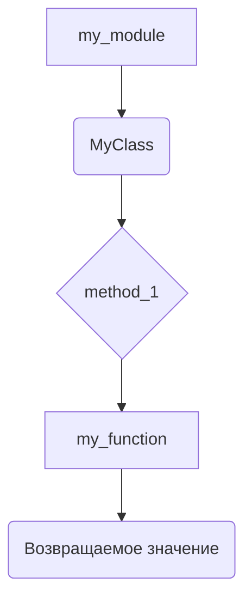
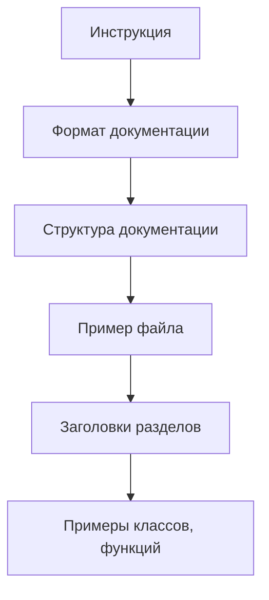

# ИНСТРУКЦИЯ по написанию документации для Python-файлов

## Обзор

Данная инструкция описывает шаги по созданию документации в формате Markdown для Python-файлов. Документация должна быть структурированной и содержать полное описание функций, классов и других элементов кода.

## Требования к формату

* **Формат:** Markdown (.md)
* **Заголовок:** Каждый файл должен начинаться с заголовка и краткого описания содержимого.
* **Комментарии:** Для функций и классов использовать стандартный формат документации Python, с подробными описаниями параметров, возвращаемых значений и возможных исключений.
* **Обработка исключений:** Вместо `e` использовать `ex`.
* **Содержание (TOC):** В начале документации размещать оглавление со ссылками на все разделы.
* **Форматирование:** Соблюдать правильный синтаксис Markdown для заголовков, списков, ссылок.


## Структура документации (пример)

###  `my_module.py`

```markdown
# Модуль `my_module`

## Обзор

Описание функциональности модуля `my_module`.

## Оглавление

* [Классы](#классы)
* [Функции](#функции)

## Классы

### `MyClass`

**Описание**: Описание класса `MyClass`.

**Атрибуты**:
* `attribute1`: Описание атрибута `attribute1`.
* `attribute2`: Описание атрибута `attribute2`.

**Методы**:
* [method_1](#method_1)

### `method_1`

**Описание**: Описание метода `method_1`.

**Параметры**:
* `param1` (int): Описание параметра `param1`.

**Возвращает**:
* int: Описание возвращаемого значения.

**Вызывает исключения**:
* `ValueError`: Описание исключения.


## Функции

### `my_function`

**Описание**: Описание функции `my_function`.

**Параметры**:
* `arg1` (str): Описание параметра `arg1`.
* `arg2` (int, optional): Описание параметра `arg2`. По умолчанию 0.

**Возвращает**:
* bool: Описание возвращаемого значения.

**Вызывает исключения**:
* `TypeError`: Описание исключения.


```

##  Mermaid Диаграмма (Пример)



**Объяснение:**

Диаграмма показывает взаимосвязь между модулем `my_module`, классом `MyClass`, методом `method_1` и функцией `my_function`.  `my_module` содержит классы и функции. `MyClass` использует `method_1`. `my_function` может быть вызвана извне или из методов класса.


## Объяснение кода (пустой, так как нет кода на python)

В данной инструкции описывается **процесс** создания документации, а не код.  Отсутствует предоставленный код Python для анализа.


```
```

```

**Возможные ошибки/улучшения**:

* Необходимо предоставлять код на Python для анализа.
* Пример `Mermaid` диаграммы может быть улучшен конкретным примером.
* Необходимо указать, как `my_module` интегрируется в остальной проект (импорты, зависимости).