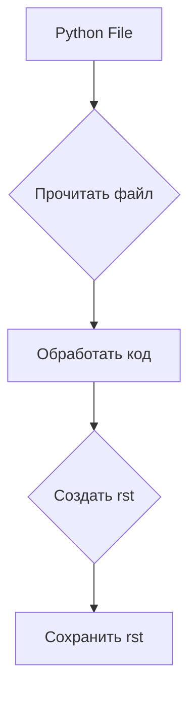

```MD
# Инструкция по написанию документации в формате RST для Python-файлов

## <input code>

```
# ИНСТРУКЦИЯ

Для каждого входного Python-файла создайте документацию в формате `rst` для последующей компиляции с Sphinx. Документация должна соответствовать следующим требованиям:

1. **Формат документации**:
   - Используйте стандарт `reStructuredText (rst)`.
   - Каждый файл должен начинаться с заголовка и краткого описания его содержимого.
   - Для всех классов и функций используйте следующий формат комментариев:
     ```python
     def function(param: str, param1: Optional[str | dict | str] = None) -> dict | None:
         """
         Args:
             param (str): Описание параметра `param`.
             param1 (Optional[str | dict | str], optional): Описание параметра `param1`. По умолчанию `None`.

         Returns:
             dict | None: Описание возвращаемого значения. Возвращает словарь или `None`.

         Raises:
             SomeError: Описание ситуации, в которой возникает исключение `SomeError`.
         """
     ```
   - Используйте `ex` вместо `e` в блоках обработки исключений.

2. **Дерево TOC**:
   - Включите разделы в документации с помощью `.. toctree::`.
   - Структура файла `index.rst` должна содержать ссылки на все описания модулей.

3. **Форматирование документации**:
   - Все заголовки классов, функций и методов должны быть документированы с использованием директив Sphinx (`autoclass`, `autofunction`).
   - Пример:
     ```rst
     .. automodule:: module_name
         :members:
         :undoc-members:
         :show-inheritance:
     ```

4. **Заголовки разделов**:
   - Используйте заголовки уровня 1 (`=`), уровня 2 (`-`), уровня 3 (`~`), и уровня 4 (`^`).

5. **Пример файла**:
   ```rst
   Название модуля
   =============

   .. automodule:: module_name
       :members:
       :undoc-members:
       :show-inheritance:

   Функции
   --------

   .. autofunction:: module_name.function_name
   ```

Сгенерируйте соответствующую документацию для каждого входного Python-файла в формате `rst`.
## <algorithm>

(Блок-схема отсутствует, т.к. код не содержит конкретного кода для анализа.  Предполагается, что код будет генерировать rst-документацию из python-файлов.)

## <mermaid>



## <explanation>

**Описание:**

Данный код представляет собой инструкцию (не код программы), описывающую **процесс генерации документации** в формате `reStructuredText (RST)` для Python-кода с использованием Sphinx.

**Импорты:**

В данном коде нет импортов. Это инструкция, которая описывает *как* должны быть написаны импорты в `rst` файлах.

**Классы:**

Инструкция описывает, как должны документироваться классы в `rst`-файлах с использованием Sphinx директив.

**Функции:**

Инструкция описывает, как должны быть документированы функции в Python, и как их документация должна быть оформлена в `rst` с использованием Sphinx директив.

**Переменные:**

Инструкция не оперирует переменными в контексте программы.

**Возможные ошибки или области для улучшения:**

* **Нет примера реализации:**  Инструкция не содержит примеров реализаций. Для улучшения, необходимо добавить конкретные примеры, как она должна быть применена к реальному коду.
* **Сложность понимания:**  Инструкция на уровне высокого уровня, но в ней нет деталей по использованию.  Необходимы более конкретные примеры использования в `rst` файлах.
* **Не указаны требования к структуре исходных файлов:** Инструкция не содержит информации о том, как должны быть организованы исходные Python файлы. Это важно для понимания, *как* будут работать функции и классы.

**Взаимосвязи с другими частями проекта:**

Инструкция предполагает наличие инструментов для компиляции документации Sphinx. Она тесно связана с самими Python-файлами, которые будут документированы, и с файлом `index.rst`, являющимся входной точкой для документации.