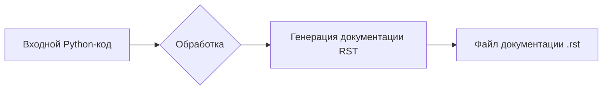

```MD
# Инструкция по написанию документации в формате RST для Python-кода

## 1. <input code>

```plaintext
# הוראות
לכל קובץ Python קלט, צרו תיעוד בפורמט `rst` לצורך קומפילציה לאחר מכן עם Sphinx. התיעוד צריך לעמוד בדרישות הבאות:

1. **פורמט התיעוד**:
   - השתמשו בסטנדרט `reStructuredText (rst)`.
   - כל קובץ צריך להתחיל בכותרת ובתיאור קצר של התוכן שלו.
   - עבור כל המחלקות והפונקציות, השתמשו בפורמט ההערות הבא:
     ```python
     def function(param: str, param1: Optional[str | dict | str] = None) -> dict | None:
         """
         ארגומנטים:
             param (str): תיאור הפרמטר `param`.
             param1 (Optional[str | dict | str], optional): תיאור הפרמטר `param1`. ברירת המחדל היא `None`.

         ערך מוחזר:
             dict | None: תיאור הערך המוחזר. מחזיר מילון או `None`.

         יוצאים:
             SomeError: תיאור המצב שבו מתרחש החריג `SomeError`.
         """
     ```
   - השתמשו ב-`ex` במקום `e` בחסימות טיפול בחריגים.

2. **עץ תוכן (TOC)**:
   - כללו פרקים בתיעוד באמצעות `.. toctree::`.
   - מבנה הקובץ `index.rst` צריך לכלול קישורים לכל התיאורים של המודולים.

3. **עיצוב התיעוד**:
   - כל כותרות המחלקות, הפונקציות והשיטות צריכות להיות מתועדות באמצעות פקודות Sphinx (`autoclass`, `autofunction`).
   - דוגמה:
     ```rst
     .. automodule:: module_name
         :members:
         :undoc-members:
         :show-inheritance:
     ```

4. **כותרות פרקים**:
   - השתמשו בכותרות ברמה 1 (`=`), רמה 2 (`-`), רמה 3 (`~`) ורמה 4 (`^`).

5. **דוגמת קובץ**:
   ```rst
   שם המודול
   ===========\n

   .. automodule:: module_name
       :members:
       :undoc-members:
       :show-inheritance:

   פונקציות
   --------

   .. autofunction:: module_name.function_name
   ```

צור את התיעוד המתאים לכל קובץ Python קלט בפורמט `rst`.
# -------------------- סיום ההוראות -------------------------
```

## 2. <algorithm>

Алгоритм работы состоит в генерации документации в формате RST для Python-кода, следуя заданным инструкциям.  Нет явного алгоритма, просто описание, как необходимо генерировать документ.


## 3. <mermaid>



Диаграмма показывает, что входной Python-код обрабатывается для генерации файла документации в формате RST.  Зависимостей от внешних библиотек в этом алгоритме нет.

## 4. <explanation>

Данный текст представляет собой набор инструкций по генерации документации в формате RST для Python-кода, используя Sphinx.  Он описывает структуру, формат и правила для создания документации.


**Импорты:**  В данном коде нет импортированных библиотек Python.  Это инструкция, а не код.


**Классы:**  Инструкция описывает, как необходимо структурировать документацию классов и функций.


**Функции:**  Инструкция задает формат документации функций (аргументы, возвращаемые значения, описания).


**Переменные:** Нет конкретных переменных в данном коде.


**Возможные ошибки/улучшения:** Инструкция не содержит кода, поэтому невозможно выделить конкретные ошибки или области для улучшений в коде.


**Цепочка взаимосвязей:** Инструкция описывает процесс создания документации, который должен быть связан с процессом сборки документации Sphinx.  Для создания полного документа, инструкция указывает на необходимость создания файла `index.rst`,  который будет содержать ссылки на остальные файлы документации.

**Ключевые аспекты:**

* **РеСт-текст**: Формат для документации, поддерживаемый Sphinx.
* **Sphinx**: Инструмент для генерации документации из исходного кода.
* **Автодокументирование**: Sphinx умеет автоматически генерировать документацию из кода, поэтому указанные `automodule`, `autofunction` важны для Sphinx.


**Заключение:** Данный текст — это руководство по стилю, а не код.  Он описывает необходимые шаги для создания документации в формате RST, используемой при работе со Sphinx.