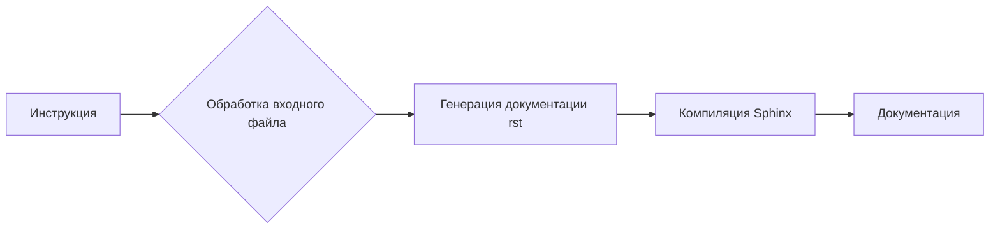

# <input code>

```python
# ИНСТРУКЦИЯ
Для каждого входного Python файла создайте документацию в формате `rst` для последующей компиляции с Sphinx. Документация должна соответствовать следующим требованиям:

1. **Формат документации**:
   - Используйте стандарт `reStructuredText (rst)`.
   - Каждый файл должен начинаться с заголовка и краткого описания его содержимого.
   - Для всех классов и функций используйте следующий формат комментариев:
     ```python
     def function(param: str, param1: Optional[str | dict | str] = None) -> dict | None:
         """
         Аргументы:
             param (str): Описание параметра `param`.
             param1 (Optional[str | dict | str], optional): Описание параметра `param1`. По умолчанию равно `None`.

         Возвращаемое значение:
             dict | None: Описание возвращаемого значения. Возвращает словарь или `None`.

         Исключения:
             SomeError: Описание ситуации, в которой возникает исключение `SomeError`.
         """
     ```
   - Используйте `ex` вместо `e` в блоках обработки исключений.

2. **Дерево оглавлений (TOC)**:
   - Включите разделы в документации с использованием `.. toctree::`.
   - Структура файла `index.rst` должна содержать ссылки на все описания модулей.

3. **Форматирование документации**:
   - Все заголовки классов, функций и методов должны быть задокументированы с использованием директив Sphinx (`autoclass`, `autofunction`).
   - Пример:
     ```rst
     .. automodule:: module_name
         :members:
         :undoc-members:
         :show-inheritance:
     ```

4. **Заголовки разделов**:
   - Используйте заголовки первого уровня (`=`), второго уровня (`-`), третьего уровня (`~`) и четвертого уровня (`^`).

5. **Пример файла**:
   ```rst
   Название модуля
   ===============\n

   .. automodule:: module_name
       :members:
       :undoc-members:
       :show-inheritance:

   Функции
   --------

   .. autofunction:: module_name.function_name
   ```

Сгенерируйте соответствующую документацию для каждого входного Python файла в формате `rst`.
```

# <algorithm>

Нет алгоритма в традиционном смысле.  Данная инструкция описывает *требования* к процессу генерации документации, а не алгоритм для её выполнения.  Инструкция задаёт формат для документации в формате reStructuredText (rst) и описывает, как должны быть написаны комментарии к коду Python, чтобы Sphinx мог генерировать из них документацию.

# <mermaid>



Диаграмма показывает, что инструкция определяет процесс, в результате которого входной Python-файл превращается в документацию, скомпилированную с помощью Sphinx.

# <explanation>

**Импорты:**

Нет импортов в представленном коде. Это инструкция, описывающая *как* создавать документацию для других файлов.

**Классы:**

Нет объявлений классов. Инструкция описывает правила написания документации для классов.

**Функции:**

Нет функций. Инструкция описывает как документировать функции.

**Переменные:**

Нет переменных. Инструкция описывает правила форматирования документации.

**Возможные ошибки или области для улучшений:**

Инструкция не содержит кода, который нужно анализировать.  Она описывает требования к коду, который будет анализироваться в будущем.  Она не содержит никаких ошибок, так как это просто описание.


**Взаимосвязи с другими частями проекта:**

Инструкция предполагает, что существует процесс, который будет принимать Python-файлы в качестве входных данных и использовать эту инструкцию для генерации соответствующей документации в формате rst.  Эта документация, скорее всего, будет использоваться системой сборки Sphinx.