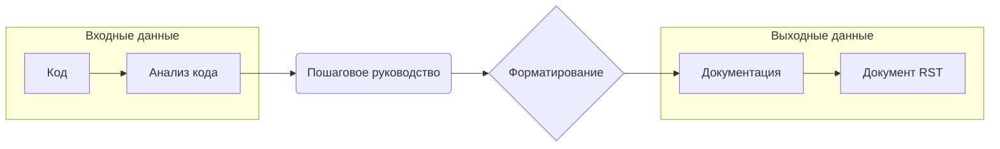

```MD
# Анализ кода (инструкции по генерации документации)

**1. <input code>**

```
**Instructions for Code Documentation Generation**

1. **Analyze the code**: Understand the logic and actions performed by the given code block.

2. **Create a step-by-step guide**:
    - **Description**: Explain what the code block does.
    - **Execution steps**: Outline the sequence of actions in the code.
    - **Usage example**: Provide a code example showing how to use this block in a project.

3. **Formatting**: Follow the structure in `reStructuredText (RST)`:

```rst
How to use this code block
=========================================================================================\n\nDescription
-------------------------
[Explain what the code does.]

Execution steps
-------------------------
1. [First step description.]
2. [Second step description.]
3. [Continue as necessary...]

Usage example
-------------------------
.. code-block:: python

    [Example usage code]
```

4. **Avoid vague terms** like "getting" or "doing." Be specific about what the code does, e.g., "checks," "validates," or "sends."
```

**2. <algorithm>**

Этот код представляет собой набор инструкций для написания документации к коду.  Он не содержит исполняемого кода, а описывает процесс документации.  Алгоритм состоит из следующих шагов:

1. **Анализ кода**:  Разбор логики и действий, выполняемых кодом.
2. **Пошаговое руководство**:
   - **Описание**:  Объяснение того, что делает блок кода.
   - **Шаги выполнения**:  Определение последовательности действий в коде.
   - **Пример использования**:  Приведение примера использования этого блока в проекте.
3. **Форматирование**:  Следование структуре `reStructuredText (RST)`.
4. **Избегание нечетких терминов**:  Использование конкретных глаголов (например, "проверяет", "валидирует", "отправляет").


**Пример**: Если входным блоком кода является функция `calculate_average`, то алгоритм будет включать:

*   Описание: функция вычисляет среднее значение списка чисел.
*   Шаги выполнения:
    1. Берёт на вход список чисел.
    2. Суммирует все числа в списке.
    3. Делит сумму на количество чисел в списке.
    4. Возвращает результат.
*   Пример использования: см. пример в формате `reStructuredText (RST)`.


**Передача данных:** В этом случае данные передаются в виде инструкций по созданию документации. Входной блок – это код, а выходной – это документ RST.


**3. <mermaid>**



**Описание диаграммы:**

*   **Анализ кода**: Начало процесса, принимающий на вход код.
*   **Пошаговое руководство**:  Результат анализа – пошаговые инструкции по документации.
*   **Форматирование**: Набор правил для форматирования документации.
*   **Документация**:  Итоговый продукт процесса – документ RST.


**4. <explanation>**

* **Импорты:** Нет импортов. Это документ-инструкция, не содержащий исполняемого кода.

* **Классы:** Нет классов.

* **Функции:** Нет функций.

* **Переменные:** Нет переменных.

* **Возможные ошибки/улучшения:**  Инструкция предполагает, что код уже написан.  Необходимо добавить конкретный пример кода для демонстрации применения этой инструкции. В инструкциях не указан способ передачи входного кода на обработку и получения результата (документации). Инструкции следует дополнить инструкциями по использованию инструментария/среды для обработки кода.  В настоящем формате это скорее описание процесса, чем код для реализации.


**Цепочка взаимосвязей:**  Данный документ (инструкция) предоставляет шаги для создания документации для любого другого кода. Нет прямой зависимости от конкретных файлов проекта.