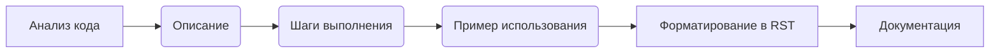

# Анализ кода: Инструкции для генерации документации

**1. <input code>**

```
**Инструкции для генерации документации к коду**

1. **Анализируй код**: Пойми логику и действия, выполняемые данным фрагментом кода.
  
2. **Создай пошаговую инструкцию**:
    - **Описание**: Объясни, что делает данный блок кода.
    - **Шаги выполнения**: Опиши последовательность действий в коде.
    - **Пример использования**: Приведи пример кода, как использовать данный фрагмент в проекте.

3. **Форматирование**: Следуй структуре в `reStructuredText (RST)`:

```rst
Как использовать этот блок кода
=========================================================================================\n\nОписание
-------------------------
[Объяснение, что делает код.]

Шаги выполнения
-------------------------
1. [Описание первого шага.]
2. [Описание второго шага.]
3. [Продолжай по необходимости...]

Пример использования
-------------------------
.. code-block:: python

    [Пример использования кода]
```

4. **Избегай расплывчатых терминов** вроде "получаем" или "делаем". Будь конкретным, что именно делает код, например: "проверяет", "валидирует" или "отправляет".
```

**2. <algorithm>**

Этот код представляет собой набор инструкций для написания документации к коду.  Алгритм работы не в коде, а в инструкции, которая объясняет процесс написания документации.  Шаг за шагом описывается, как необходимо создавать документирующую информацию в формате reStructuredText (RST).

**Пример:**

Если нужно документировать функцию `calculate_sum`, описывающая алгоритм сложения двух чисел, шаги будут следующими:

1. **Анализируем код:** Изучаем функцию `calculate_sum`.
2. **Создаем описание:** Описываем, что делает функция `calculate_sum` (например, "функция складывает два числа").
3. **Создаем шаги выполнения:** Описываем последовательность действий (например, "принимает на вход два числа, складывает их, возвращает результат").
4. **Создаем пример использования:** Приводим пример вызова функции (например, `result = calculate_sum(5, 3)`).
5. **Форматируем:** Используем RST формат для создания документации.

**Передача данных** между блоками не происходит, так как описываемый код не содержит ни функций, ни классов.  Информация передается только посредством текстового описания.


**3. <mermaid>**



**Объяснение зависимостей:**

Эта диаграмма отражает последовательность действий для создания документации.  Зависимости здесь чисто логические,  связанные с процессом документирования.  Нет внешних зависимостей от библиотек или пакетов.

**4. <explanation>**

* **Импорты:**  Здесь нет импортируемых модулей. Код представляет собой текст с инструкциями.

* **Классы:** Отсутствуют классы.

* **Функции:** Нет функций,  есть инструкция о том как нужно написать текст документации.

* **Переменные:** Нет переменных.


* **Возможные ошибки или улучшения:**
    * Инструкции слишком общие. Для конкретного кода нужны детализированные инструкции с примерами.
    * Не хватает конкретики, например, для примеров нужно указать какие функции и классы будут документироваться.
    * Для улучшения можно добавить раздел о том, как использовать инструменты для обработки и формата рест-текста.


**Цепочка взаимосвязей с другими частями проекта:**

Эти инструкции предполагают, что существует код, к которому нужно создать документацию.  Взаимодействие  с другими частями проекта происходит через механизм создания документации на основе предоставленного кода.  По сути, эти инструкции это шаблон для генерации документации.  На конкретные части проекта они ссылаются лишь через описание этапа анализа кода.