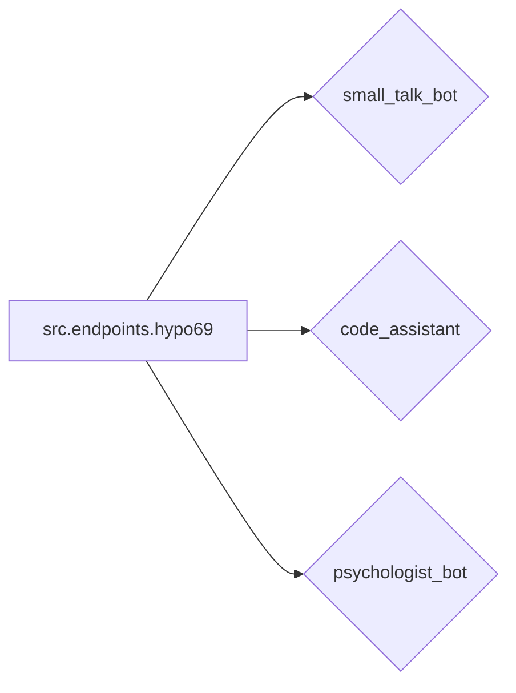

```MD
# Анализ модуля `src.endpoints.hypo69`

1. **<input code>**:

```rst
.. module: src.endpoints.hypo69
	.. synopsys: эндпоинты для разработчика 
```
### **hypo69 Module**: эндпоинты для разработчика
**small_talk_bot** - бот с чатом модели ии
**code_assistant** - модуль обучения модели коду проекта
**psychologist_bot** - ранняя разработка модуля парсинга диалогов
```

2. **<algorithm>**:

Код представляет собой описание модуля `src.endpoints.hypo69`, а не алгоритм в привычном смысле.  Он описывает функциональность данного модуля, как набор "эндпоинтов" (точек входа в систему).  Блок-схема не применима, так как нет конкретного алгоритма выполнения.  Данные не передаются между функциями/классами, так как это всего лишь описание.

3. **<mermaid>**:



Описание диаграммы:

*   `src.endpoints.hypo69` - это модуль, содержащий различные компоненты для взаимодействия с пользователем.
*   `small_talk_bot`, `code_assistant`, `psychologist_bot` - это  различные функциональные единицы внутри модуля `src.endpoints.hypo69`, отвечающие за диалог с моделью ИИ, обучение модели коду и парсинг диалогов соответственно.  Они взаимосвязаны через общий модуль `src.endpoints.hypo69`, но алгоритм взаимодействия между ними не описывается.

4. **<explanation>**:

* **Импорты**:  В коде нет импорта, это просто описание модуля.  Импорты будут находиться в файлах, которые используют этот модуль.
* **Классы**:  Описание не содержит классов.
* **Функции**:  Описание не содержит функций.  Этот код лишь описывает, какие функции/возможности (эндпоинты) должны быть реализованы в этом модуле.
* **Переменные**: Нет переменных.
* **Возможные ошибки или области для улучшений**:  Описание слишком общее и не содержит конкретики, что затрудняет анализ и понимание.  Необходимо было бы предоставить код функций/классов, чтобы дать более подробное объяснение.  Отсутствие описания алгоритмов и внутренней логики кода  является главной проблемой для анализа.

**Цепочка взаимосвязей с другими частями проекта**:

Модуль `src.endpoints.hypo69` будет использоваться другими частями проекта, которые нуждаются в его функциях, например, интерфейсом пользователя, которые будут вызывать  `small_talk_bot`, `code_assistant`, и `psychologist_bot`. Связь будет осуществляться через вызовы функций или методов.  Точная схема зависит от конкретной реализации проекта.


**Вывод**:

Данный код описывает *структуру* модуля, но не содержит *действительного* кода. Для дальнейшего анализа необходимо предоставление исходных кодов классов и функций, которые реализуют описанные "эндпоинты".