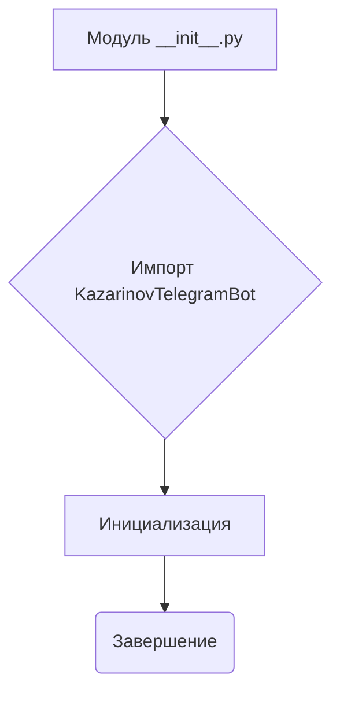

```MD
# <input code>

```python
## \file hypotez/src/endpoints/kazarinov/__init__.py
# -*- coding: utf-8 -*-
#! venv/Scripts/python.exe
#! venv/bin/python/python3.12

"""
.. module: src.endpoints.kazarinov 
	:platform: Windows, Unix
	:synopsis:

"""
MODE = 'dev'

from .kazarinov_bot import KazarinovTelegramBot
```

# <algorithm>

Этот код является модулем инициализации для подсистемы `kazarinov` в приложении `hypotez`.

В нём происходит импорт класса `KazarinovTelegramBot`, определяющего бота для Telegram.

**Блок-схема:**



**Пример:**

В модуле `__init__.py` происходит импорт класса `KazarinovTelegramBot`, который, предположительно, реализует логику работы бота в Telegram.  После этого  модуль готов к использованию другими частями приложения.

# <mermaid>


**Объяснение диаграммы:**

Диаграмма отображает иерархическую структуру проекта `hypotez`.

* `hypotez` — корневой каталог проекта.
* `src` — каталог с исходными кодами.
* `endpoints` — каталог с модулями, отвечающими за взаимодействие с различными конечными точками (например, API или Telegram).
* `kazarinov` — подкаталог, содержащий функциональность, связанную с ботом Kazarinov.
* `__init__.py` — модуль инициализации для подкаталога `kazarinov`.
* `KazarinovTelegramBot` — класс, реализующий функциональность бота.

# <explanation>

* **Импорты:**

   `from .kazarinov_bot import KazarinovTelegramBot`: Импортирует класс `KazarinovTelegramBot` из файла `kazarinov_bot.py` внутри папки `kazarinov`. Символ `.` в импорте указывает на относительный путь к файлу, что предполагает, что `kazarinov_bot.py` находится в подкаталоге `endpoints/kazarinov`.  Это типичный подход для организации кода в проектах Python.

* **Классы:**

   `KazarinovTelegramBot`:  Класс, который, по всей вероятности, отвечает за взаимодействие с Telegram-ботом.  Подробности реализации находятся в файле `kazarinov_bot.py`.  Наличие этого класса в файле `__init__.py` подразумевает, что этот класс будет доступен для использования в других модулях при импорте из каталога `endpoints/kazarinov`.

* **Функции:**

   В данном файле нет определённых функций. Есть константа `MODE`, которая, вероятно, определяет режим работы приложения (`dev` — вероятно, режим разработки).

* **Переменные:**

   `MODE = 'dev'`: Строковая переменная, используемая для управления режимом работы приложения.

* **Возможные ошибки/улучшения:**

   Файл `__init__.py`  краткий, но важный, поскольку он предоставляет точку входа для использования класса `KazarinovTelegramBot`  в других модулях. Возможно, этот файл будет расширяться в будущем для управления настройками или дополнительными функциями бота.


**Цепочка взаимосвязей:**

Файл `__init__.py` служит связующим звеном для взаимодействия между модулями проекта. Другие модули, возможно, импортируют класс `KazarinovTelegramBot` из этого файла для инициализации и использования бота в своем функционале.  Следующим этапом, вероятно, будет инициализация этого класса в какой-либо другой части проекта для запуска бота.