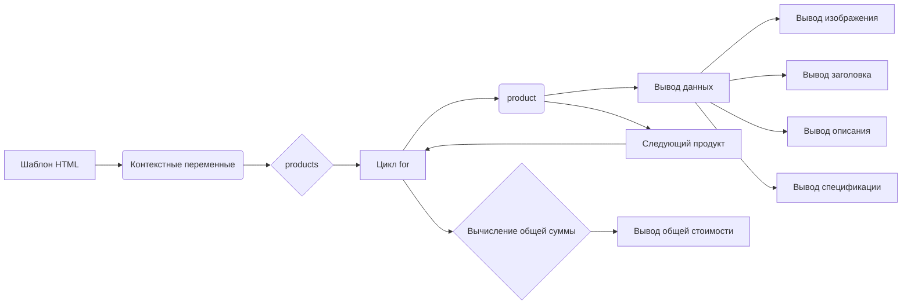

```MD
# Анализ кода шаблона HTML для генерации прайс-листа

## <input code>

```html
<!DOCTYPE html>
<html>

<head>
    <meta charset="UTF-8">
    <meta name="viewport" content="width=device-width, initial-scale=1.0">
    <title>{{ title }}</title>
    <style>
        body {
            background-color: #ffffff; /* Белый фон */
            color: #000000; /* Черный текст */
            font-family: 'Segoe UI', Tahoma, Geneva, Verdana, sans-serif;
            margin: 0;
            padding: 0;
        }
        h1 {
            text-align: center;
            margin-top: 50px;
            font-size: 36px;
        }
        .lead {
            text-align: center;
            font-size: 18px;
            margin: 10px 0;
        }
        .container {
            width: 90%;
            margin: 0 auto;
        }
        .row {
            display: flex;
            flex-wrap: wrap;
            justify-content: space-between;
        }
        .product-card {
            display: flex;
            align-items: center;
            background-color: #f8f9fa; /* Светлый фон карточек */
            border: 1px solid #dee2e6;
            border-radius: 8px;
            padding: 15px;
            margin: 15px 0;
            width: 100%;
            box-sizing: border-box;
        }
        .product-card img {
            width: 320px;
            height: 280px;
            object-fit: contain; /* Сохранение пропорций изображения */
            border-radius: 5px;
            background-color: white; /* Белый фон под изображением */
            margin-right: 15px; /* Отступ справа от изображения */
        }
        .product-info {
            flex: 1; /* Занимает оставшееся пространство */
        }
        .price-tag {
            background-color: #238636;
            color: white;
            padding: 5px 10px;
            border-radius: 5px;
            font-weight: bold;
        }
        .footer {
            text-align: center;
            margin-top: 30px;
            padding: 15px;
            border-top: 1px solid #dee2e6;
        }
    </style>
</head>

<body>
    <div class="container">
        <h1>{{ title }}</h1>
        <p class="lead">{{ description }}</p>

        <div class="row">
            \
            <div class="product-card">\
                \
                <div class="product-info">\
                    <h3>{{ product.product_title }}</h3>\
                    <p>{{ product.product_description }}</p>\
                    <p>{{ product.specification }}</p>\
                </div>\
            </div>\
            \
        </div>

        <div class="footer">
            <p>Общая стоимость: \
                <span class="price-tag">{{ price }} {{ currency }}</span>\
            </p>
        </div>
    </div>
</body>

</html>
```

## <algorithm>

(Блок-схема не подходит для такого кода, поскольку это шаблон HTML.  Блок-схема могла бы подойти для скрипта, обрабатывающего данные и генерирующего этот шаблон.)

## <mermaid>



## <explanation>

**Импорты:** Нет импортируемых библиотек или пакетов, так как это HTML шаблон.

**Классы:** Нет классов. Шаблон HTML использует CSS стили для форматирования элементов.

**Функции:** Нет функций. Шаблон использует Django теги для отображения данных.

**Переменные:**
* `title`: Строка, содержащая заголовок страницы.
* `description`: Строка, содержащая описание.
* `products`: Список объектов `product`.  Каждая запись в списке должна иметь атрибуты `image_local_saved_path`, `product_title`, `product_description`, `specification`.
* `price`: Число, содержащее общую стоимость.
* `currency`: Строка, содержащая валюту (например, "руб").

**Связь с другими частями проекта:**

Шаблон предполагает наличие переменных `title`, `description`, `products`, `price`, `currency` заполненных, вероятно, в какой-то другой части приложения (например, контроллере или виде Django). Эти данные передаются в шаблон, где происходит рендеринг HTML. 

**Возможные ошибки и улучшения:**

* **Недостающая валидация данных:**  Шаблон не выполняет проверки данных, поэтому если переменные имеют неподходящие типы или значения, могут возникнуть ошибки при рендеринге.
* **Ошибка при отсутствии данных:** Если `products` пустой, цикл `` не выполнится, что может привести к не отображению данных.  Нужно предусмотреть обработку такого случая.
* **Неудобство чтения:**  Можно улучшить читабельность, добавив более информативную документацию или комментарии.
* **Улучшение оформления:**  Можно добавить более продвинутую стилизацию с использованием Bootstrap или других фреймворков.

**В заключение:** данный HTML шаблон служит для представления прайс-листа.  Он использует Django шаблоны и предполагает получение данных из других частей приложения.  Валидация данных и обработка пустых списков (`products`) важны для надежного функционирования.