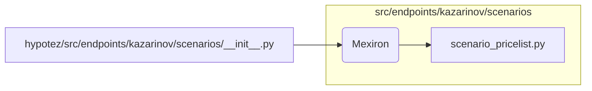

# <input code>

```python
## \file hypotez/src/endpoints/kazarinov/scenarios/__init__.py
# -*- coding: utf-8 -*-
#! venv/Scripts/python.exe
#! venv/bin/python/python3.12

"""
.. module: src.endpoints.kazarinov.scenarios 
	:platform: Windows, Unix
	:synopsis:

"""
MODE = 'dev'


from .scenario_pricelist import Mexiron
```

# <algorithm>

Этот код представляет собой модуль `__init__.py` для пакета `scenarios` в проекте `hypotez`.  По сути, он импортирует один класс (`Mexiron`) из подпапки `scenario_pricelist`.  Алгоритм очень прост: импорт класса.  Нет циклов, условных операторов или вызовов функций.

**Пример:**

```
+-----------------+
|    __init__.py   |
+-----------------+
|  MODE = 'dev'   |
+-----------------+
| from ... import |
+-----------------+
```

**Переменные:**

`MODE` хранит строку `'dev'` - вероятно, константа, определяющая режим работы приложения.

# <mermaid>



**Объяснение диаграммы:**

Диаграмма показывает импорт `Mexiron` из файла `scenario_pricelist.py`, который находится внутри пакета `scenarios`.  `scenario_pricelist.py` - это зависимость.  `__init__.py` это точка входа в пакет.


# <explanation>

**Импорты:**

* `from .scenario_pricelist import Mexiron`: Этот импорт подключает класс `Mexiron` из модуля `scenario_pricelist.py`, который находится в той же директории (`./scenario_pricelist.py`).  Символ `.` указывает на поиск в текущем пакете (`src.endpoints.kazarinov.scenarios`).  Этот импорт позволяет использовать класс `Mexiron` внутри модуля `__init__.py` и в других модулях этого пакета.

**Классы:**

* `Mexiron`:  Определен в файле `scenario_pricelist.py`.  Без предоставленного кода `scenario_pricelist.py` невозможно определить его точное функциональное назначение.  Но, судя по названию, он связан с ценами и сценариями (скорее всего, ценовыми сценариями).

**Функции:**

В этом модуле нет функций.

**Переменные:**

* `MODE = 'dev'`:  Переменная, хранящая строку, возможно, конфигурационная переменная, определяющая режим работы приложения (`dev`, `prod` и т.д.).

**Возможные ошибки или области для улучшений:**

* **Отсутствие документации:** Хотя `scenario_pricelist` документирован (используется `.. module`), в файле `__init__.py` нет документации, что усложняет понимание цели `MODE` без дополнительных данных.

**Цепочка взаимосвязей:**

Модуль `__init__.py` служит точкой входа в пакет `scenarios`, который, скорее всего, содержит различные сценарии для расчета или анализа.  Модуль `Mexiron` предоставляет логику для определенного сценария (ценообразования).  Следующим шагом для анализа было бы изучение кода `scenario_pricelist.py` для понимания его функциональности и взаимосвязи с другими частями проекта.  Без доступа к `scenario_pricelist.py` сложно представить полную картину.