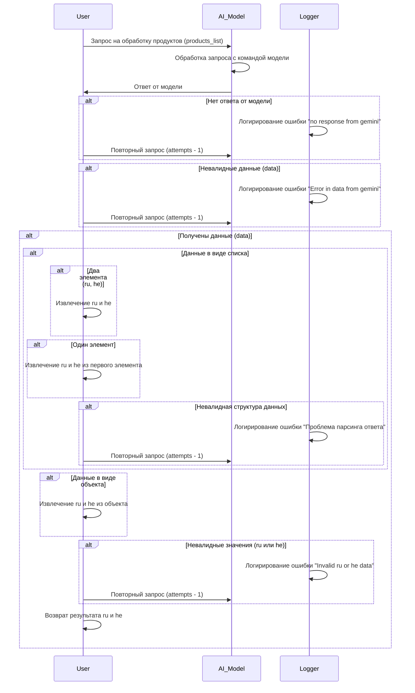

```MD
# Анализ кода (mermaid диаграмма)

## <input code>



## <algorithm>

Диаграмма описывает алгоритм обработки запроса на обработку списка продуктов (products_list) с помощью AI модели (например, Gemini).  Алгоритм включает в себя:

1. **Запрос:** Пользователь отправляет запрос на обработку списка продуктов в AI модель.
2. **Обработка (AI модель):** Модель обрабатывает запрос.
3. **Ответ:** Модель возвращает ответ.
4. **Обработка ответа:**
   - **Проверка на отсутствие ответа:** Если ответа нет, логируется ошибка "no response from gemini" и запрос повторяется (с уменьшением попыток).
   - **Проверка на невалидные данные:** Если полученные данные невалидны, логируется ошибка "Error in data from gemini" и запрос повторяется (с уменьшением попыток).
   - **Проверка типа данных:** Если данные получены:
     - **Список:** Проверяется структура списка:
       - Два элемента (ru, he): Извлекаются значения ru и he.
       - Один элемент: Извлекаются значения ru и he из первого элемента.
       - Невалидная структура: Логируется ошибка "Проблема парсинга ответа" и запрос повторяется (с уменьшением попыток).
     - **Объект:** Извлекаются значения ru и he из объекта.
     - **Невалидные значения (ru или he):** Логируется ошибка "Invalid ru or he data" и запрос повторяется (с уменьшением попыток).
   - **Возврат результата:** Если все проверки пройдены, возвращается результат (значения ru и he).

Примеры данных:

* **products_list:** Список продуктов для обработки.
* **Ответ модели (data):**  Это может быть список (с двумя элементами, с одним элементом или список с невалидной структурой), или объект.  
* **ru:** Значение для языка русский.
* **he:** Значение для языка иврит.


## <mermaid>

(mermaid код уже приведен выше)

## <explanation>

Этот код представляет собой описание алгоритма обработки запросов на обработку данных продуктов.  Он описывает взаимодействие между:

* **User (пользователь):**  Инициатор запроса.
* **AI_Model (AI модель):**  Сервис, обрабатывающий запрос и возвращающий результат.
* **Logger (логирование):**  Утилита для записи ошибок и событий.

**Импорты:**  Нет импортируемых модулей.  Это чистая диаграмма последовательности.

**Классы:**  Нет определенных классов.

**Функции:**  Нет определенных функций.

**Переменные:**  Используются переменные `products_list`, `attempts`, `data`, `ru`, `he`. Эти переменные не определены по типу,  но предполагаются в контексте пользовательских данных и результатов обработки.

**Возможные ошибки и улучшения:**

* Диаграмма не описывает *как* происходит выполнение запроса. Не хватает деталей о реализации. Не показана структура данных `products_list` и формата ответа AI модели.
* Не показано количество попыток `attempts`.
* Не описано, как обрабатываются ошибки в рамках AI модели.
* Не описаны возвращаемые значения (например, возвращаемый статус обработки).
* Не указано, как осуществляется логирование ошибок.
* Не показана логика построения повторных запросов.

**Взаимосвязи с другими частями проекта:**

Диаграмма показывает взаимодействие с AI моделью и сервисом логирования.  Необходимо понимать, как эти компоненты интегрированы в основной проект (`hypotez/src`).