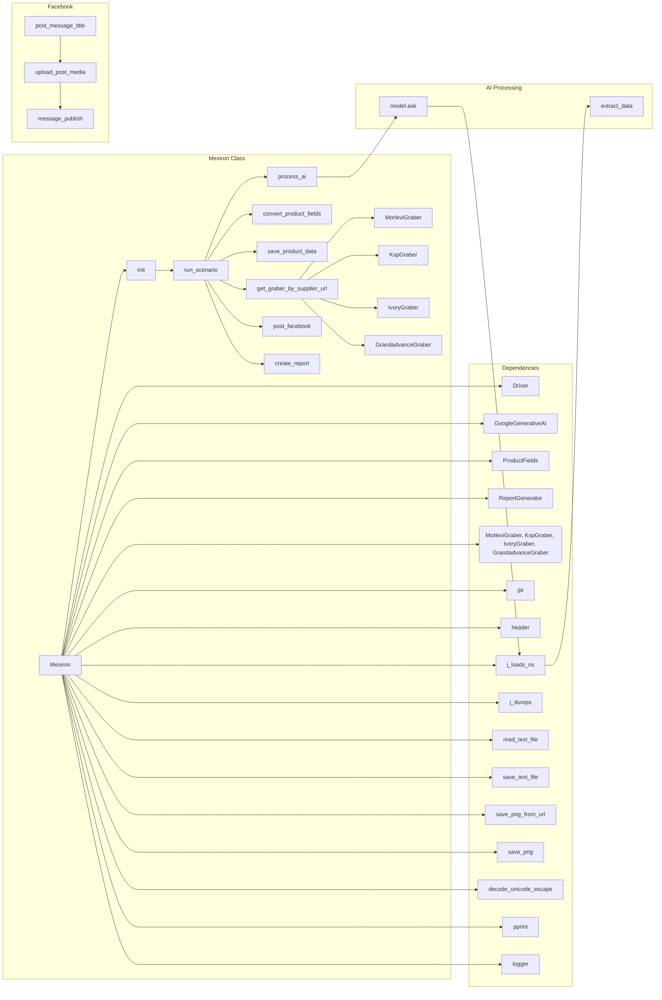

```MD
# Анализ кода файла `hypotez/src/endpoints/kazarinov/scenarios/scenario_pricelist.py`

## <input code>

```python
# ... (код файла)
```

## <algorithm>

**Блок-схема алгоритма:**

```mermaid
graph TD
    A[Инициализация Mexiron] --> B{Загрузка конфигурации};
    B -- Успешно -- C[Проверка пути экспорта];
    B -- Ошибка -- D[Логирование ошибки и возврат];
    C -- Успешно -- E[Загрузка моделей и API ключа];
    E -- Успешно -- F[Получение списка URL];
    F -- Пустой список -- G[Логирование и возврат False];
    F -- Не пустой список -- H[Проход по URL];
    H -- Успешно -- I[Парсинг данных];
    I -- Успешно -- J[Сохранение данных в файл];
    I -- Ошибка -- K[Логирование ошибки и переход к следующему URL];
    J -- Успешно -- L[Обработка данных с помощью AI];
    L -- Успешно -- M[Сохранение результатов в he.json и ru.json];
    M -- Ошибка -- N[Логирование ошибки и возврат];
    L -- Ошибка -- O[Обработка ошибки и возврат];
    M -- Успешно -- P[Создание отчета (html и pdf)];
    P -- Успешно -- Q[Публикация в Facebook (he и ru)];
    Q -- Успешно -- R[Возврат True];
    Q -- Ошибка -- S[Логирование ошибки и возврат];
    N -- Ошибка -- S;
    O -- Ошибка -- S;
    K -- Успешно -- H;
    H -- Конец списка -- T[Возврат True];
```

**Пример:**

Если `urls` содержит `['url1', 'url2']`, алгоритм пройдет по каждому URL, обработает данные, сохранит их и т.д.  В случае ошибок на каком-то из шагов, будет залогировано сообщение об ошибке и выполнение перейдет к следующему URL.


## <mermaid>



**Объяснение зависимостей:**

Код использует множество модулей из пакета `src`, такие как `gs`, `Driver`, `GoogleGenerativeAI`, `ProductFields`, `ReportGenerator`, различные граберы для разных поставщиков (MorleviGraber, KspGraber, etc.), утилиты для работы с файлами (`read_text_file`, `save_text_file`, `j_loads_ns`, `j_dumps`, etc.), а также библиотеку `telegram` для интеграции с Telegram, и др.


## <explanation>

**Импорты:**

- `asyncio`:  Для асинхронного выполнения задач.
- `random`, `shutil`, `pathlib`, `typing`, `types`, `dataclasses`: Стандартные библиотеки Python для различных целей.
- `header`: Возможно, файл заголовков (header.py) для проекта.
- `gs`:  По видимому, модуль `gs` (global-settings?) предоставляет доступ к глобальным настройкам, путям к файлам и др.
- `ProductFields`: Класс, вероятно, для хранения данных о продуктах, полученных из парсеров.
- `Driver`, `GoogleGenerativeAI`:  Классы для управления браузером и доступом к API модели Gemini.
- `post_message_title`, `upload_post_media`, `message_publish`: Функции из модуля `advertisement.facebook` для публикаций в Facebook.
- `MorleviGraber`, `KspGraber`, `IvoryGraber`, `GrandadvanceGraber`:  Классы для парсинга данных из разных поставщиков.
- `ReportGenerator`:  Класс для генерации отчетов в HTML и PDF.
- `telegram`, `CallbackContext`, `Update`: Библиотека Telegram для работы с ботами.
- `j_loads_ns`, `j_dumps`:  Утилиты для работы с JSON.
- `unicode`, `printer`: Функции для работы с Unicode и вывода данных.
- `logger`: Модуль для ведения логирования.

**Классы:**

- `Mexiron`:  Основной класс для обработки данных о товарах. Содержит:
    - `driver`: Экземпляр класса `Driver` для управления браузером.
    - `export_path`: Путь для сохранения результатов.
    - `mexiron_name`: Имя текущей обработки.
    - `products_list`: Список обработанных продуктов (данные о товарах).
    - `model`: Экземпляр класса `GoogleGenerativeAI`.
    - `config`: Настройки, загруженные из файла.
    - `__init__`: Инициализация объекта с настройками и загрузкой данных.
    - `run_scenario`: Метод для запуска сценария.
    - `get_graber_by_supplier_url`: Метод для выбора грабера в зависимости от URL поставщика.
    - `convert_product_fields`: Преобразование данных в формат, понятный модели.
    - `save_product_data`: Сохранение данных о продуктах в файлы JSON.
    - `process_ai`: Обработка данных с помощью модели Gemini.
    - `post_facebook`: Публикация результатов в Facebook.
    - `create_report`: Генерация отчета.

**Функции:**

- `process_ai`: Обрабатывает данные с помощью модели Gemini, принимает на вход список продуктов и возвращает обработанные данные на he и ru.
- `get_graber_by_supplier_url`: Выбирает нужный грабер в зависимости от URL.
- `convert_product_fields`: Преобразует данные в подходящий для модели формат.
- `save_product_data`: Сохраняет данные продукта в JSON-файл.
- `post_facebook`: Публикует данные в Facebook.
- `create_report`: Создает отчеты в HTML и PDF.

**Переменные:**

- `MODE`: Переменная, содержащая режим работы (например, 'dev').
- `gs.path`, `gs.now`, `gs.credentials`: Вероятно, глобальные переменные, содержащие пути, текущую дату и учетные данные соответственно.

**Возможные ошибки и улучшения:**

- **Обработка ошибок:**  Код содержит много проверок `if not ...`, но не всегда явно обрабатывает ситуации с отсутствием данных.  Нужно более четко определять, какие ошибки обрабатываются, и как реагировать на них.
- **Перегрузка `process_ai`:** Функция `process_ai`  написана с повторным вызовом `self.process_ai` при возникновении ошибок.  Это может быть не оптимально при частых ошибках модели Gemini.  Стоит рассмотреть более устойчивые методы решения проблем с моделью, например, ограничение количества попыток.
- **Зависимости:** В коде явно указаны URL и парсеры для разных поставщиков.  Улучшение - использование конфигурационного файла для управления этими зависимостями.
- **Ошибки в `j_dumps`:** Обработка ошибок при сохранении JSON-данных в файлы могла бы быть более информативной.  Стоит добавлять дополнительную информацию об ошибке в лог-файл, включая путь к файлу.
- **Обработка данных от модели:** Улучшить способ получения данных от модели. Сейчас предполагается, что она возвращает JSON, но лучше предусмотреть обработку различных вариантов ответа от модели.

**Взаимосвязь с другими частями проекта:**

- Модуль `scenario_pricelist` тесно связан с модулями для работы с поставщиками (например, `graber` из `src.suppliers`),  моделями AI (`gemini` из `src.ai`),  с Facebook рекламой, генерацией отчетов.