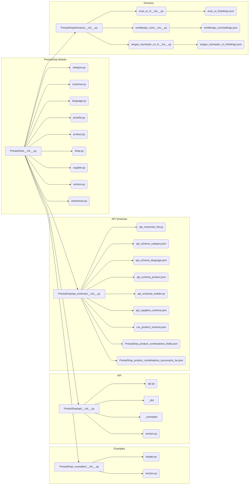

# Анализ структуры кода PrestaShop

## <input code>

```
### Структура каталогов

1. **Основной каталог (`PrestaShop`)**:
    - `__init__.py`: Инициализирует модуль.
    - `category.py`: Управляет функциональностью, связанной с категориями.
    - `customer.py`: Управляет функциональностью, связанной с клиентами.
    - `language.py`: Управляет функциональностью, связанной с языками.
    - `pricelist.py`: Управляет функциональностью, связанной со списками цен.
    - `product.py`: Управляет функциональностью, связанной с продуктами.
    - `shop.py`: Управляет функциональностью, связанной с магазинами.
    - `supplier.py`: Управляет функциональностью, связанной с поставщиками.
    - `version.py`: Управляет информацией о версии модуля.
    - `warehouse.py`: Управляет функциональностью, связанной с складами.

2. **Каталог примеров (`_examples`)**:
    - Содержит примеры скриптов и файлы документации для эффективного использования модуля.
    - `__init__.py`: Инициализирует модуль примеров.
    - `header.py`: Пример скрипта заголовка.
    - `version.py`: Пример скрипта версии.

3. **Каталог API (`api`)**:
    - Содержит файлы, связанные с API PrestaShop.
    - `__init__.py`: Инициализирует модуль API.
    - `_dot`: Содержит файлы DOT для графических представлений.
    - `_examples`: Предоставляет примеры скриптов, демонстрирующие использование API.
    - `api.py`: Содержит основную логику взаимодействия с API PrestaShop.
    - `version.py`: Управляет информацией о версии модуля API.

4. **Каталог схем API (`api_schemas`)**:
    - Содержит файлы JSON-схем и скрипты для управления схемами API.
    - `__init__.py`: Инициализирует модуль схем API.
    - `api_resourses_list.py`: Список доступных ресурсов API.
    - `api_schema_category.json`: JSON-схема для категорий.
    - `api_schema_language.json`: JSON-схема для языков.
    - `api_schema_product.json`: JSON-схема для продуктов.
    - `api_schemas_buider.py`: Скрипт для построения схем API.
    - `api_suppliers_schema.json`: JSON-схема для поставщиков.
    - `csv_product_schema.json`: CSV-схема для продуктов.
    - `PrestaShop_product_combinations_fields.json`: JSON-файл для полей комбинаций продуктов.
    - `PrestaShop_product_combinations_sysnonyms_he.json`: JSON-файл для синонимов комбинаций продуктов на иврите.

5. **Каталог доменов (`domains`)**:
    - Содержит подкаталоги для разных доменов, каждый со своими настройками и конфигурациями.
    - `__init__.py`: Инициализирует модуль доменов.
    - `ecat_co_il`: Настройки для `ecat.co.il`.
        - `__init__.py`: Инициализирует домен `ecat.co.il`.
        - `settings.json`: JSON-файл с настройками для `ecat.co.il`.
    - ... (Аналогично для других доменов)


### Ключевые компоненты

... (Описание функциональности компонентов)


### Пример использования

```python
from PrestaShop.product import Product

# Инициализация продукта
product = Product()

# Пример операции с продуктом
product_data = product.get_product_data(product_id="12345")

print(product_data)
```


### Документация

... (Описание документации)
```

## <algorithm>

(Здесь должна быть блок-схема, описывающая алгоритм работы.  В данном случае это просто описание структуры, поэтому блок-схема будет невозможна.)

## <mermaid>



## <explanation>

**Импорты:**  В данном коде нет явных импортов, но описывается структура файлов и папок, предполагающая импорт классов и функций из различных модулей PrestaShop,  например, `from PrestaShop.product import Product`.  Взаимодействие между модулями (например, `PrestaShop` и `api`)  осуществляется через импорты, что подразумевается.

**Классы:**  Описаны классы, например, `Product`, в `product.py`, которые представляют собой абстракции для работы с продуктами PrestaShop.  Эти классы, вероятно, содержат атрибуты (например, `product_id`, `name`) и методы (например, `get_product_data`), для взаимодействия с API.  Схема предполагает наличие классов в каждом из модулей, для управления соответствующими данными.

**Функции:**  Описание методов (функций внутри классов) показывает, что, например,  `Product.get_product_data` принимает `product_id` и возвращает данные продукта.  Функциональность таких методов, как `get_product_data`, предполагается реализованной в `api.py`,  поскольку там описана основная логика взаимодействия с API PrestaShop.

**Переменные:**  Примеры использования переменных, таких как `product_id`, подразумевают, что они могут хранить идентификаторы продуктов или другие данные.

**Возможные ошибки и улучшения:**

* **Недостаток деталей:**  Отсутствуют реализации классов и функций.  Нужно просмотреть код исходных файлов, чтобы получить точное понимание.
* **Отсутствие обработки ошибок:**  В описании отсутствуют механизмы обработки ошибок (например, при некорректных запросах к API).
* **Улучшение структуры:** Возможно, стоит добавить документацию (docstrings) к классам и функциям для более четкого объяснения их назначения.

**Цепочка взаимосвязей:** Модуль `PrestaShop` использует `api` для взаимодействия с PrestaShop API. Модуль `api_schemas` определяет форматы для данных, возвращаемых API.  Каждый домен (`ecat_co_il`, `emildesign_com`)  наверняка использует функциональность модулей `PrestaShop` для настройки и работы со своими данными.


**Важно:** Данный анализ основан на предоставленном описании структуры проекта, а не на самом коде.  Для более точного анализа необходимы исходные файлы.