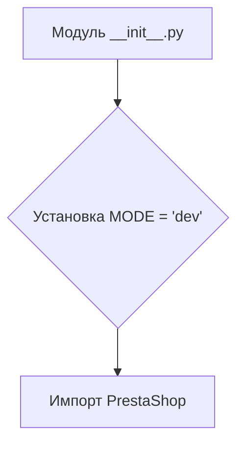
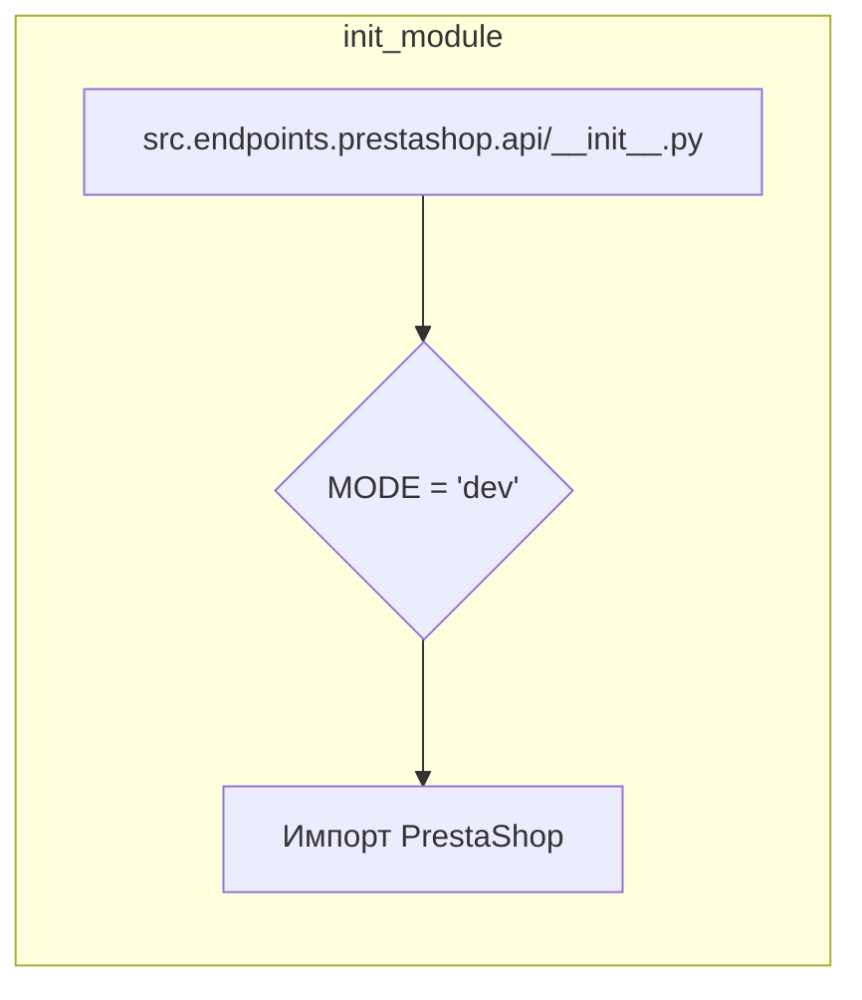

```MD
# Анализ кода hypotez/src/endpoints/prestashop/api/__init__.py

## <input code>

```python
## \file hypotez/src/endpoints/prestashop/api/__init__.py
# -*- coding: utf-8 -*-
#! venv/Scripts/python.exe
#! venv/bin/python/python3.12

"""
.. module: src.endpoints.prestashop.api 
	:platform: Windows, Unix
	:synopsis:

"""
MODE = 'dev'

from .api import PrestaShop
```

## <algorithm>

Код представляет собой инициализацию модуля `src.endpoints.prestashop.api`.  Алгоритм крайне прост:

1. **Установка константы MODE:** Назначает строковое значение 'dev' переменной MODE. Это, скорее всего, режим работы приложения (development, production и т.д.).

2. **Импорт класса PrestaShop:** Импортирует класс `PrestaShop` из подпапки `api` текущего модуля.


**Пример:**

При импорте модуля `src.endpoints.prestashop.api` в другом месте приложения, эта константа и класс будут доступны.




## <mermaid>



## <explanation>

**Импорты:**

- `from .api import PrestaShop`:  Импортирует класс `PrestaShop` из модуля `api` внутри текущей папки (`endpoints/prestashop/api`).  Таким образом, код может использовать класс `PrestaShop` без полного пути.  Эта строка предполагает, что в подпапке `api` находится файл `api.py` содержащий определение класса `PrestaShop`.

**Классы:**

- `PrestaShop`:  Этот класс не определен в представленном фрагменте кода. Его определение находится в файле `api.py` (или другом файле) в подпапке `api`.  Для понимания его функциональности необходим код этого файла.

**Функции:**

- Нет функций в данном коде.

**Переменные:**

- `MODE`: Строковая переменная, содержащая значение 'dev'.  Вероятно, используется для настройки поведения приложения (например, для включения или выключения определенных функций в разных средах).

**Возможные ошибки или области для улучшений:**

- Недостаточно информации для полной оценки. Необходимо видеть определение класса `PrestaShop` для понимания его назначения и работы.
- Комментарии могли бы быть более подробными, например, указав, что такое `MODE`.


**Взаимосвязи с другими частями проекта:**

- Фрагмент кода импортирует класс `PrestaShop`.  Это указывает на то, что класс `PrestaShop` скорее всего определяет функции и методы, которые будут использоваться для взаимодействия с API Престашоп.  Подключение к API и обработка данных (получение, отправка) вероятно происходят в методах этого класса.
- Далее,  для получения более полной картины, нужно посмотреть какие функции и методы класса `PrestaShop` используются, что позволяет понять функциональность всей системы.
- Для дальнейшего анализа необходимо рассмотреть файлы `src/endpoints/prestashop/api/api.py`, а также связанные файлы, которые импортируются в этом модуле и взаимодействуют с ним.