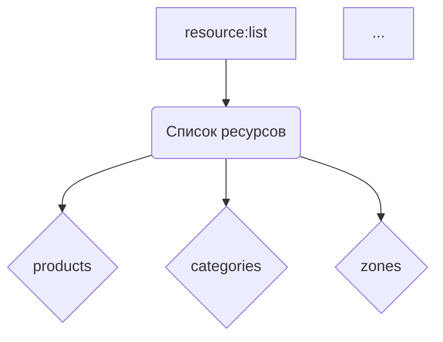

# <input code>

```python
## \file hypotez/src/endpoints/prestashop/api_schemas/api_resourses_list.py
# -*- coding: utf-8 -*-\
#! venv/Scripts/python.exe
#! venv/bin/python/python3.12

"""
.. module: src.endpoints.prestashop.api_schemas 
	:platform: Windows, Unix
	:synopsis: Список всех доступных ресурсов для API вызовов

"""
MODE = 'dev'

resource:list = [
    'products', 
    'categories', 
    'attachments', 
    'addresses',  
    'carriers', 
    'cart_rules', 
    'carts',
    'countries',
    'content_management_system',
    'currencies', 
    'customer_messages', 
    'customer_threads',
    'customers',
    'customizations',
    'deliveries',
    'employees', 
    'groups', 
    'guests',
    'image_types',
    'customizations',
    'images',
    'languages', 
    'manufacturers', 
    'messages',
    'order_carriers',
    'order_cart_rules',
    'order_details',
    'order_histories', 
    'order_invoices', 
    'order_payments',
    'order_slip',
    'order_states',
    'orders',
    'price_ranges',
    'product_customization_fields',
    'product_feature_values',
    'product_features', 
    'product_option_values', 
    'product_options',
    'product_suppliers',
    'products',
    'search',
    'shop_groups',
    'shop_urls',
    'shops', 
    'specific_price_rules', 
    'specific_prices',
    'states',
    'stock_availables',
    'stock_movement_reasons',
    'stock_movements',
    'stocks',
    'stores',
    'suppliers', 
    'supply_order_details', 
    'supply_order_receipt_histories',
    'supply_order_states',
    'supply_orders',
    'tags',
    'tax_rule_groups',
    'tax_rules',
    'taxes',
    'translated_configurations',
    'warehouse_product_locations', 
    'warehouses', 
    'weight_ranges',
    'zones',
    ]
```

# <algorithm>

Этот код определяет список строк, представляющих имена ресурсов API.

1. **Инициализация**: Переменная `resource` инициализируется как список строк.
2. **Заполнение списка**:  В список `resource` добавляются строки, представляющие названия доступных API ресурсов.

**Пример данных**:

```
['products', 'categories', ...] 
```

**Нет циклов, условий или вызовов функций**, поэтому нет сложной логики.


# <mermaid>



# <explanation>

Этот файл `api_resourses_list.py` определяет константный список строк, содержащих имена ресурсов для API PrestaShop.


## Импорты

Нет импортов в этом файле.  Файл определяет константные данные.


## Классы

Нет классов в данном коде.


## Функции

Нет функций в данном коде.


## Переменные

- `resource:list`:  Список строк.  Содержит имена доступных API-ресурсов (products, categories и т.д.).  Тип списка является типизированным, `list`, в соответствии с PEP 484, что указывает Python интерпретатору более точный тип.


## Возможные ошибки и улучшения

- **Недостаток документирования**: Отсутствие документации по назначению переменной `MODE` затрудняет понимание её роли в проекте. 
- **Необходимость лучшей организации**: Если список ресурсов сильно вырастет, рекомендуется использовать более структурированный подход (например, словарь или список словарей), чтобы улучшить читаемость и возможность добавления/изменения данных.
- **Дополнительная типизация**: Вместо `resource:list`, можно использовать стандартный `List[str]` из `typing` для большей совместимости.

**Цепочка взаимосвязей**:

Этот файл является частью проекта `hypotez`, вероятно, используется для определения доступных API-эндопоинтов для платформы PrestaShop.  Он будет использоваться другими частями проекта для формирования запросов к API и обработки ответов.  Например, в файлах, отвечающих за обработку запросов, этот список будет использоваться для проверки валидности запрошенного ресурса.
```
hypotez/src/endpoints/prestashop/api_schemas/api_resourses_list.py --> (контроллеры API Престашоп)