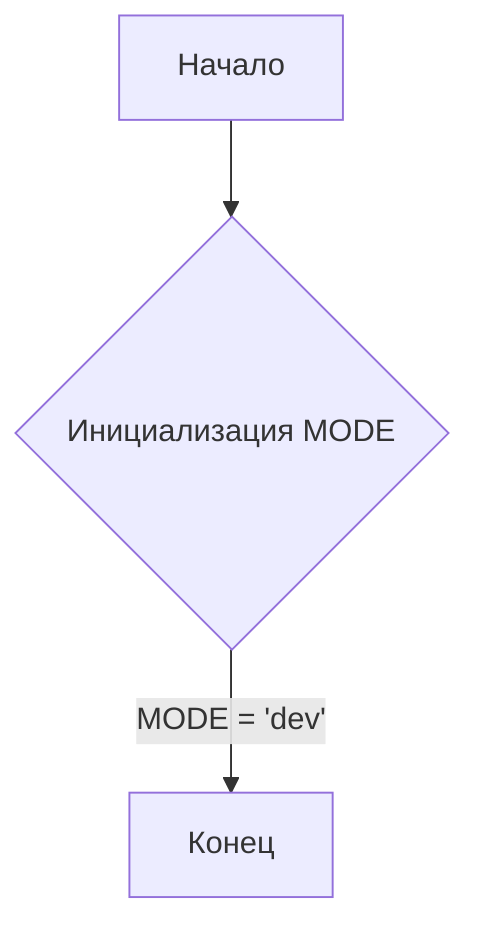
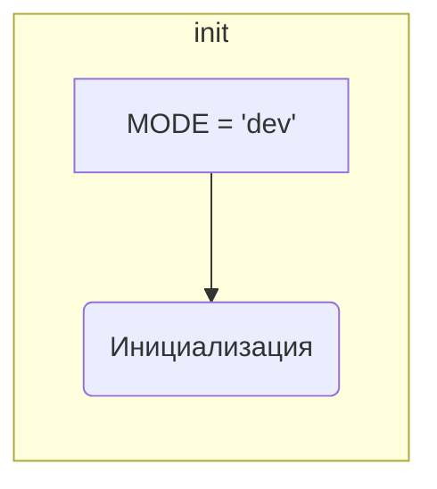

```MD
# Анализ файла hypotez/src/endpoints/prestashop/domains/__init__.py

1. **<input code>**

```python
## \file hypotez/src/endpoints/prestashop/domains/__init__.py
# -*- coding: utf-8 -*-\
#! venv/Scripts/python.exe
#! venv/bin/python/python3.12

"""
.. module: src.endpoints.prestashop.domains 
	:platform: Windows, Unix
	:synopsis:

"""
MODE = 'dev'

"""
	:platform: Windows, Unix
	:synopsis:

"""


"""
	:platform: Windows, Unix
	:synopsis:

"""


"""
  :platform: Windows, Unix

"""
"""
  :platform: Windows, Unix
  :platform: Windows, Unix
  :synopsis:
"""MODE = 'dev'
  
""" module: src.endpoints.prestashop.domains """
```

2. **<algorithm>**

Этот файл, скорее всего, служит для инициализации модуля `domains` в рамках подсистемы обработки данных PrestaShop. Алгоритм в данном случае тривиальный: определение константы `MODE`.  Поскольку содержатся только комментарии и константа,  блок-схема будет очень простой.



Примеры:  Этот код не содержит вычислений или операций, он просто устанавливает значение переменной.


3. **<mermaid>**




4. **<explanation>**

* **Импорты:**  В файле отсутствуют импорты.  Это означает, что этот файл, скорее всего, не содержит логики, основанной на других модулях.

* **Классы:** Нет ни одного класса.

* **Функции:** Нет функций.

* **Переменные:** Единственная переменная `MODE` определена с типом `str`. Ее значение установлено в 'dev'.  В данном контексте `MODE` скорее всего используется для обозначения режима работы.

* **Возможные ошибки или области для улучшений:** Файл слишком многокомментирован, и большая часть комментариев не информативна.  Константа `MODE` с таким же именем, но в другом месте в коде, скорее всего, приведет к проблеме. Необходимо использовать единую константу во всём проекте.  Также, отсутствуют любые проверки.


* **Взаимосвязи с другими частями проекта:**  Этот файл, как инициализатор, скорее всего, используется другими частями `hypotez` для получения конфигурации.  Возможно, он устанавливает глобальную настройку для обработки данных PrestaShop.  Без контекста всего проекта трудно оценить точную роль файла, но, вероятно, он подключается модулями/скриптами, работающими с Престашоп.  Для определения точного местоположения в проекте нужны другие связанные файлы, например файлы с импортами этого модуля или файлы, которые обращаются к `MODE`.