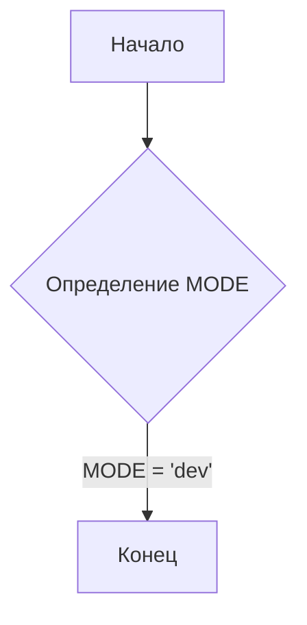
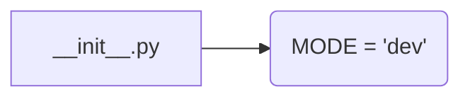

```MD
1. **<input code>**:

```python
## \file hypotez/src/endpoints/prestashop/domains/emildesign_com/__init__.py
# -*- coding: utf-8 -*-
#! venv/Scripts/python.exe
#! venv/bin/python/python3.12

"""
.. module: src.endpoints.prestashop.domains.emildesign_com 
	:platform: Windows, Unix
	:synopsis:

"""
MODE = 'dev'

"""
	:platform: Windows, Unix
	:synopsis:

"""


"""
	:platform: Windows, Unix
	:synopsis:

"""


"""
  :platform: Windows, Unix

"""
"""
  :platform: Windows, Unix
  :platform: Windows, Unix
  :synopsis:
"""MODE = 'dev'
  
""" module: src.endpoints.prestashop.domains.emildesign_com """


"""    
"""
```

2. **<algorithm>**:

Этот файл, `__init__.py`, является инициализатором пакета. Алгоритм работы здесь тривиален – он просто определяет константу `MODE` со значением `'dev'`.  Пошаговая блок-схема:



Пример:  Код устанавливает режим разработки (`MODE = 'dev'`). Данные не передаются между другими компонентами в этом файле.


3. **<mermaid>**:



В данном случае, взаимосвязь очень простая: файл `__init__.py` определяет переменную `MODE`.


4. **<explanation>**:

* **Импорты**: Нет импортов. Этот файл является инициализатором, и импорты будут определены в других файлах пакета `hypotez/src/endpoints/prestashop/domains/emildesign_com`.

* **Классы**: Нет классов.

* **Функции**: Нет функций.

* **Переменные**:  `MODE`: Строковая переменная, которая, скорее всего, используется в других частях кодовой базы для определения режима работы (например, 'dev', 'prod').  Тип данных – строка.  Использование: этот модуль определяет константу `MODE`, которая, вероятно, используется в других частях приложения для настройки поведения.

* **Возможные ошибки или области для улучшений**:
    * **Недостаток документации**: Комментарии `"""Docstring"""`  почти бесполезны.  Необходимо указать, как эта константа используется в других частях приложения.
    * **Избыточность**: Повторение строки `MODE = 'dev'` несколько раз в комментариях не нужно и затрудняет чтение.
    * **Неясно назначение**: Нет явного объяснения *почему* `MODE` имеет значение `'dev'`.  Важно документировать, когда и как используется эта константа.

* **Цепочка взаимосвязей**:  Файл `__init__.py` определяет переменную `MODE` для пакета.  Другие файлы в папке `hypotez/src/endpoints/prestashop/domains/emildesign_com` могут импортировать и использовать эту константу для выбора поведения.  Например, при настройке подключения к базе данных, использовании разных конфигураций тестов, или при иных вариациях работы.  Без контекста других файлов определить точную взаимосвязь невозможно.

**Вывод**: Файл `__init__.py`  является простым инициализатором, который определяет глобальную переменную `MODE`.   Недостаточно документации и некоторые дублирования снижают читабельность и понимание его роли в проекте.