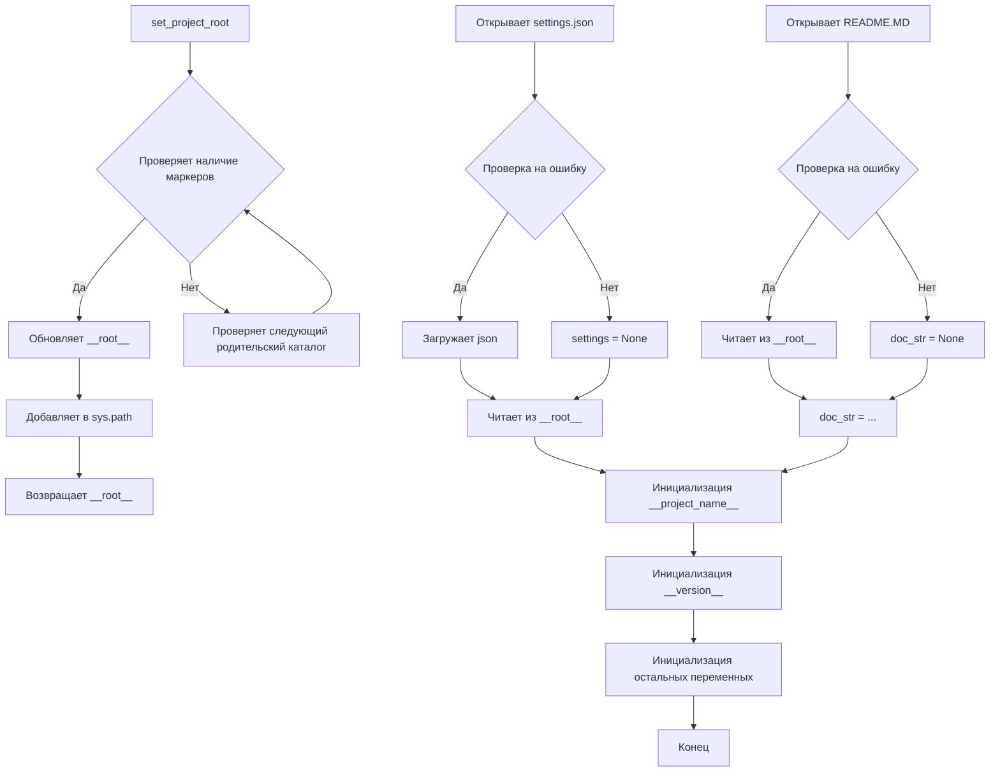

# <input code>

```python
## \file hypotez/src/logger/header.py
# -*- coding: utf-8 -*-
#! venv/Scripts/python.exe
#! venv/bin/python/python3.12

"""
module: src.logger 
	:platform: Windows, Unix
	:synopsis: Модуль определяющий корневой путь к проекту. Все импорты строятся относительно этого пути.
    :TODO: В дальнейшем перенести в системную переменную"""
MODE = 'dev'

import sys
import json
from packaging.version import Version

from pathlib import Path
def set_project_root(marker_files=('pyproject.toml', 'requirements.txt', '.git')) -> Path:
    """
    Finds the root directory of the project starting from the current file's directory,
    searching upwards and stopping at the first directory containing any of the marker files.

    Args:
        marker_files (tuple): Filenames or directory names to identify the project root.
    
    Returns:
        Path: Path to the root directory if found, otherwise the directory where the script is located.
    """
    __root__:Path
    current_path:Path = Path(__file__).resolve().parent
    __root__ = current_path
    for parent in [current_path] + list(current_path.parents):
        if any((parent / marker).exists() for marker in marker_files):
            __root__ = parent
            break
    if __root__ not in sys.path:
        sys.path.insert(0, str(__root__))
    return __root__


# Get the root directory of the project
__root__ = set_project_root()
"""__root__ (Path): Path to the root directory of the project"""

from src import gs

settings:dict = None
try:
    with open(gs.path.root / 'src' /  'settings.json', 'r') as settings_file:
        settings = json.load(settings_file)
except (FileNotFoundError, json.JSONDecodeError):
    ...

doc_str:str = None
try:
    with open(gs.path.root / 'src' /  'README.MD', 'r') as settings_file:
        doc_str = settings_file.read()
except (FileNotFoundError, json.JSONDecodeError):
    ...


__project_name__ = settings.get("project_name", 'hypotez') if settings  else 'hypotez'
__version__: str = settings.get("version", '')  if settings  else ''
__doc__: str = doc_str if doc_str else ''
__details__: str = ''
__author__: str = settings.get("author", '')  if settings  else ''
__copyright__: str = settings.get("copyrihgnt", '')  if settings  else ''
__cofee__: str = settings.get("cofee", "Treat the developer to a cup of coffee for boosting enthusiasm in development: https://boosty.to/hypo69")  if settings  else "Treat the developer to a cup of coffee for boosting enthusiasm in development: https://boosty.to/hypo69"
```

# <algorithm>

1. **`set_project_root`:**
    * Получает текущий путь к файлу (`__file__`).
    * Инициализирует `__root__` этим путем.
    * Проходит по родительским каталогам, начиная с текущего.
    * Для каждого родительского каталога проверяет существование файлов/папок из `marker_files`.
    * Если один из файлов/папок найден, `__root__` обновляется и цикл прерывается.
    * Добавляет найденный корневой каталог в `sys.path`.
    * Возвращает найденный корневой каталог.

**Пример:** Если `__file__` находится в `hypotez/src/logger/header.py`, и `pyproject.toml` находится в `hypotez`, то `__root__` будет установлен в `hypotez`.

2. **Получение данных из `settings.json`:**
   * Используется `gs.path.root`, вероятно, представляющий путь к корню проекта.
   * Открывает `settings.json` в корне проекта и пытается загрузить JSON-данные.
   * Если файл не найден или данные не валидны, `settings` остается `None`.
   
**Пример:** Если `settings.json` находится в `hypotez/src/settings.json` и содержит данные, `settings` будет содержать эти данные.

3. **Получение `README.MD`:**
   * Похожая логика, что и с `settings.json`, но пытается получить строку из файла `README.MD`.


4. **Инициализация переменных проекта:**
   * Использует `settings.get` для безопасного извлечения значений из `settings`.
   * Если `settings` равно `None`, используется значение по умолчанию.
   * Устанавливает значения переменных `__project_name__`, `__version__`, `__doc__`, `__author__`, `__copyright__`, `__coffee__` на основе полученных данных.

**Пример:** Если `settings` содержит `"project_name": "MyProject"` и `"version": "1.0.0"`, то `__project_name__` будет `MyProject`, а `__version__` будет `1.0.0`.

# <mermaid>



**Подключаемые зависимости:**

* `pathlib`: Для работы с путями к файлам.
* `json`: Для работы с JSON-файлами.
* `packaging.version`: Для работы с версиями.
* `sys`: Для работы со списком модулей.

Зависимость `gs` предполагает, что это определенный модуль в проекте (`src.gs`).  Без понимания этого модуля сложно проследить всю цепочку взаимосвязей.  Необходимо понять, что делает `gs.path.root`.

# <explanation>

* **Импорты:**
    * `sys`: Для доступа к системным переменным, в частности `sys.path`.  Это важно, чтобы импортировать модули, находящиеся вне стандартной папки проекта.
    * `json`: Для работы с JSON-данными.
    * `packaging.version`: Для более точной работы с версиями пакетов.
    * `pathlib`: Модуль для работы с путями к файлам.  Используется для получения и обработки пути к файлам.
* **Классы:** Нет классов в этом коде.
* **Функции:**
    * `set_project_root(marker_files)`:  Функция находит корневой каталог проекта, начиная с текущего файла и ищет файлы/каталоги, указанные в `marker_files` (например, `pyproject.toml`, `requirements.txt`, `.git`).  Она важна, поскольку позволяет получить корневой путь к проекту независимо от того, где в иерархии проекта находится код. Возвращает Path к корневому каталогу.
* **Переменные:**
    * `__root__`: Папка root проекта, результат работы `set_project_root()`.
    * `settings`: Словарь, содержащий данные из `settings.json`.
    * `doc_str`: Строка с содержимым `README.MD`.
    * `__project_name__`, `__version__`, `__doc__`, `__author__`, `__copyright__`, `__cofee__`: Переменные, содержащие метаданные проекта, полученные из `settings.json`.
* **Возможные ошибки/улучшения:**
    * **Обработка ошибок:**  Используются `try...except` блоки для обработки `FileNotFoundError` и `json.JSONDecodeError`. Это правильно, но можно улучшить, добавив более информативные сообщения об ошибках.
    * **`gs.path.root`:** Непонятно, откуда берется `gs.path.root`.  Это важный компонент, который неявно используется для построения пути к `settings.json` и `README.MD`.  Для лучшей читаемости и поддержки кода, необходимо уточнить, что такое `gs.path.root`. В идеале `gs.path.root` должен быть определен ранее в модуле `gs` или быть доступным через определенное интерфейс.


**Цепочка взаимосвязей:**

`logger/header.py` устанавливает путь к корню проекта (`__root__`) и использует его для доступа к другим файлам проекта (например, `settings.json` и `README.MD`).  Эти файлы могут содержать информацию о проекте, которая используется в других частях проекта.  Для более глубокого анализа нужна информация о том, как `logger/header.py` взаимодействует с другими частями кода, особенно с модулем `gs`.