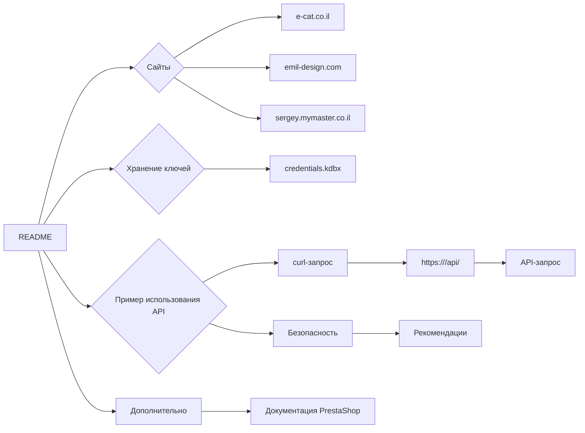

```MD
# Управление сайтами на PrestaShop

## <input code>

```
# Управление сайтами на PrestaShop

Данный `README` файл описывает структуру и способ работы с сайтами на платформе PrestaShop, а также хранение и использование ключей API.

## Сайты

Ваши сайты, работающие на PrestaShop:
1. [e-cat.co.il](https://e-cat.co.il)
2. [emil-design.com](https://emil-design.com)
3. [sergey.mymaster.co.il](https://sergey.mymaster.co.il)

Каждый из этих сайтов использует API для взаимодействия с различными параметрами и функциями.

## Хранение ключей API

Ключи API для каждого сайта хранятся в файле `credentials.kdbx`. Этот файл является защищенной базой данных паролей и содержит следующие данные для каждого сайта:
- URL сайта
- Ключ API
- Дополнительные метаданные (если необходимо)

Для работы с ключами из файла используйте менеджер паролей, поддерживающий формат `.kdbx`, например, [KeePass](https://keepass.info/) или [KeePassXC](https://keepassxc.org/).

## Пример использования API

Чтобы подключиться к API одного из сайтов, следуйте следующему шаблону:

### Запрос данных через API

**Шаблон API-запроса:**
```bash
curl -X GET 'https://<URL_сайта>/api/<endpoint>' \
-H 'Authorization: Basic <base64(API_KEY)>'
```

**Объяснение параметров:**
- `<URL_сайта>` — адрес сайта, например, `e-cat.co.il`.
- `<endpoint>` — конечная точка API (например, `products`, `customers`).
- `<API_KEY>` — ключ API, закодированный в формате Base64.

### Пример вызова API
Для получения списка продуктов на сайте `e-cat.co.il`:
```bash
curl -X GET 'https://e-cat.co.il/api/products' \
-H 'Authorization: Basic <base64(API_KEY)>'
```

## Рекомендации по безопасности

- Никогда не передавайте файл `credentials.kdbx` третьим лицам.
- Убедитесь, что файл находится в защищенном месте, доступном только вам.
- Регулярно обновляйте ключи API и пароли для базы данных.

## Дополнительно

Если у вас возникли вопросы или трудности с подключением, ознакомьтесь с [официальной документацией PrestaShop API](https://devdocs.prestashop.com/), где представлена информация о доступных конечных точках и способах работы с ними.
```

## <algorithm>

Код представляет собой документ (README), описывающий, как взаимодействовать с API PrestaShop сайтов.  Алгоритм работы заключается в предоставлении информации о:

1. **Сайтах:**  Указываются адреса трёх сайтов, использующих PrestaShop API.

2. **Хранении API-ключей:** Описывается, что ключи хранятся в защищённом файле `credentials.kdbx`.

3. **Шаблоне API-запроса:**  Представлен шаблон curl команды для работы с API.  Приводится пример.

4. **Рекомендации по безопасности:**  Даются советы по безопасности при работе с API-ключами.

**Пример данных:**

- Сайт: `e-cat.co.il`
- URL: `https://e-cat.co.il/api/products`
- Endpoint: `products`
- API-ключ (в кодировке base64): `<base64(API_KEY)>`


Поскольку это документ, а не работающий код, блок-схема не применима.


## <mermaid>



Диаграмма отображает структуру документации, показывая взаимосвязи между разделами и подтемами.  Зависимости здесь чисто информационные, описывающие структурированную подачу информации, а не программный код.


## <explanation>

Этот файл - `README`, а не код. Он описывает процесс взаимодействия с PrestaShop сайтами через их API, включая хранение API ключей и примеры использования.  Он не содержит импортов, классов, функций или переменных в традиционном смысле.  

* **Цель файла:**  Предоставить инструкции для работы с API PrestaShop.
* **Структура:** Файл организован по разделам, что позволяет легко находить нужную информацию.
* **Описание API:** Описываются URL сайтов, методы запросов, конечные точки (`endpoint`) и примеры использования.
* **Важно:**  Файл акцентирует внимание на безопасности, подчёркивая необходимость защиты ключей API и соблюдения мер предосторожности.  Это критический аспект при работе с API.

**Возможные улучшения:**

* Добавление более подробных примеров кода (если речь идет о конкретном приложении), включая  язык запросов к API.
* Уточнение способов получения API-ключей (если это требуется).
* Указание используемых библиотек (если используются).


**Взаимосвязи с другими частями проекта:**

Этот `README` файл служит информационным руководством для пользователей, использующих API PrestaShop.  Он не содержит логики или кода, поэтому прямых взаимосвязей с другими частями проекта нет.  Однако, предполагается, что  другие части проекта (например, приложение, которое использует API) будут ссылаться на эти описания для правильной организации запросов к API.