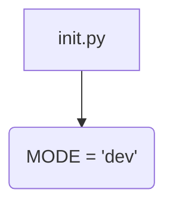
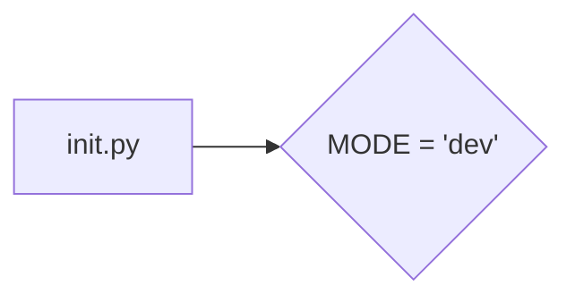

# <input code>

```python
## \file hypotez/src/fast_api/__init__.py
# -*- coding: utf-8 -*-
#! venv/Scripts/python.exe
#! venv/bin/python/python3.12

"""
.. module: src.fast_api 
	:platform: Windows, Unix
	:synopsis:

"""
MODE = 'dev'
```

# <algorithm>

Этот файл представляет собой инициализирующий модуль для пакета `fast_api`. Он содержит единственную переменную `MODE`, которая, скорее всего, определяет режим работы приложения (например, `dev`, `prod`).  Поскольку код очень короткий, блок-схема будет простой.




В данном случае переменная `MODE` просто устанавливает значение строки 'dev'.  Значение этой переменной может использоваться в других частях кодовой базы для настройки поведения приложения (например, включения дополнительных проверок, использования разных баз данных, настройки логирования и т.д.) в зависимости от режима работы (разработки, производства).

# <mermaid>



# <explanation>

- **Импорты**:  В этом файле нет импортов.  Это типичный файл инициализации, который содержит конфигурацию и настройки для пакета.

- **Классы**: Нет классов.

- **Функции**: Нет функций.

- **Переменные**: `MODE`: Строковая переменная, содержащая значение 'dev'. Она, вероятно, используется для настройки конфигурации приложения, как описано в алгоритме.  Тип данных - строка.

- **Возможные ошибки или области для улучшений**:

    - Отсутствие документации:  хотя есть docstring, он не соответствует стандартам Python (PEP 257).  Лучше было бы добавить описание, почему используется данная переменная `MODE`, как именно она используется в других частях кода и какие значения она может принимать (например, 'dev', 'test', 'prod').
    - Возможно, полезно было бы указать, что переменная `MODE` должна храниться в файле `.env`, или в другом формате, более подходящем для хранения конфигурационных данных, а не напрямую в коде.
    - Возможно, переменной `MODE` следует присвоить значение из внешнего источника (например, файла конфигурации), а не напрямую в коде. Это сделает код более гибким и поддерживаемым.

**Цепочка взаимосвязей с другими частями проекта:**

Эта переменная `MODE` скорее всего используется в других модулях пакета `fast_api` для определения поведения приложения. Например, в других модулях могут быть условные операторы, которые в зависимости от значения `MODE` включают или выключают определенные функции, блоки кода или используют различные конфигурационные настройки.

**Вывод:**

Файл `__init__.py` в папке `fast_api` служит для инициализации пакета и, в данном случае, определяет переменную `MODE` для настройки приложения.  Это важная часть модульной организации проекта, позволяющая разделять логику и конфигурацию.