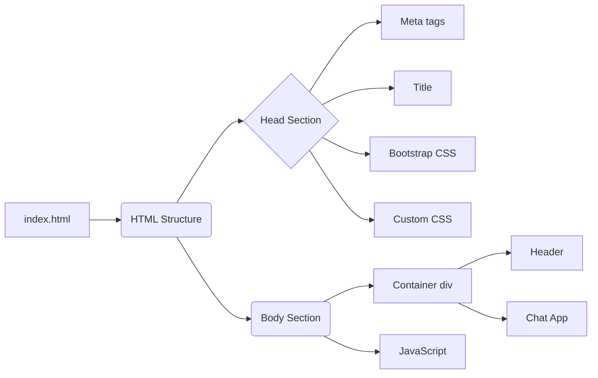

```MD
# Анализ кода index.html

## <input code>

```html
## \file hypotez/src/fast_api/gemini/frontent/index.html
# -*- coding: utf-8 -*-\
#! venv/Scripts/python.exe

""" module: src.fast_api.gemini.frontent """
MODE = 'debug'
<!DOCTYPE html>
<html lang="en">
<head>
    <meta charset="UTF-8">
    <meta name="viewport" content="width=device-width, initial-scale=1.0">
    <title>Chat with Generative AI</title>
    <link rel="stylesheet" href="/static/bootstrap.min.css">
    <style>
        body {
            padding: 2rem;
        }
    </style>
</head>
<body>
    <div class="container">
        <h1>AI Chat Interface</h1>
        <div id="chat-app"></div>
    </div>

    <script type="text/babel" src="/static/app.js"></script>
</body>
</html>
```

## <algorithm>

Этот код представляет собой HTML-шаблон для веб-страницы.  Он не содержит алгоритма в традиционном понимании, это скорее структура страницы.  Пошаговая блок-схема в этом случае не применима.

## <mermaid>



## <explanation>

**Импорты:**

Нет импортов в традиционном смысле, так как это просто HTML-файл.  `#! venv/Scripts/python.exe` — это метаинформация для интерпретатора Python,  указывающая, какой интерпретатор использовать для запуска потенциально связанного с этим файлом Python кода (вероятно, это часть конфигурации запуска web-сервера).  `# -*- coding: utf-8 -*-` — директива для интерпретатора, указывающая на кодировку файла.  `/static/bootstrap.min.css` и `/static/app.js`  - пути к файлам, которые, скорее всего, находятся в директории `static` проекта, и содержат соответственно стили Bootstrap и JavaScript код приложения.

**Классы:**

Нет классов.  Это HTML, использующий встроенный в браузер механизм рендеринга.

**Функции:**

Нет функций.

**Переменные:**

`MODE = 'debug'` — это константа, которая, скорее всего, используется для настройки поведения приложения.  В данном контексте она никак не влияет на сам HTML, но может использоваться в JavaScript коде, который будет обращаться к этой переменной.


**Возможные ошибки или области для улучшений:**

* Отсутствие проверки наличия файлов `bootstrap.min.css` и `app.js` в директории `static`.  Если файлы отсутствуют, браузер покажет ошибку 404.
* Нет описания `app.js`. Для полноценного анализа требуется доступ к этому файлу.

**Взаимосвязи с другими частями проекта:**

Этот HTML-файл взаимодействует с `app.js`, который, вероятно, содержит JavaScript-логику для работы приложения.  Файл `app.js`  получает данные от серверной части (FastAPI, вероятно), чтобы динамически отображать содержимое `div` с id `chat-app`.  Связь устанавливается через API запросы из JavaScript кода.