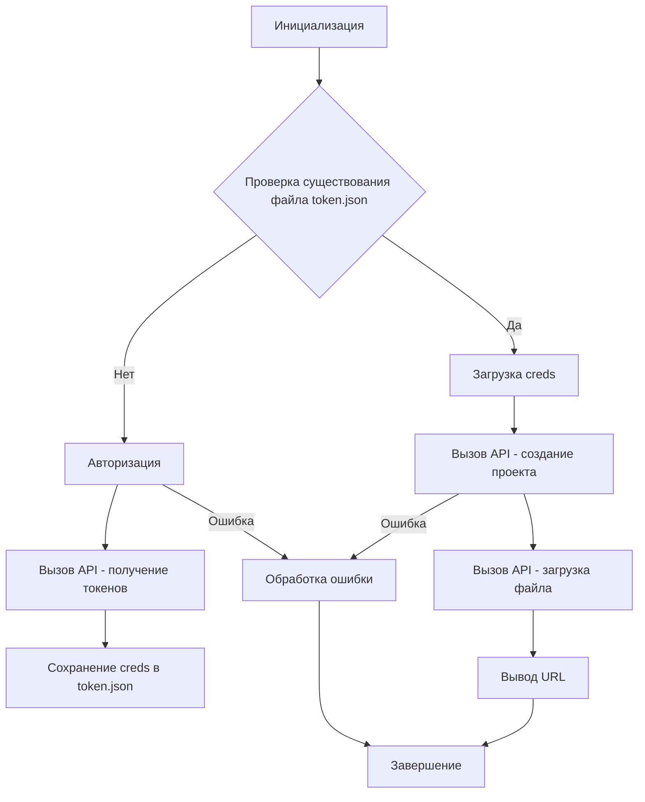

# <input code>

```python
## \file hypotez/src/goog/quickstart.py
# -*- coding: utf-8 -*-\
#! venv/Scripts/python.exe
#! venv/bin/python/python3.12

"""
.. module: src.goog 
	:platform: Windows, Unix
	:synopsis:

"""
MODE = 'dev'


"""
Shows basic usage of the Apps Script API.
Call the Apps Script API to create a new script project, upload a file to the
project, and log the script's URL to the user.

https://developers.google.com/apps-script/api/quickstart/python
"""


from pathlib import Path

from google.auth.transport.requests import Request
from google.oauth2.credentials import Credentials
from google_auth_oauthlib.flow import InstalledAppFlow
from googleapiclient import errors
from googleapiclient.discovery import build

import header
from src import gs

# If modifying these scopes, delete the file token.json.
SCOPES = ['https://www.googleapis.com/auth/script.projects']

SAMPLE_CODE = """
function helloWorld() {
  console.log("Hello, world!");
}
""".strip()

SAMPLE_MANIFEST = """
{
  "timeZone": "America/New_York",
  "exceptionLogging": "CLOUD"
}
""".strip()


def main():
    """Calls the Apps Script API."""
    creds = None
    # The file token.json stores the user's access and refresh tokens, and is
    # created automatically when the authorization flow completes for the first
    # time.
    token_path = gs.path.tmp / 'e-cat-346312-137284f4419e.json'
    if token_path.exists():
        creds = Credentials.from_authorized_user_file(token_path, SCOPES)
    # If there are no (valid) credentials available, let the user log in.
    if not creds or not creds.valid:
        if creds and creds.expired and creds.refresh_token:
            creds.refresh(Request())
        else:
            flow = InstalledAppFlow.from_client_secrets_file(
                'credentials.json', SCOPES)
            creds = flow.run_local_server(port=0)
        # Save the credentials for the next run
        with Path('token.json').open('w') as token:
            token.write(creds.to_json())

    try:
        service = build('script', 'v1', credentials=creds)

        # Call the Apps Script API
        # Create a new project
        request = {'title': 'My Script'}
        response = service.projects().create(body=request).execute()

        # Upload two files to the project
        request = {
            'files': [{
                'name': 'hello',
                'type': 'SERVER_JS',
                'source': SAMPLE_CODE
            }, {
                'name': 'appsscript',
                'type': 'JSON',
                'source': SAMPLE_MANIFEST
            }]
        }
        response = service.projects().updateContent(
            body=request,
            scriptId=response['scriptId']).execute()
        print('https://script.google.com/d/' + response['scriptId'] + '/edit')
    except errors.HttpError as error:
        # The API encountered a problem.
        print(error.content)


if __name__ == '__main__':
    main()
```

# <algorithm>

1. **Инициализация:**  
    - `creds = None`:  Переменная `creds` инициализируется как `None` для хранения учетных данных.
    - `token_path`: определяется путь к файлу с токеном доступа.
    - Проверка существования `token_path`. Если файл существует, то `creds` загружается из файла.

2. **Авторизация:**
    - Проверка `creds` на корректность и актуальность.
    - Если `creds` не валидны, вызывается `flow.run_local_server()` для получения новых учетных данных у пользователя.
    - Полученные `creds` сохраняются в `token.json`.


3. **Вызов API:**
    - `service = build(...)`:  Создается объект для взаимодействия с Google Apps Script API.
    - `response = service.projects().create(...)`: Создается новый проект Apps Script.
    - `response = service.projects().updateContent(...)`: Загружаются два файла в новый проект (`SAMPLE_CODE`, `SAMPLE_MANIFEST`).
    - `print(...)`: Вывод URL созданного скрипта.

4. **Обработка ошибок:**
    - `try...except errors.HttpError`:  Обработка возможных ошибок при взаимодействии с API.


**Примеры:**

- При успешном выполнении, `response` содержит данные, позволяющие получить ссылку на созданный проект.
- При ошибке, `error.content` содержит информацию об ошибке.

**Передача данных:**

- Учетные данные (`creds`) передаются между этапами.
- `request` и `response` используются для передачи данных между запросами API.


# <mermaid>



# <explanation>

**Импорты:**

- `from pathlib import Path`:  Для работы с путями файлов, необходимыми для работы с файлом `token.json`.
- `from google.auth.transport.requests import Request`:  Для создания HTTP-запросов, необходимых для получения доступа к API.
- `from google.oauth2.credentials import Credentials`:  Для работы с учетными данными доступа к API.
- `from google_auth_oauthlib.flow import InstalledAppFlow`:  Для автоматической настройки доступа к API (авторизация пользователя).
- `from googleapiclient import errors`: Для обработки ошибок API.
- `from googleapiclient.discovery import build`: Для взаимодействия с API Google Apps Script.
- `import header`:  Предположительно, модуль для общей функциональности проекта (необходим дальнейший анализ).
- `from src import gs`:  Импорт модуля `gs` из пакета `src`. Предположительно, модуль для работы с файловой системой или другими ресурсами.

**Классы:**

- `Credentials`:  Класс для работы с учетными данными доступа к API.

**Функции:**

- `main()`:  Главная функция, которая выполняет все действия.
    - `creds = None`: Инициализация переменной учетных данных.
    - `token_path = gs.path.tmp / 'e-cat-346312-137284f4419e.json'`: Определение пути к файлу с токеном.
    - `Credentials.from_authorized_user_file(...)`: Загрузка учетных данных из файла.
    - `InstalledAppFlow.from_client_secrets_file(...)`:  Получение доступа к API от пользователя.
    - `creds.refresh(...)`: Обновление токена доступа, если он истек.
    - `build('script', 'v1', credentials=creds)`: Создание объекта для взаимодействия с API.
    - `service.projects().create(...)`: Создание нового проекта в Apps Script.
    - `service.projects().updateContent(...)`: Загрузка файла в проект.
    - `print(...)`: Вывод ссылки на созданный проект.
    - `try...except`: Обработка возможных ошибок API.

**Переменные:**

- `MODE = 'dev'`:  Вероятно, переменная для указания режима работы.
- `SCOPES`: Список разрешений, необходимых для доступа к API.
- `SAMPLE_CODE`, `SAMPLE_MANIFEST`:  Пример кода и манифеста для скрипта Apps Script.
- `token_path`: Путь к файлу с токеном доступа.
- `creds`: Хранит данные авторизации для доступа к API.
- `service`: Объект для взаимодействия с API.
- `request`, `response`:  Переменные для работы с запросами и ответами API.

**Возможные ошибки и улучшения:**

- Отсутствие обработки ошибок при создании объекта `service`.
- Возможно, нужно добавить обработку ошибок для `service.projects().create()` и других вызовов API.
- Необходимо проанализировать пакет `src`, особенно модуль `gs`, чтобы понять, как он используется.
- Разбор настроек авторизации (credentials.json) очень важен.


**Взаимосвязи с другими частями проекта:**

- Модуль `gs` явно используется для работы с путями файлов.
- Модуль `header` скорее всего содержит общие настройки или константы проекта.
- `credentials.json` содержит конфигурацию для доступа к Google Apps Script API.  Необходимо убедиться, что этот файл корректно настроен и содержит корректные ключи API.


**Заключение:**

Код реализует базовую интеграцию с Google Apps Script API для создания и заполнения проекта.  Анализ зависимостей и дальнейшее понимание `src` и `header` позволит более полно оценить функциональность и интегрировать его в более сложные сценарии.