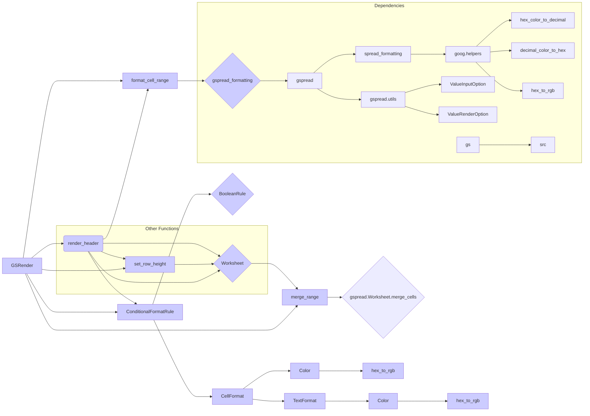

# <input code>

```python
## \file hypotez/src/goog/spreadsheet/bberyakov/grender.py
# -*- coding: utf-8 -*-
#! venv/Scripts/python.exe
#! venv/bin/python/python3.12

"""
.. module: src.goog.spreadsheet.bberyakov 
	:platform: Windows, Unix
	:synopsis:

"""
MODE = 'dev'


"""
	:platform: Windows, Unix
	:synopsis:

"""


"""
	:platform: Windows, Unix
	:synopsis:

"""


"""
  :platform: Windows, Unix

"""
"""
  :platform: Windows, Unix
  :platform: Windows, Unix
  :synopsis:
"""MODE = 'dev'
  
""" module: src.goog.spreadsheet.bberyakov """


"""  Render Google Table

 
 @section libs imports:
  - json 
  - typing 
  - gspread_formatting 
  - gspread 
  - goog.helpers 
  - gspread.utils 
  
Author(s):
  - Created by [Davidka] [BenAvraham] on 08.11.2023 .
"""
# ------------------------------
from src import gs
from src.helpers import logger, WebDriverException,  pprint

# -------------------------------


import json
from typing import List, Type, Union
from spread_formatting import *
from spread import Spreadsheet, Worksheet
from goog.helpers import hex_color_to_decimal, decimal_color_to_hex, hex_to_rgb

from spread.utils import ValueInputOption, ValueRenderOption


class GSRender():
    """
     [Class's description]


    """
    """
     Table Render
    Украшательства. 
    ------------------------------
    class CellFormat(
        numberFormat: Any | None = None,
        backgroundColor: Any | None = None,
        borders: Any | None = None,
        padding: Any | None = None,
        horizontalAlignment: Any | None = None,
        verticalAlignment: Any | None = None,
        wrapStartegy: Any | None = None,
        textDirection: Any | None = None,
        textFormat: Any | None = None,
        hyperlinkDisplayType: Any | None = None,
        textRotation: Any | None = None,
        backgroundColorStyle: Any | None = None
    )
    """
    render_schemas: dict
    

    def __init__ (self, *args, **kwards) -> None:
        """
         [Function's description]

        Parameters : 
             self : [description]
             *args : [description]
             **kwards : [description]
        Returns : 
             None : [description]

        """
        #self.render_schemas = json.loads('goog\\schema.json')
        ...
    
    def render_header (self, ws: Worksheet, world_title: str, range: str = 'A1:Z1', merge_type: str('MERGE_ALL') | str('MERGE_COLUMNS') | str('MERGE_ROWS') = 'MERGE_ALL' ) -> None:
        """
         Рисую заголовок таблицы в первой строке

        Parameters : 
             self : [description]
             ws : Worksheet : таблица в книге
             world_title : str : заголовок гугл таблицы
             range : 'A1:Z1' : диапазон ячеек
             merge_type : str('MERGE_ALL') | str('MERGE_COLUMNS') | str('MERGE_ROWS') = 'MERGE_ALL' : 'MERGE_ALL' | 'MERGE_COLUMNS' | 'MERGE_ROWS'
        Returns : 
             None : [description]

        """
        ... #rest of the code
```

# <algorithm>

The code defines a class `GSRender` for formatting and rendering Google Sheets.  The `render_header` function formats a given range of cells with a specified background color, alignment, text style, and potentially conditional formatting based on cell values.  It also merges cells as specified by `merge_type`. The `set_worksheet_direction` function changes the writing direction of the worksheet (left-to-right or right-to-left). The `header`, `write_category_title`, and `get_first_empty_row` functions are used to append rows, apply formatting, and determine the next available row.

**Example for `render_header`:**

1. Takes a Worksheet object (`ws`), a title string (`world_title`), and a cell range (`range`).
2. Defines colors for the background (`bg_color`) and foreground (`fg_color`).
3. Creates a `CellFormat` object specifying formatting: background color, alignment, direction, bold text, and font size.
4.  Creates a `ConditionalFormatRule` object to apply formatting based on a condition (number greater than 50).
5. Sets the row height.
6. Applies the `CellFormat` to the entire range and merges the cells according to `merge_type`.


# <mermaid>



# <explanation>

**Imports:**

- `from src import gs`: Imports the `gs` module from the `src` directory, likely a module for interacting with Google Sheets.
- `from src.helpers import logger, WebDriverException, pprint`: Imports helper functions from `src.helpers`, suggesting logging (`logger`), error handling for web driver interactions (`WebDriverException`), and pretty printing (`pprint`).
- `import json`: Imports the `json` module for working with JSON data.
- `from typing import List, Type, Union`: Imports typing functionalities for type hinting.
- `from spread_formatting import *`: Imports the `spread_formatting` module, which presumably contains functions and classes for formatting Google Sheets.
- `from spread import Spreadsheet, Worksheet`: Imports `Spreadsheet` and `Worksheet` classes from the `spread` module, representing Google Sheets and their individual worksheets respectively.
- `from goog.helpers import ...`: Imports functions for handling colors from the `goog.helpers` module.  These likely convert between hexadecimal and decimal color representations (and potentially perform color-related operations).
- `from spread.utils import ...`: Imports classes `ValueInputOption` and `ValueRenderOption` likely related to setting and rendering cell values from `spread.utils`.


**Classes:**

- `GSRender`: This class encapsulates methods for rendering Google Sheets.  `render_schemas`: likely a dictionary holding schemas for different renderings (e.g. headers, body).  `__init__` initializes the class, and other functions within (`render_header`, `merge_range`, `set_worksheet_direction`, `header`, `write_category_title`, `get_first_empty_row`) are methods to perform specific operations on Google Sheets, using Worksheet and Spreadsheet objects.  

**Functions:**

- `render_header(self, ws, world_title, range='A1:Z1', merge_type='MERGE_ALL')`: Formats a header row (range A1:Z1 by default), applying background color, alignment, and potentially conditional formatting to cell values greater than 50.  `merge_type` controls merging of cells.
- `merge_range(self, ws, range, merge_type='MERGE_ALL')`: Merges cells in the given range. The `merge_type` parameter is crucial, specifying how cells should be merged (all, columns, or rows).
- `set_worksheet_direction(self, sh, ws, direction='rtl')`: Sets the writing direction of the worksheet (`ws`) within the spreadsheet (`sh`) to right-to-left (`rtl` by default) or left-to-right (`ltr`). The update requires a `batch_update` to the spreadsheet.
- `header(self, ws, ws_header, row=None)`: Appends a header row (`ws_header`) to the worksheet at the specified or a calculated row number.  It then calls `render_header` to style the header.
- `write_category_title(self, ws, ws_category_title, row=None)`: Similar to `header`, but for category titles, also applying merging.
- `get_first_empty_row(self, ws, by_col=None)`: Finds the first empty row in the worksheet, optionally starting from a specific column (`by_col`).


**Potential Errors and Improvements:**

- **Missing error handling:** The code lacks comprehensive error handling.  For instance, if `ws` is not valid, or if a function call fails, the program will crash.  Using `try...except` blocks would significantly increase robustness.
- **Unnecessary `...` placeholders:** The `...` placeholders in the `render_header` and other functions indicate incomplete implementation.  Code sections with `...` need to be filled out.
- **Implicit type checking:** The use of `Any` for some types in the function parameters could be replaced by more specific types (e.g., `str`, `int`, or appropriate custom types) for better code maintainability and readability.
- **Magic numbers:** The hardcoded values like `'#FFAAAA'` for colors should be extracted into named constants for better readability and maintainability.
- **Conditional formatting issues:**  The conditional formatting applied within `render_header` has a potential flaw: it applies formatting to all cells in the specified range, regardless of their values. If only certain cells should be formatted, ensure you filter the range correctly.
- **Lack of input validation:** Input validation is crucial to avoid unexpected behavior.


**Relationships with other parts of the project:**

- The `gs` import suggests a module responsible for interacting with the Google Sheets API.
- The `helpers` module likely contains utility functions, logging mechanisms, and error handling relevant to the project.
- The `spread` and `spread_formatting` modules seem to provide functionality for manipulating spreadsheet objects and data.
- The `goog.helpers` module is specialized for color management within the broader project. The project likely uses a Startegy of modularity and separation of concerns.


This analysis provides a solid understanding of the code's functionality and potential areas for improvement, emphasizing the dependencies and relationships between modules within the larger project.