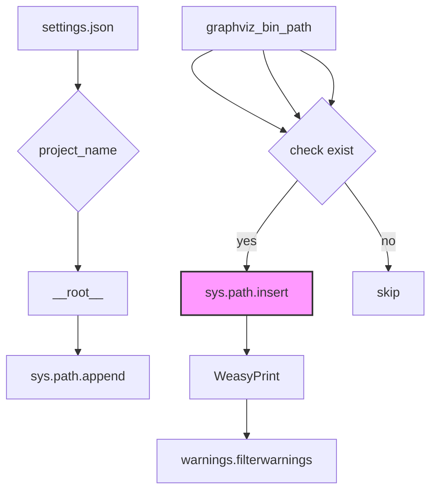

# <input code>

```python
## \file hypotez/src/gui/context_menu/header.py
# -*- coding: utf-8 -*-\
#! venv/Scripts/python.exe
#! venv/bin/python/python3.12

"""
.. module: src.gui.context_menu 
	:platform: Windows, Unix
	:synopsis:

"""
MODE = 'dev'


"""
	:platform: Windows, Unix
	:synopsis:

"""


"""
	:platform: Windows, Unix
	:synopsis:

"""


"""
  :platform: Windows, Unix

"""
"""
  :platform: Windows, Unix
  :platform: Windows, Unix
  :synopsis:
"""MODE = 'dev'
  
""" module: src.gui.context_menu """


""" Absolute path to modules and GTK & FFPMEG bin directory """

import json
import sys
from pathlib import Path

# Load the project name from settings.json
with open('settings.json', 'r') as settings_file:
    settings = json.load(settings_file)
    project_name = settings.get("project_name", "hypotez")  

# Define the root path of the project
__root__: Path = Path.cwd().resolve().parents[Path.cwd().parts.index(project_name)]
sys.path.append(str(__root__))

# Paths to bin directories
gtk_bin_path = __root__ / "bin" / "gtk" / "gtk-nsis-pack" / "bin"
ffmpeg_bin_path = __root__ / "bin" / "ffmpeg" / "bin"
graphviz_bin_path = __root__ / "bin" / "graphviz" / "bin"

# Update the PATH variable if the paths are missing
paths_to_add = [gtk_bin_path, ffmpeg_bin_path, graphviz_bin_path]
current_paths = set(Path(p) for p in sys.path)

for bin_path in paths_to_add:
    if bin_path not in current_paths:
        sys.path.insert(0, str(bin_path))

# Set the variable for WeasyPrint
sys_path_env_var = "WEASYPRINT_DLL_DIRECTORIES"
if sys_path_env_var not in sys.path:
    sys.path.insert(0, str(gtk_bin_path))

"""Suppress GTK log output to the console"""
import warnings
warnings.filterwarnings("ignore", category=UserWarning)
```

# <algorithm>

**Шаг 1:** Импортирует необходимые библиотеки (`json`, `sys`, `pathlib`, `warnings`).

**Шаг 2:** Загружает имя проекта из файла `settings.json`.  Пример: Если `settings.json` содержит `{ "project_name": "myproject" }`, `project_name` будет равно `myproject`. Иначе `hypotez`.

**Шаг 3:** Определяет корневую директорию проекта (`__root__`) на основе имени проекта.  Пример: Если проект находится в `C:\Users\User\Documents\myproject`, `__root__` будет `C:\Users\User\Documents`.

**Шаг 4:** Добавляет корневую директорию в `sys.path`, чтобы Python мог находить модули проекта.


**Шаг 5:** Определяет пути к бинарным каталогам (`gtk_bin_path`, `ffmpeg_bin_path`, `graphviz_bin_path`).  Пример:  `gtk_bin_path` будет указывать на путь к папке с исполняемыми файлами GTK.

**Шаг 6:** Проверяет, существуют ли каталоги bin. Если каталог отсутствует, добавляет его в `sys.path`.  Пример: Если `gtk_bin_path` не существует, код не выполняет дальнейшее добавление.

**Шаг 7:** Добавляет путь к бинарным файлам GTK в `sys.path` для WeasyPrint, если переменная `sys_path_env_var` не существует в `sys.path`.

**Шаг 8:** Отключает предупреждения GTK.

**Пример:**
```
settings.json
{
  "project_name": "myproject"
}
```

**Пример данных перемещения:** Данные из `settings.json` (строка 22) передаются в переменную `project_name`.

# <mermaid>



**Описание диаграммы:**

- `settings.json` -  источник данных (имя проекта).
- `project_name` - переменная, получающая имя проекта из файла настроек.
- `__root__` - переменная, содержащая путь к корневой директории проекта.
- `sys.path.append` - функция, добавляющая путь в список путей поиска модулей.
- `gtk_bin_path`, `ffmpeg_bin_path`, `graphviz_bin_path` - переменные, хранящие пути к каталогам бинарных файлов.
- `check exist` - блок проверки существования папки библиотек.
- `sys.path.insert` -  функция, добавляющая путь в начало списка путей поиска модулей, если папка не существует.
- `WeasyPrint` - предполагаемое использование библиотек WeasyPrint, требующих добавление путей к папкам с бинарными файлами.
- `warnings.filterwarnings` - функция, игнорирующая предупреждения GTK.

**Зависимости:**

Код зависит от `json`, `sys`, `pathlib`, `warnings` и `settings.json`.  Прямое использование `settings.json` должно быть объяснено в файле документации.


# <explanation>

**Импорты:**

- `json`: для работы с файлом настроек `settings.json`.
- `sys`: для управления путями поиска модулей (`sys.path`).
- `pathlib`: для удобной работы с путями к файлам и директориям.
- `warnings`: для отключения предупреждений GTK.

**Классы:**

Нет классов в данном коде.

**Функции:**

Нет функций, выполняющих какие-либо действия.  Есть конструкция `with open()`, но она относится к стандартной функциональности Python.

**Переменные:**

- `MODE`: строковая переменная, хранящая значение режима (например, 'dev', 'prod').
- `project_name`: строка, имя проекта, получаемое из `settings.json`.
- `__root__`: переменная-путь, хранящая абсолютный путь к корню проекта.
- `gtk_bin_path`, `ffmpeg_bin_path`, `graphviz_bin_path`: пути к бинарным каталогам.
- `paths_to_add`: список путей, которые необходимо добавить в `sys.path`.
- `current_paths`: множество текущих путей в `sys.path`.
- `sys_path_env_var`: строковая переменная для WeasyPrint.

**Возможные ошибки и улучшения:**

- **Обработка ошибок:**  Код не обрабатывает случай, когда `settings.json` не существует или не содержит ключа `project_name`. Необходимо добавить обработку исключений (`try...except`).
- **Комментарии:** Код содержит комментарии, но можно добавить более подробные пояснения к логике кода.
- **Динамический поиск зависимостей:** Проверка наличия папок `bin` может быть расширена на случай, если в будущем появятся новые зависимости.
- **Проверка `sys.path`:** Проверка `sys.path` на дубликаты путей была бы дополнительной мерой предосторожности.

**Цепочка взаимосвязей:**

Этот код является частью инициализации проекта. Он настраивает окружение Python, чтобы проект мог найти нужные ему библиотеки.  Далее, эта настройка необходима для запуска GUI или других компонентов проекта, которые используют GTK, FFmpeg или другие инструменты, находящиеся в каталогах bin.