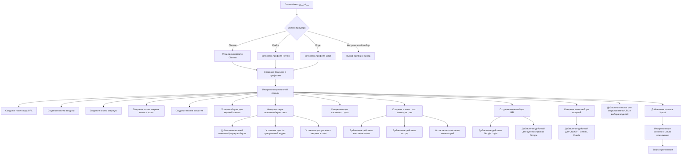
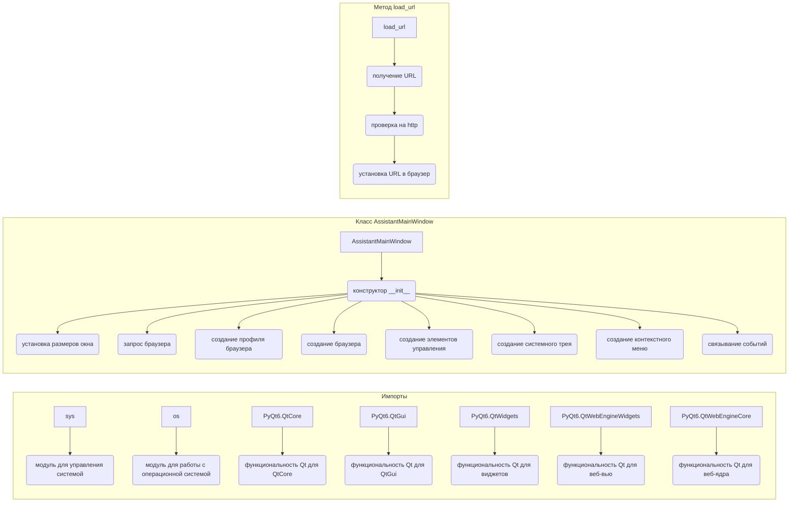

# <input code>

```python
## \file hypotez/src/gui/openai_trаigner/main.py
# -*- coding: utf-8 -*-\
#! venv/Scripts/python.exe
#! venv/bin/python/python3.12

"""
.. module: src.gui.openai_trаigner 
	:platform: Windows, Unix
	:synopsis:

"""
MODE = 'dev'


"""
	:platform: Windows, Unix
	:synopsis:

"""


"""
	:platform: Windows, Unix
	:synopsis:

"""


"""
  :platform: Windows, Unix

"""
"""
  :platform: Windows, Unix
  :platform: Windows, Unix
  :synopsis:
"""MODE = 'dev'
  
""" module: src.gui.openai_trаigner """


import sys
import os
from PyQt6.QtCore import Qt, QUrl
from PyQt6.QtGui import QIcon, QAction
from PyQt6.QtWidgets import (
    QApplication, QMainWindow, QSystemTrayIcon, QMenu, QPushButton,
    QVBoxLayout, QHBoxLayout, QWidget, QLineEdit, QMessageBox
)
from PyQt6.QtWebEngineWidgets import QWebEngineView
from PyQt6.QtWebEngineCore import QWebEngineProfile
```

# <algorithm>



**Пример:** Пользователь выбирает браузер Chrome. Алгоритм переходит в блок C, устанавливает профиль Chrome, затем в блок G создает QWebEngineView с этим профилем.  Данные (путь к профилю) перемещаются между блоками B и C.

# <mermaid>



# <explanation>

**Импорты:**

- `sys`, `os`: стандартные модули Python для работы с системой и файловой системой соответственно.
- `PyQt6`:  библиотека для создания графических интерфейсов в Python. Подмодули `QtCore`, `QtGui`, `QtWidgets`, `QtWebEngineWidgets`, и `QtWebEngineCore`  обеспечивают различные элементы для работы с окнами, виджетами, веб-вью и профилями. Связаны с GUI.

**Классы:**

- `AssistantMainWindow`: основной класс, представляющий окно приложения.
    - `__init__`: Инициализирует окно, устанавливает размеры, создает веб-вью, верхнюю панель с кнопками,  системный трей, меню. Обрабатывает выбор браузера и создает соответствующий профиль.
    - `ask_for_browser`: запрашивает у пользователя выбор браузера.
    - `load_url`: загружает URL в веб-вью.
    - `hide_to_tray`: сворачивает окно в системный трей.
    - `quit_app`: завершает приложение.
    - `closeEvent`: переопределяет обработку закрытия окна, для скрытия в трее.

**Функции:**

- `ask_for_browser()`:  Запрашивает и возвращает выбор браузера.
- `load_url(url=None)`: Загружает URL в веб-вью.  Учитывает возможность передачи URL в параметрах. Добавляет "http://" если URL не начинается с http.
- `hide_to_tray()`: Сворачивает окно в системный трей.
- `quit_app()`: Завершает приложение и скрывает иконку трея.


**Переменные:**

- `MODE`:  строковая переменная, скорее всего, используется для определения режима работы (например, разработки или производства).
- `profile`: экземпляр `QWebEngineProfile`, хранящий настройки выбранного браузера.
- `browser`: экземпляр `QWebEngineView` для отображения веб-страниц.
- `url_input`, `load_button`:  элементы управления для ввода URL и его загрузки.


**Возможные ошибки и улучшения:**

- **Пути к профилям браузеров:** Пути к профилям браузеров (`profile_path`) могут быть некорректными на других системах или у пользователей с нестандартными установками браузеров.  Необходимо реализовать более универсальный способ определения путей.
- **Проверка на ошибки при загрузке URL:** Необходимо добавить проверку на успешную загрузку URL в `load_url` и выводить сообщения об ошибках пользователю.
- **Локализация:** Добавить поддержку локализации (перевода).
- **Обработка ввода пользователя:** В функции `load_url` нужно валидировать URL, чтобы предотвратить ошибки при попытке загрузки некорректного адреса.

**Цепочка взаимосвязей:**

Этот код является частью графического интерфейса приложения, вероятно, для работы с OpenAI.  Взаимодействие с OpenAI происходит через веб-вью (browser).  Дополнительные модули или функции, которые выполняют взаимодействие с OpenAI, расположены в других частях проекта (`src`).