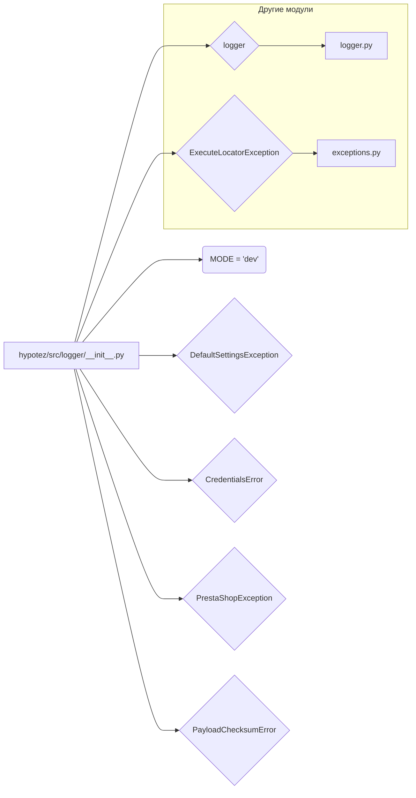

```MD
# Анализ кода hypotez/src/logger/__init__.py

## <input code>

```python
## \file hypotez/src/logger/__init__.py
# -*- coding: utf-8 -*-
#! venv/Scripts/python.exe
#! venv/bin/python/python3.12

"""
.. module: src.logger 
	:platform: Windows, Unix
	:synopsis:

"""
MODE = 'dev'

from .logger import logger
#from .beeper import Beeper
from .exceptions import ( ExecuteLocatorException, 
                         DefaultSettingsException, 
                         CredentialsError, 
                         PrestaShopException, 
                         PayloadChecksumError
                        )
```

## <algorithm>

Этот код представляет собой инициализационный модуль для пакета `logger`.  Он не содержит каких-либо сложных алгоритмов, но устанавливает константу `MODE` и импортирует классы и функции из других модулей внутри пакета `src.logger`. Алгоритм работы сводится к инициализации и импорту.  Нет циклов или рекурсии.

Пример:

1. Интерпретатор Python встречает файл `__init__.py`.
2. Он читает и выполняет код.
3. Переменная `MODE` присваивается строка 'dev'.
4. Модули `logger`, `ExecuteLocatorException`, `DefaultSettingsException`, `CredentialsError`, `PrestaShopException` и `PayloadChecksumError` импортируются.

## <mermaid>



## <explanation>

**Импорты:**

- `from .logger import logger`: Импортирует объект `logger` из модуля `logger.py` внутри пакета `src.logger`. Это, вероятно, объект, связанный с логированием.  Символ `.` указывает на относительный импорт.
- `from .exceptions import ...`: Импортирует несколько классов исключений (`ExecuteLocatorException`, `DefaultSettingsException`, и т.д.) из модуля `exceptions.py` внутри пакета `src.logger`. Эти классы, вероятно, определены для обработки ошибок, специфичных для проекта.

**Классы:**

- Нет классов определены напрямую в `__init__.py`.  Определения классов находятся в `logger.py` (для объекта `logger`, скорее всего) и `exceptions.py`.

**Функции:**

- Нет функций определены напрямую в `__init__.py`.  Функционал, если он есть, находится в импортируемых модулях (`logger.py` и др.).

**Переменные:**

- `MODE = 'dev'`:  Константа, вероятно, используемая для настройки режима работы, например, режима отладки ('dev') или производства ('prod').  Может использоваться в других частях проекта для управления логированием и поведением приложения.

**Возможные ошибки или улучшения:**

- **Документация:** Документация `""".. module: src.logger ..."""` должна быть более подробной.  Необходимо описать назначение пакета и, возможно, его ключевые особенности.
- **Комментарии:** Добавление комментариев к переменной `MODE` и импортам улучшит понимание кода.
- **Избегать комментариев-дубликатов:** Комментарии `#! venv/Scripts/python.exe` и `#! venv/bin/python/python3.12` не нужны, так как Python сам определит интерпретатор.

**Взаимосвязь с другими частями проекта:**

Этот файл является частью пакета `logger`.  Другие части проекта, скорее всего, будут импортировать объекты и классы из него, чтобы использовать логирование и обрабатывать специфические исключения, связанные с приложением. Модуль `logger` вероятно содержит логгер, а `exceptions` - обработчики исключений.


```