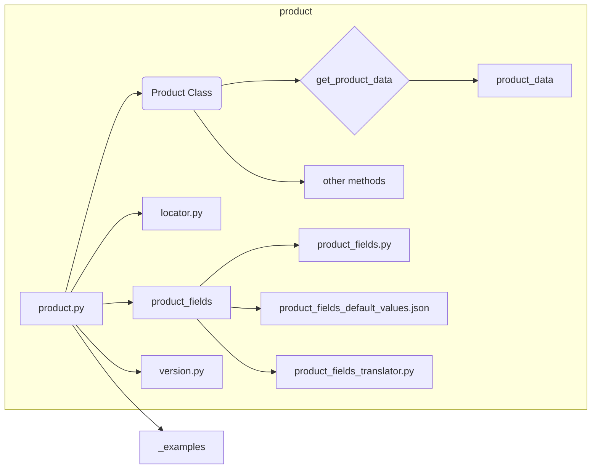

```MD
# Анализ кода модуля `product`

Этот документ анализирует описание модуля `product`, а не сам код.  Представленный текст описывает структуру и функциональность модуля, не содержащий приведённого кода.

## <input code>

```
I'll start by extracting the contents of the `product.zip` file to see what it contains. Let's proceed with that.

I'll extract the contents of the `product.zip` file.

The `product` module contains several Python files, example files, and a JSON file. Here is a summary of the extracted contents:

1. `__init__.py`: Initializes the module.
2. `locator.py`: Likely contains locator definitions for web elements.
3. `product.py`: Contains the main logic related to products.
4. `product_fields`: Directory containing files related to product fields.
5. `version.py`: Manages the version information of the module.
6. `_examples`: Directory containing example scripts.

### Key Components

1. **Locator**
    - **Purpose**: Defines locators for web elements related to products.
    - **Functionality**:
        - Contains locators used by Selenium WebDriver to interact with web pages.

2. **Product**
    - **Purpose**: Manages product-related functionality.
    - **Functionality**:
        - Handles operations related to product data.
        - Interacts with the `product_fields` module to manage product attributes.

3. **Product Fields**
    - **Purpose**: Manages fields and attributes of products.
    - **Functionality**:
        - Defines product fields and their default values.
        - Translates product field names and values as needed.
        - Provides a central location for product attribute management.

4. **Version Management**
    - **Purpose**: Manages the versioning of the module.
    - **Functionality**:
        - Defines the current version of the module.
        - Provides version information for compatibility and updates.

5. **Documentation and Examples**
    - **Purpose**: Provides detailed documentation and usage examples for developers.
    - **Functionality**:
        - Explains the functionality and usage of the module.
        - Provides example scripts to demonStarte how to interact with product data.

### Example Usage

Here's an example of how you might use the `product` module:

```python
from product.product import Product
from product.product_fields import ProductFields

# Initialize the Product and ProductFields
product = Product()
product_fields = ProductFields()

# Example operation on product
product_data = product.get_product_data(product_id="12345")
product_fields.update_field("price", 19.99)

print(product_data)
```

### Additional Information

The `product_fields` directory contains additional scripts:

- **product_fields.py**: Defines the fields and their operations.
- **product_fields_default_values.json**: JSON file containing default values for product fields.
- **product_fields_translator.py**: Handles translation of field names and values.

### Documentation

The `_examples` directory contains example scripts and documentation files to help developers understand and use the module effectively.
```

## <algorithm>

К сожалению, из-за отсутствия кода невозможно построить блок-схему.  Описание лишь описывает структуру и функциональность модуля.

## <mermaid>



## <explanation>

Этот код не является кодом, а описанием структуры и функциональности модуля `product`.  Он описывает:

* **Структуру:** Модуль содержит файлы `__init__.py`, `locator.py`, `product.py`, директорию `product_fields` (содержащую `product_fields.py`, `product_fields_default_values.json`, `product_fields_translator.py`), `version.py` и директорию `_examples`.  Это типичная структура Python-модуля, организованного по принципу ответственности.

* **Компоненты:** Описывает классы `Product`, `Locator`, и функциональность модуля `Product Fields`.

* **Функциональность:**  Описывает, как классы взаимодействуют:  `Product` использует `Product Fields` для обработки атрибутов продукта.  Это показательно для модульной архитектуры, где отдельные части выполняют определенные задачи.

* **Примеры использования:**  Приводит пример использования импорта классов `Product` и `ProductFields` для получения данных продукта и обновления данных атрибутов продукта.

* **Зависимости:**  Описание предполагает, что `product.py` использует `locator.py`, `product_fields.py`, `product_fields_default_values.json`, `product_fields_translator.py` и `version.py`.


**Отсутствует код для анализа:**  Без предоставленного кода сложно определить точные типы переменных,  взаимодействия методов и классов,  а также возможные ошибки и пути улучшения.


**Дополнительные замечания:**
  * Диаграмма `mermaid` представляет предполагаемую взаимосвязь компонентов.
  *  Необходима дополнительная информация о методах внутри классов `Product`, `ProductFields`  и  о структуре файлов `locator.py`, `version.py` и `product_fields` для более точного анализа.