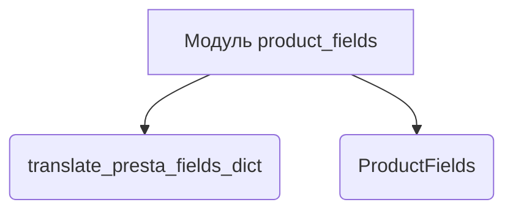
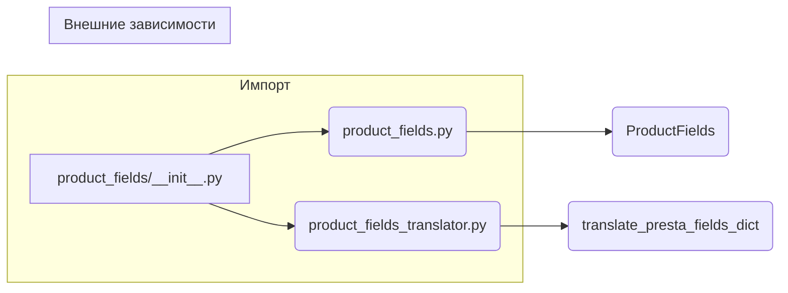

```MD
# <input code>

```python
## \file hypotez/src/product/product_fields/__init__.py
# -*- coding: utf-8 -*-\
#! venv/Scripts/python.exe
#! venv/bin/python/python3.12

"""
.. module: src.product.product_fields 
	:platform: Windows, Unix
	:synopsis: Модуль полей товара

"""
MODE = 'dev'

from .product_fields import ProductFields
from .product_fields_translator import translate_presta_fields_dict
```

# <algorithm>



Пример:
Функция `translate_presta_fields_dict` принимает словарь полей из PrestaShop и преобразует его в формат, используемый внутри проекта.
Класс `ProductFields` содержит данные и методы для работы с полями товаров.

**Пошаговая блок-схема (упрощенная):**

1. Импортируются необходимые компоненты.
2. Переменная `MODE` получает значение 'dev'.
3. В дальнейшем код может использовать импортированные классы `ProductFields` и функцию `translate_presta_fields_dict`.

Данные между компонентами в этом фрагменте не передаются явно.


# <mermaid>



**Объяснение к диаграмме:**

Диаграмма показывает структуру импорта. Модуль `product_fields/__init__.py` импортирует классы и функции из подмодулей `product_fields.py` и `product_fields_translator.py`. Эти файлы, скорее всего, содержат детали реализации классов и функций, связанных с обработкой данных полей товаров.  Нет видимых внешних зависимостей из этого файла.


# <explanation>

* **Импорты:**
    * `from .product_fields import ProductFields`: Импортирует класс `ProductFields` из файла `product_fields.py` в текущем пакете (`src.product.product_fields`). Это позволяет использовать класс `ProductFields` в текущем модуле.
    * `from .product_fields_translator import translate_presta_fields_dict`: Импортирует функцию `translate_presta_fields_dict` из файла `product_fields_translator.py` в текущем пакете.  Вероятно, эта функция отвечает за преобразование данных о полях из системы PrestaShop в формат, используемый в системе проекта.

* **Классы:**
    * `ProductFields`: Этот класс, скорее всего, определяет структуру и методы для работы с данными полей товаров. Без доступа к коду файла `product_fields.py` точное назначение его атрибутов и методов неизвестно.

* **Функции:**
    * `translate_presta_fields_dict`:  Эта функция преобразует словарь полей из PrestaShop в другой формат, используемый внутри приложения.  Предполагается, что она принимает словарь как аргумент и возвращает преобразованный словарь или другой объект данных.  Без кода функции невозможно определить все аргументы и возвращаемые значения.

* **Переменные:**
    * `MODE = 'dev'`:  Переменная глобального уровня.  Вероятно, используется для настройки поведения приложения в разных средах (разработка, тестирование, продакшен).


* **Возможные ошибки и улучшения:**
    * Отсутствует документация к классу и функции, что затрудняет понимание и использование кода.
    * Нет примеров использования импортированных объектов, что затрудняет понимание их назначения.
    * Неясно, как данные передаются и обрабатываются между `translate_presta_fields_dict` и `ProductFields`.

**Цепочка взаимосвязей:**

Файл `product_fields/__init__.py` выступает как интерфейс для других частей приложения, предоставляя доступ к классу `ProductFields` и функции `translate_presta_fields_dict`. Эти функции и классы, скорее всего, взаимодействуют с другими частями проекта, обрабатывая данные о товарах и переводя данные из одного формата в другой. Без доступа к остальному коду точный вид взаимодействия трудно определить.