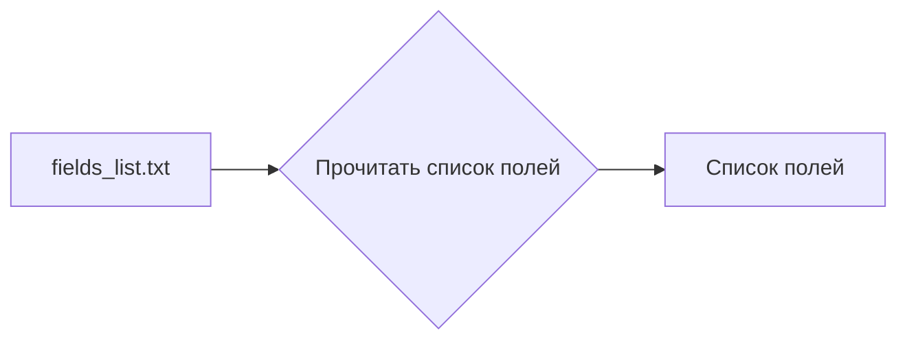

# Анализ файла `hypotez/src/product/product_fields/fields_list.txt`

```
additional_delivery_times
additional_shipping_cost
advanced_stock_management
affiliate_short_link
affiliate_summary
affiliate_summary_2
affiliate_text
affiliate_image_large
affiliate_image_medium
affiliate_image_small
associations
available_date
available_for_order
available_later
available_now
cache_default_attribute
cache_has_attachments
cache_is_pack
condition
customizable
date_add
date_upd
delivery_in_stock
delivery_out_stock
depth
description
description_short
ean13
ecotax
height
how_to_use
specification
id_category_default
id_default_combination
id_default_image
locale
id_manufacturer
id_product
id_shop_default
id_shop
id_supplier
id_tax
id_type_redirected
indexed
ingredients
is_virtual
isbn
link_rewrite
location
low_stock_alert
low_stock_threshold
meta_description
meta_keywords
meta_title
minimal_quantity
mpn
name
online_only
on_sale
out_of_stock
pack_stock_type
price
product_type
quantity_discount
redirect_type
reference
show_condition
show_price
state
supplier_reference
text_fields
unit_price_ratio
unity
upc
uploadable_files
visibility
volume
weight
wholesale_price
width
local_saved_image
local_saved_video
```

## <algorithm>

Этот файл содержит список строк, каждая из которых представляет собой имя поля продукта.  Алгортим работы сводится к простому перечислению.  Нет циклов, ветвлений, или вычислений, только хранение данных.  

Данные не перемещаются между функциями или классами, так как это просто текстовый файл.  Файл, скорее всего, используется для конфигурации или доступа к данным, например, для генерации списка полей базы данных или для определения полей, которые должны быть отображены в интерфейсе.


## <mermaid>



## <explanation>

Файл `fields_list.txt`  является простым текстовым файлом, содержащим список строк. Каждая строка представляет собой имя поля, используемого для описания продуктов.  Этот файл, скорее всего, является частью конфигурации или ресурсом данных для приложения, связанного с управлением продуктами (например, в электронной коммерции).

**Импорты:** Нет импортов. Файл не содержит импортируемого кода.

**Классы:** Нет классов.

**Функции:** Нет функций.

**Переменные:** Нет переменных.

**Возможные ошибки или улучшения:**

* **Отсутствует структуризация:** Файл является просто списком, что делает его не очень гибким при добавлении новых полей или изменении их структуры. Оптимально хранить информацию в формате, поддерживающем структурирование (например, JSON, CSV), что упростит чтение и управление списком полей.
* **Отсутствует проверка данных:** Не предусмотрено, как обрабатывать добавление невалидных данных (например, с неверными именами полей).

**Взаимосвязи с другими частями проекта:**

Файл `fields_list.txt` определенно связан с другими частями проекта, такими как:

* **БД:** Вероятно, содержимое этого файла используется при создании/модификации таблиц базы данных (например, при миграции базы данных).
* **Сервер:**  Список полей может быть использован для обработки запросов API или формирование ответов.
* **Интерфейс пользователя:** Список полей используется для отображения информации о продуктах или создания форм для ввода данных о продуктах.


**Вывод:**

Файл `fields_list.txt` служит для сохранения перечня наименований полей, связанных с продуктами.  Хотя он прост по структуре, его практическая полезность заключается в его применении в других частях системы.  Для улучшения его использования следует перейти от простого текстового списка к формату, позволяющему структурирование данных и валидацию.