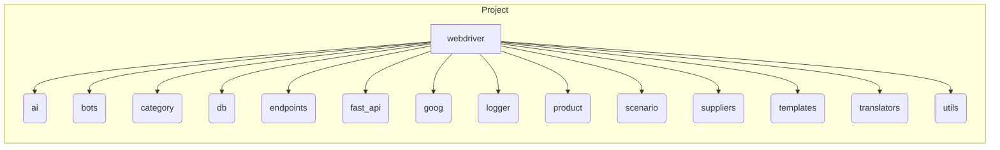

```MD
# <input code>

```markdown
# Table of Contents

1. [webdriver](#webdriver)
2. [ai](#ai)
3. [bots](#bots)
4. [category](#category)
5. [db](#db)
6. [endpoints](#endpoints)
7. [fast_api](#fast_api)
8. [goog](#goog)
9. [logger](#logger)
10. [product](#product)
11. [scenario](#scenario)
12. [suppliers](#suppliers)
13. [templates](#templates)
14. [translators](#translators)
15. [utils](#utils)


# Modules

## webdriver
Module for working with web drivers and automating browser actions.

## ai
Module for integrating artificial intelligence, including interaction with various AI models.

## bots
Module for creating and managing bots that interact with users.

## category
Module for working with product or data categories.

## db
Module for interacting with databases, including creating, reading, and updating data.

## endpoints
Module for creating and handling API endpoints that interact with clients.

## fast_api
Module for using FastAPI within the project, including request routing and configuration.

## goog
Module for working with Google services, such as Google Cloud or APIs.

## logger
Module for logging, providing functionality for recording logs and errors.

## product
Module for working with products, including processing product and service data.

## scenario
Module for modeling and executing interaction scenarios.

## suppliers
Module for interacting with suppliers, including integration with external systems.

## templates
Module for working with data templates and generating them.

## translators
Module for text translation using various tools and APIs.

## utils
Utility module that includes various helper functions for the project.
```

# <algorithm>

The provided code is a list of modules, not executable code.  Therefore, no algorithm can be described in terms of step-by-step execution.  It's a table of contents and module descriptions.  It outlines the different parts of a software project.

# <mermaid>



# <explanation>

This code is a documentation, not executable code. It serves as a table of contents and a list of modules that likely make up a Python project.  Each module, like `webdriver`, `ai`, `logger`, etc., likely contains Python code (functions, classes, etc.) that implement the described functionality.

* **Purpose:** The code lists and briefly describes the various components of a larger software project.  It's the documentation of the project's structure.  It gives a high-level overview of the features the software addresses.


* **Possible Errors/Improvements:**
    * The documentation is incomplete without actual implementation details within each module.
    *  More detailed descriptions of the expected interactions between modules would be useful (e.g., how `ai` uses `db`, how `endpoints` call `utils` functions).

* **Relationships with other parts of the project:**  The diagram above shows a high-level dependency graph assuming that each module might use functions, classes or data from other modules. The actual relationship (imports) between the modules are not reflected in the markdown format. For a real analysis, you'd need to look at the Python files themselves.


**Missing Context**: Without the actual Python code (`.py` files) for each of these modules, a more in-depth analysis is impossible. The code example only provides the module listing and some descriptions, but lacks code functionality details.