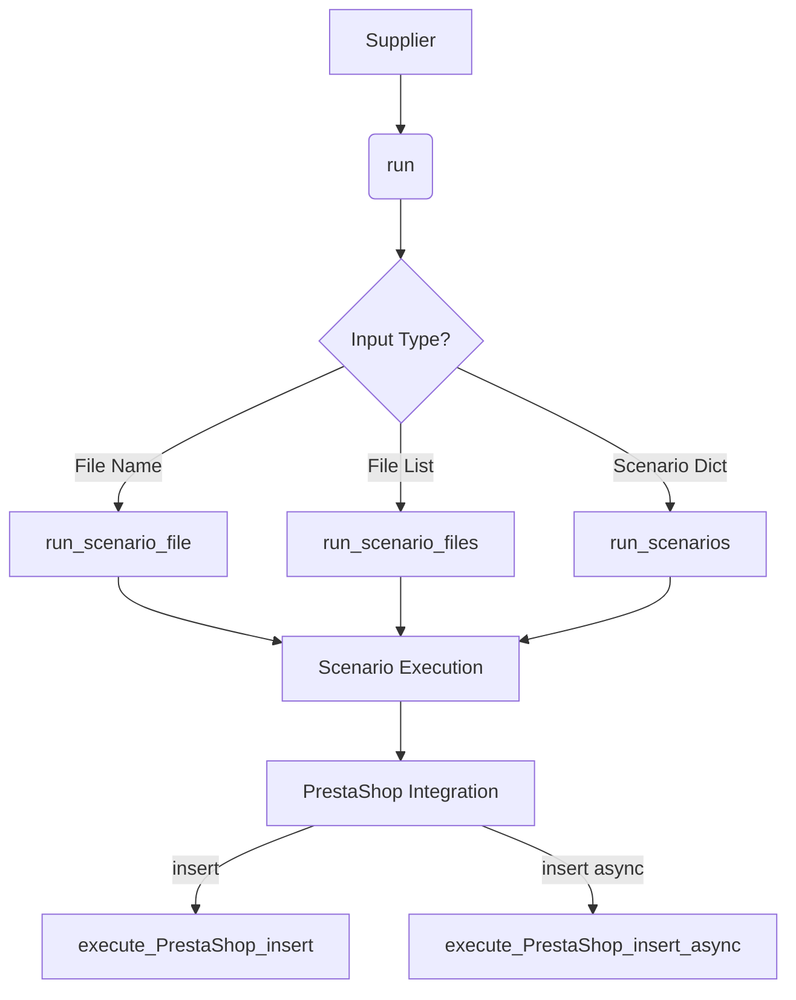

```MD
# <input code>

```python
## \file hypotez/src/scenario/__init__.py
# -*- coding: utf-8 -*-\
#! venv/Scripts/python.exe
#! venv/bin/python/python3.12

"""
.. module: src.scenario 
	:platform: Windows, Unix
	:synopsis: Module with scenario execution functions: `run_scenario_files`, `run_scenarios`  
Scenario executor for suppliers.
----


The logic executed is as follows:
<pre>
  +-----------+
  |  Scenario |
  +-----------+
        |
        | Defines
        |
        v
  +-----------+
  | Executor  |
  +-----------+
        |
        | Uses
        |
        v
  +-----------+        +-----------+
  |  Supplier | <----> |  Driver   |
  +-----------+        +-----------+
        |                     |
        | Provides Data        | Provides Interface
        |                     |
        v                     v
  +-----------+        +-----------+
  |  PrestaShop       | Other Suppliers |
  +-----------+        +-----------+
</pre>
@code
s = Supplier('aliexpress')

run_scenario_files(s, 'file1')

s = Supplier('aliexpress')
scenario_files = ['file1', ...]
run_scenario_files(s, scenario_files)

scenario1 = {'key': 'value'}
run_scenarios(s, scenario1)


list_of_scenarios = [scenario1, ...]
run_scenarios(s, list_of_scenarios)


@endcode
Example of a scenario file:
```json
{
  "scenarios": {

    "feet-hand-treatment": {
      "url": "https://hbdeadsea.co.il/product-category/bodyspa/feet-hand-treatment/",
      "name": "Foot and Hand Care",
      "condition": "new",
      "presta_categories": {
        "default_category": 11259,
        "additional_categories": []
      }
    },

    "creams-butters-serums-for-body": {
      "url": "https://hbdeadsea.co.il/product-category/bodyspa/creams-butters-serums-for-body/",
      "name": "Creams, Butters, and Serums for Body",
      "condition": "new",
      "presta_categories": {
        "default_category": 11260,
        "additional_categories": []
      }
    }
}
```
```python

For detailed information on the scenario dictionary, read here: ...

When the program is started via main(), the following sequence of execution occurs:
@code
s = Supplier('aliexpress')

s.run()

s.run('file1')

scenario_files = ['file1', ...]
s.run(scenario_files)

scenario1 = {'key': 'value'}
s.run(scenario1)


list_of_scenarios = [scenario1, ...]
s.run(list_of_scenarios)
```
"""
MODE = 'dev'
from .executor import (
    run_scenario, 
    run_scenarios, 
    run_scenario_file, 
    run_scenario_files, 
    execute_PrestaShop_insert, 
    execute_PrestaShop_insert_async,
)
```

# <algorithm>

The code defines a module for scenario execution. The `run_scenario_files` and `run_scenarios` functions are the core of the scenario execution logic.

**1. Scenario Definition:** Scenarios are likely stored in files or data structures (e.g., dictionaries or lists).  The `scenario` dictionary example represents the format for a scenario.

**2. Execution via Supplier:** A `Supplier` class (not shown) is responsible for handling the execution. It likely contains the `run()` method for initiating the execution process. The `run()` method may accept various types of scenario inputs (individual files, lists of files, or dictionaries representing scenarios).

**3. Executor Handling:** The `run()` method of the `Supplier` likely calls appropriate functions `run_scenario`, `run_scenario_file`, or `run_scenario_files` from the `executor` module. These functions actually execute the scenario logic.

**4. Input Processing:**  The input formats handled include single file names, lists of file names, and dictionaries. The code provides example calls with different input types.

**5. PrestaShop Integration:** The module likely interacts with a PrestaShop system (`execute_PrestaShop_insert` and `execute_PrestaShop_insert_async`).

# <mermaid>



**Explanation of Dependencies:** The `executor` module is imported. This indicates a dependency on a separate module containing the functions for actually running scenarios.  The code relies on the `Supplier` class (implicitly, not directly shown here) to orcheStarte the process and likely handle data transfer and context.

# <explanation>

* **Imports:** The `from .executor import ...` statement imports functions from a module named `executor` located within the same directory as the current file (`src/scenario`).  This structure suggests a modular design, with `scenario` being the entry point for scenario execution, and `executor` handling the actual execution logic. `execute_PrestaShop_insert` and `execute_PrestaShop_insert_async` indicate the module needs to interact with a PrestaShop system.  


* **Classes (Implicit):** The code shows interactions with a `Supplier` class. This class is not defined directly within this file but likely exists elsewhere in the project. This suggests a design pattern where the `Supplier` class acts as an abstraction to manage different suppliers (e.g., `aliexpress`). It likely contains methods to interact with the system (like `run()`) and store data associated with a particular supplier.


* **Functions:** The imported functions (`run_scenario`, `run_scenarios`, etc.) are responsible for executing the various scenario types. The docstrings describe what types of inputs are expected and that different suppliers are used and provide the information.


* **Variables:** `MODE` is a global variable likely used for configuration (e.g., development mode versus production mode).  Other variables will be passed to the `run_scenario_*` functions as input scenarios or file paths.


* **Possible Errors/Improvements:** The code is well-commented, which is important for maintainability, but adding more detailed docstrings to functions within the `executor` module and the `Supplier` class would increase readability.  It would be beneficial to define input validation to ensure that the data being passed is in the expected format and that error handling is in place to manage possible exceptions.  Also, consider adding logging for more effective debugging and monitoring of the execution process.


* **Relationships:** The `scenario` module depends on the `executor` module to provide its functionality. The relationships indicate that scenarios are executed through interactions with a supplier to access data, and the execution process is also interacting with the PrestaShop system.

**Further Analysis:** The example `scenario` data suggests a structure for managing products and their information. A possible further analysis would involve identifying the data sources used by the supplier, and determining how the code transforms and transfers the data to the PrestaShop system.