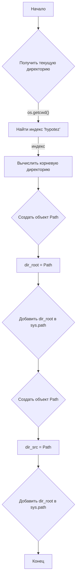

# <input code>

```python
## \file hypotez/src/suppliers/_examples/header.py
# -*- coding: utf-8 -*-\
#! venv/Scripts/python.exe
#! venv/bin/python/python3.12

"""
.. module: src.suppliers._examples 
	:platform: Windows, Unix
	:synopsis:

"""
MODE = 'dev'

"""
	:platform: Windows, Unix
	:synopsis:

"""


"""
	:platform: Windows, Unix
	:synopsis:

"""


"""
  :platform: Windows, Unix

"""
"""
  :platform: Windows, Unix
  :platform: Windows, Unix
  :synopsis:
"""MODE = 'dev'
  
""" module: src.suppliers._examples """


import os
import sys
from pathlib import Path

dir_root : Path = Path (os.getcwd()[:os.getcwd().rfind('hypotez')+7]) ## <- Корневая директория проекта
sys.path.append (str (dir_root) )  # Добавляю корневую директорию в sys.path
dir_src = Path (dir_root, 'src') 
sys.path.append (str (dir_root) ) # Добавляю рабочую директорию в sys.path 


```

# <algorithm>



**Пример:**

Если текущая директория - `/home/user/project/hypotez/src/suppliers/_examples`, то:

1. `os.getcwd()` вернет `/home/user/project/hypotez/src/suppliers/_examples`.
2. `os.getcwd().rfind('hypotez')` вернет индекс 19.
3. `os.getcwd()[:os.getcwd().rfind('hypotez')+7]` вернет `/home/user/project/hypotez`.
4. `Path` создает объект пути `/home/user/project/hypotez`.
5. `sys.path.append` добавляет этот путь в список импортируемых каталогов.

# <mermaid>

```mermaid
graph LR
    A[header.py] --> B(os);
    A --> C(sys);
    A --> D(pathlib);
    B --> E[os.getcwd()];
    E --> F[str];
    F --> G[Path];
    G --> H[dir_root];
    C --> I[sys.path.append];
    I --> J[dir_root];
    D --> K[Path];
    K --> L[dir_src];
    I --> M[str(dir_root)];
```

**Объяснение диаграммы:**

Диаграмма демонстрирует зависимости файла `header.py` от модулей `os`, `sys` и `pathlib`.  Модуль `os` используется для получения текущей директории, `sys` - для добавления путей в `sys.path`, и `pathlib` для работы с объектами путей.  `header.py` создаёт переменные `dir_root` и `dir_src` для хранения путей, и добавляет эти пути в `sys.path`, чтобы Python мог находить файлы и модули в нужном месте.


# <explanation>

* **Импорты**:
    * `os`: Модуль для взаимодействия с операционной системой, используется для получения текущей директории.
    * `sys`: Модуль для доступа к интерпретатору Python и управления импортами.  Важно для добавления путей в `sys.path`.
    * `pathlib`: Модуль для работы с объектами путей, предоставляет более удобный и переносимый способ работы с файлами и директориями, чем стандартные методы Python.

* **Классы**: Нет определённых классов.

* **Функции**: Нет определённых функций.

* **Переменные**:
    * `MODE`: Строковая переменная, предположительно, определяет режим работы (например, 'dev', 'prod').
    * `dir_root`: Объект `Path`, хранящий путь к корневой директории проекта.  Этот объект из библиотеки `pathlib` предоставляет более безопасный способ работы с путями, чем стандартные строковые методы Python.
    * `dir_src`: Объект `Path`, хранящий путь к директории `src` в проекте.

* **Возможные ошибки и улучшения**:

    * **Жесткая привязка к имени папки:** Код предполагает, что папка проекта называется `hypotez`.  Если имя папки отличается, код не будет работать корректно. Можно использовать более универсальное решение, например, основываясь на наличии файла, директории или на другом определяющем элементе.
    * **Избыточное добавление:** Код добавляет `dir_root` дважды в `sys.path`.  Достаточно сделать это один раз.
    * **Проверка существования директории:** Необходимо проверить, что директория `hypotez` существует, чтобы избежать ошибок.
    * **Документация:** Документация в виде `""" ... """` не соответствует PEP 257, хотя не критически для кода. При этом, комментарии должны быть в PEP 257 формате, например, при описании назначения и аргументов функций.

**Взаимосвязь с другими частями проекта**:

Файл `header.py` служит для настройки среды разработки и корректной работы импортов, тем самым обеспечивая взаимодействие с модулями в директории `src` проекта.  Он важен для всех скриптов, использующих `src` для импорта.