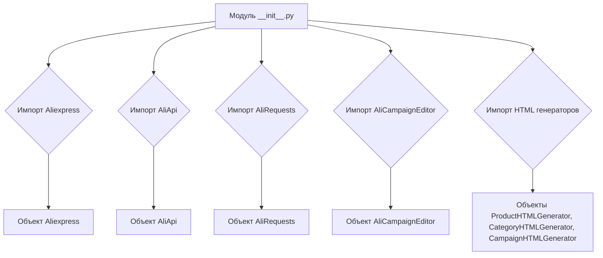
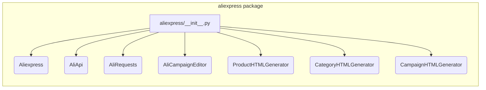

## <input code>

```python
## \file hypotez/src/suppliers/aliexpress/__init__.py
# -*- coding: utf-8 -*-
#! venv/Scripts/python.exe
#! venv/bin/python/python3.12

"""
.. module: src.suppliers.aliexpress 
	:platform: Windows, Unix
	:synopsis:

"""
MODE = 'dev'

from .aliexpress import Aliexpress
from .aliapi import AliApi
from .alirequests import AliRequests
from .campaign import AliCampaignEditor
from .campaign.html_generators import ProductHTMLGenerator, CategoryHTMLGenerator, CampaignHTMLGenerator 
```

## <algorithm>

Данный код представляет собой модуль инициализации для пакета `aliexpress` в проекте `hypotez`. Он содержит импорты, необходимые для работы других модулей внутри этого пакета.  

Алгортим работы в этом случае очень прост. Модуль импортирует необходимые классы и объекты из других файлов внутри пакета `aliexpress`.  По сути, это подготовка необходимых компонентов для работы.  Никаких сложных вычислений или обработки данных здесь нет.

**Пример:**
Модуль `aliexpress` будет использовать классы `Aliexpress`, `AliApi`, `AliRequests`, `AliCampaignEditor` и генераторы HTML из подпапки `campaign`.

**Блок-схема:**




## <mermaid>



## <explanation>

**Импорты:**

Импорты (`from .aliexpress import Aliexpress`, `from .aliapi import AliApi`, ...)  импортируют классы и модули из подпапок внутри пакета `aliexpress`.  Символ `.` перед именем файла указывает, что файлы находятся в той же папке, что и текущий файл `__init__.py`.   Это стандартная практика в Python для организации модулей в пакетах.  Например, `Aliexpress` вероятно содержит класс, представляющий самого поставщика AliExpress.

**Классы:**

*   `Aliexpress`: Вероятно, представляет собой класс, который управляет взаимодействием с поставщиком AliExpress. Может содержать методы для получения данных, настройки параметров или других операций, специфичных для AliExpress.
*   `AliApi`: Вероятно, класс для взаимодействия с API AliExpress.
*   `AliRequests`: Возможно, класс для обработки HTTP-запросов к API AliExpress.
*   `AliCampaignEditor`: Вероятно, класс для работы с рекламными кампаниями AliExpress.
*   `ProductHTMLGenerator`, `CategoryHTMLGenerator`, `CampaignHTMLGenerator`: Классы, генерирующие HTML-представления для продуктов, категорий и рекламных кампаний соответственно.  Вероятно, эти классы находятся в подпапке `campaign` внутри `aliexpress`.

**Функции:**

В данном `__init__.py` нет собственных функций.  Функциональность реализована в импортируемых модулях и классах.

**Переменные:**

`MODE = 'dev'`:  Константа, вероятно, для установки режима работы (например, "development", "production").  Это позволяет изменять поведение кода в зависимости от режима.

**Возможные ошибки/улучшения:**

*   Отсутствует проверка корректности импортов.  Если файлы, на которые ссылаются импорты, не существуют, код выдаст ошибку.
*   Не описаны дополнительные зависимости (например, на какие библиотеки опираются импортированные классы/модули) - нужно смотреть внутри файлов `aliexpress`, `aliapi` и т.д.
*   Отсутствуют комментарии внутри импортируемых модулей.


**Цепочка взаимосвязей:**

`hypotez/src/suppliers/aliexpress/__init__.py` служит точкой входа для работы с поставщиком AliExpress.  Для того, чтобы понять полную логику, нужно проанализировать содержимое других файлов и классов (например, `aliexpress.py`, `aliapi.py` и т.д.).  Эти файлы будут содержать реализацию классов, необходимых для взаимодействия с API AliExpress, работы с рекламными кампаниями и генерации HTML-вывода.