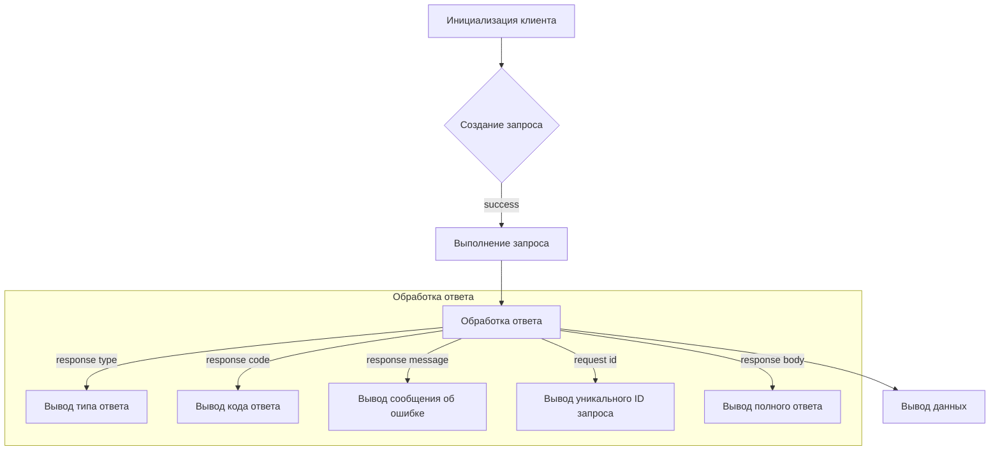
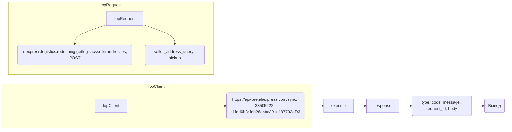

```MD
# <input code>

```python
## \file hypotez/src/suppliers/aliexpress/api/_examples/iop/test_get.py
# -*- coding: utf-8 -*-
#! venv/Scripts/python.exe # <- venv win
## ~~~~~~~~~~~~~
""" module: src.suppliers.aliexpress.api._examples.iop """

import iop

# params 1 : gateway url
# params 2 : appkey
# params 3 : appSecret
client = iop.IopClient('https://api-pre.aliexpress.com/sync', '33505222', 'e1fed6b34feb26aabc391d187732af93')

# create a api request set GET mehotd
# default http method is POST
request = iop.IopRequest('aliexpress.logistics.redefining.getlogisticsselleraddresses', 'POST')
request.set_simplify()
# simple type params ,Number ,String
request.add_api_param('seller_address_query', 'pickup')

response = client.execute(request,"50000001a27l15rndYBjw6PrtFFHPGZfy09k1Cp1bd8597fsduP0RStringNormalizery0jhF6FL")

# response type nil,ISP,ISV,SYSTEM
# nil ：no error
# ISP : API Service Provider Error
# ISV : API Request Client Error
# SYSTEM : Iop platform Error
print(response.type)

# response code, 0 is no error
print(response.code)

# response error message
print(response.message)

# response unique id
print(response.request_id)

# full response
print(response.body)
```

# <algorithm>

**Блок-схема:**



**Пример:**

1. **Инициализация клиента:** Создается объект `IopClient` с заданными URL, appkey и appSecret.
2. **Создание запроса:** Создается объект `IopRequest` с указанием API метода и параметром `seller_address_query`.
3. **Выполнение запроса:** Метод `client.execute` отправляет запрос к API.
4. **Обработка ответа:** Программа получает объект `response` с результатами запроса.
5. **Вывод данных:**  Программа выводит тип ответа, код, сообщение об ошибке, уникальный ID запроса и полное содержимое ответа.


# <mermaid>



**Объяснение диаграммы:**

Диаграмма изображает взаимодействие между `IopClient`, `IopRequest` и конечным API.
- `IopClient`: принимает URL, appkey и appSecret для подключения к API.
- `IopRequest`:  формирует запрос с указанием API-метода и параметров.
- `execute`: отправляет запрос.
- `response`: содержит ответ от API.
- `type`, `code`, `message`, `request_id`, `body`: атрибуты объекта `response`, содержащие информацию об ответе.
- `Вывод`: выводит полученные данные.


# <explanation>

**Импорты:**

- `import iop`: Импортирует модуль `iop`, который, судя по коду, предоставляет классы и функции для работы с API AliExpress.  Скорее всего, `iop` - это собственный модуль проекта или библиотека, разработанная для взаимодействия с API.  Поиска зависимостей внутри `src/` не хватает контекста.

**Классы:**

- `IopClient`: Представляет клиента для взаимодействия с API. Имеет атрибуты `gateway_url`, `appkey` и `appSecret`, используемые для инициализации соединения.  `execute` метод отправляет запросы к API и получает ответ.
- `IopRequest`: Представляет запрос к API.  Имеет метод `set_simplify()` и `add_api_param()`  для настройки запроса.

**Функции:**

- `client.execute(request, ...)`: Отправляет запрос `request` к API, используя настройки клиента. Аргумент `...` не определен, но может представлять дополнительные параметры запроса. Возвращает объект `response`, содержащий данные о результате выполнения запроса.

**Переменные:**

- `client`: Экземпляр класса `IopClient`.
- `request`: Экземпляр класса `IopRequest`.
- `response`: Экземпляр класса, представляющий результат выполнения запроса к API.  Этот тип объекта неявно создается методом `execute`.

**Возможные ошибки/улучшения:**

- Отсутствует обработка исключений.  При ошибках API или сетевых проблемах код не обрабатывает исключения. Добавление обработки исключений (`try...except`) сделает код более надежным.
- Нет проверки валидности данных, полученных от API.
- Неясно, какой тип возвращает `execute()`, предположительно - объект, содержащий `type`, `code`, `message`, `request_id`, `body`.

**Взаимосвязь с другими частями проекта:**

Необходимо больше информации о проекте `hypotez`, чтобы определить взаимосвязи с другими модулями.


**Общее замечание:** Код демонстрирует запрос к API, но для полного анализа и понимания его работы, необходимо знать, как реализованы классы `IopClient` и `IopRequest` внутри модуля `iop`.  В частности, нужно знать, как `iop` взаимодействует с низкоуровневыми средствами HTTP запросов и обработкой ответов.