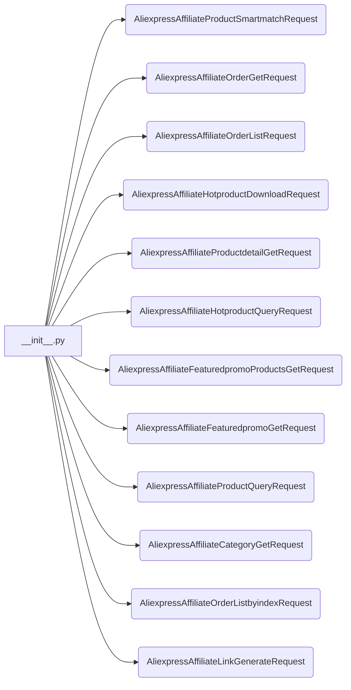

# <input code>

```python
## \file hypotez/src/suppliers/aliexpress/api/_examples/rest/__init__.py
# -*- coding: utf-8 -*-\
#! venv/Scripts/python.exe # <- venv win
## ~~~~~~~~~~~~~\
""" module: src.suppliers.aliexpress.api._examples.rest """
from .AliexpressAffiliateProductSmartmatchRequest import AliexpressAffiliateProductSmartmatchRequest
from .AliexpressAffiliateOrderGetRequest import AliexpressAffiliateOrderGetRequest
from .AliexpressAffiliateOrderListRequest import AliexpressAffiliateOrderListRequest
from .AliexpressAffiliateHotproductDownloadRequest import AliexpressAffiliateHotproductDownloadRequest
from .AliexpressAffiliateProductdetailGetRequest import AliexpressAffiliateProductdetailGetRequest
from .AliexpressAffiliateHotproductQueryRequest import AliexpressAffiliateHotproductQueryRequest
from .AliexpressAffiliateFeaturedpromoProductsGetRequest import AliexpressAffiliateFeaturedpromoProductsGetRequest
from .AliexpressAffiliateFeaturedpromoGetRequest import AliexpressAffiliateFeaturedpromoGetRequest
from .AliexpressAffiliateProductQueryRequest import AliexpressAffiliateProductQueryRequest
from .AliexpressAffiliateCategoryGetRequest import AliexpressAffiliateCategoryGetRequest
from .AliexpressAffiliateOrderListbyindexRequest import AliexpressAffiliateOrderListbyindexRequest
from .AliexpressAffiliateLinkGenerateRequest import AliexpressAffiliateLinkGenerateRequest
```

# <algorithm>

Этот код представляет собой модуль `__init__.py`, который импортирует различные классы из подпапок.  Блок-схема в данном случае тривиальна: простое импортирование.  Нет вызова функций, циклов, или обработки данных.  Данные не перемещаются между функциями, так как импорт не подразумевает никаких действий с данными.



# <mermaid>



# <explanation>

```mermaid
graph LR
    subgraph Module __init__.py
        A[AliexpressAffiliateProductSmartmatchRequest] --> |Import| B(AliexpressAffiliateProductSmartmatchRequest);
        A --> |Import| C(AliexpressAffiliateOrderGetRequest);
        A --> |Import| D(AliexpressAffiliateOrderListRequest);
        A --> |Import| E(AliexpressAffiliateHotproductDownloadRequest);
        A --> |Import| F(AliexpressAffiliateProductdetailGetRequest);
        A --> |Import| G(AliexpressAffiliateHotproductQueryRequest);
        A --> |Import| H(AliexpressAffiliateFeaturedpromoProductsGetRequest);
        A --> |Import| I(AliexpressAffiliateFeaturedpromoGetRequest);
        A --> |Import| J(AliexpressAffiliateProductQueryRequest);
        A --> |Import| K(AliexpressAffiliateCategoryGetRequest);
        A --> |Import| L(AliexpressAffiliateOrderListbyindexRequest);
        A --> |Import| M(AliexpressAffiliateLinkGenerateRequest);
    end
```

Этот файл `__init__.py`  в папке `hypotez/src/suppliers/aliexpress/api/_examples/rest`  служит для инициализации подпапки.  Главная его роль — импортировать все остальные модули из текущей директории.  Он экспортирует классы, вероятно, для использования в других частях проекта, которые занимаются взаимодействием с API AliExpress.

**Импорты:**

Все импорты вида `from .<class_name> import <class_name>` указывают на то, что импортируются классы из подпапок, начиная с текущей (`.`).  Это типичный подход для организации модулей в Python, когда в подпапках содержатся классы, связанные с определенной функциональностью (в данном случае, запросы к API).

**Классы:**

В коде присутствуют различные классы запросов, которые, скорее всего, представляют собой объекты, содержащие параметры для запроса к API AliExpress.  В дальнейшем эти классы будут использоваться для построения запросов к API.  У них могут быть атрибуты (переменные внутри класса), такие как URL, данные запроса, заголовки и др. и методы (функции внутри класса), которые выполняют определенные действия (например, отправка запроса, обработка ответа).  Примерами подобных классов являются `AliexpressAffiliateProductSmartmatchRequest`, `AliexpressAffiliateOrderGetRequest` и т.д.


**Функции:**

В данном `__init__.py` нет функций.  Только импорты. Функционал, связанный с API, скорее всего, находится в самих классах (методы, которые отправляют запросы к API).

**Переменные:**

Нет объявления переменных.

**Возможные ошибки или улучшения:**

* **Документация:** Классы должны быть снабжены docstrings, описывающими их функциональность и назначение атрибутов.
* **Проверка ввода:**  В классах запросов (в самих файлах, а не в данном `__init__.py`) рекомендуется проверять входящие данные на корректность и, возможно, обрабатывать ошибки (например, `ValueError`, `TypeError` или ошибки валидации).
* **Обработка ответов:** В классах запросов должны быть методы для обработки ответов от API (например, проверка кода ответа, извлечение нужных данных из JSON-ответа).


**Взаимосвязь с другими частями проекта:**

Этот модуль является частью пакета для работы с AliExpress.  Он, скорее всего, используется другими частями проекта, которые нуждаются в выполнении запросов к API AliExpress.  Это могут быть:
 - скрипты для парсинга данных;
 - скрипты для автоматизации работы с AliExpress;
 - сервисы, которые используют данные, полученные с API;


В целом, код организован в соответствии с принципами структурированного программирования. Однако, для более глубокого анализа, требуется изучить определения самих классов, и как они используют параметры для запросов.