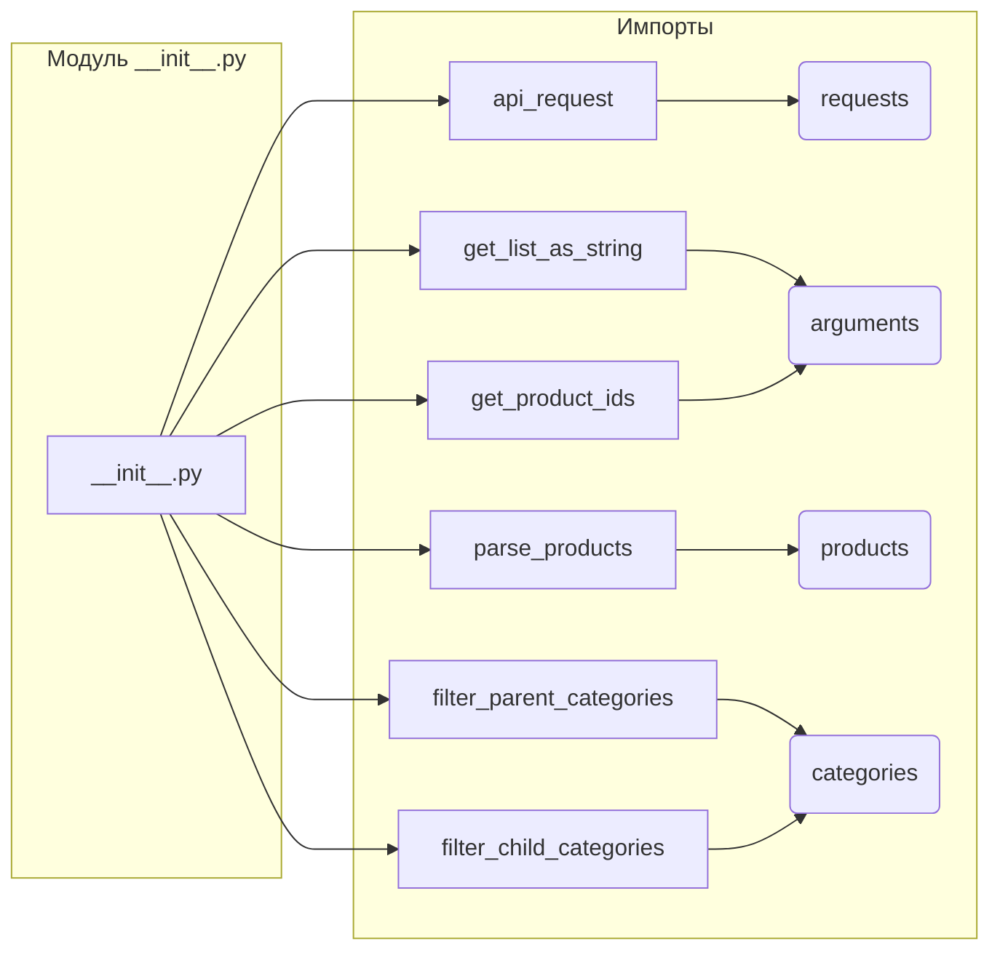

# <input code>

```python
## \file hypotez/src/suppliers/aliexpress/api/helpers/__init__.py
# -*- coding: utf-8 -*-
#! venv/Scripts/python.exe # <- venv win
## ~~~~~~~~~~~~
""" module: src.suppliers.aliexpress.api.helpers """
from .requests import api_request
from .arguments import get_list_as_string, get_product_ids
from .products import parse_products
from .categories import filter_parent_categories, filter_child_categories
```

# <algorithm>

Этот код представляет собой модуль `__init__.py` для пакета `helpers` внутри API AliExpress. Он содержит импорты, необходимые для работы других модулей в этом пакете.  В данном случае, он импортирует функции и классы из подмодулей `requests`, `arguments`, `products` и `categories`.

Нет прямого алгоритма работы, как для функции.  Этот файл просто импортирует необходимые компоненты.  Логика работы будет определена в функциях и классах, которые он импортирует.

Пример:  Функция `api_request` из `requests` будет содержать логику запроса к API AliExpress, `get_product_ids` из `arguments`  — логику извлечения списка идентификаторов продуктов и т.д.


# <mermaid>



**Объяснение диаграммы:**

Диаграмма показывает, как модуль `__init__.py` импортирует функции и классы из других модулей.  `requests`, `arguments`, `products` и `categories` - это подмодули, находящиеся внутри папки `helpers`.  Отношения – это импорты.

# <explanation>

**Импорты:**

`from .requests import api_request`: Импортирует функцию `api_request` из модуля `requests` в текущем пакете (`helpers`).  Это указывает на функцию, которая, вероятно, взаимодействует с API AliExpress.

`from .arguments import get_list_as_string, get_product_ids`: Импортирует функции `get_list_as_string` и `get_product_ids` из модуля `arguments`. Вероятно, эти функции предназначены для обработки входных данных, например, преобразования списка в строку или извлечения идентификаторов продуктов.

`from .products import parse_products`: Импортирует функцию `parse_products` из модуля `products`. Вероятно, эта функция обрабатывает данные о продуктах, полученные с API.

`from .categories import filter_parent_categories, filter_child_categories`: Импортирует функции `filter_parent_categories` и `filter_child_categories` из модуля `categories`. Эти функции, вероятно, фильтруют данные категорий.

**Классы (нет в приведённом коде):**

В данном файле нет определений классов.  Классы, если они есть, будут определены в модулях `requests`, `arguments`, `products` или `categories`.

**Функции (нет в приведённом коде):**

Функции, которые будут определять логику, содержатся в импортированных модулях (`requests`, `arguments`, `products`, `categories`).

**Переменные (нет в приведённом коде):**

Переменные также будут определены внутри импортированных функций и классов.


**Возможные ошибки/улучшения:**

* **Документация:**  Добавление docstrings к функциям и классам в импортированных модулях существенно повысит читаемость и поддержку кода.
* **Типизация:**  Использование типов данных (например, через `typing`) для функций и переменных сделает код более ясным и позволит системе обнаружить потенциальные ошибки.


**Связь с другими частями проекта:**

Этот модуль является частью API-клиента для AliExpress.  Он будет взаимодействовать с другими частями проекта, которые, вероятно, будут использовать функции, импортированные из данного модуля для работы с данными API AliExpress.  Например, основная программа, использующая этот API, будет использовать функции из `api_request`, `get_product_ids` и т.д. для получения и обработки информации с сайта AliExpress.