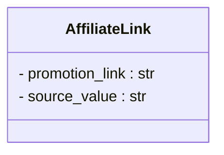

```MD
# <input code>

```python
## \file hypotez/src/suppliers/aliexpress/api/models/affiliate_link.py
# -*- coding: utf-8 -*-
#! venv/Scripts/python.exe # <- venv win
## ~~~~~~~~~~~~
""" module: src.suppliers.aliexpress.api.models """
class AffiliateLink:
    promotion_link: str
    source_value: str
```

# <algorithm>

В данном коде определен класс `AffiliateLink`.  Класс описывает структуру данных для хранения информации об аффилиатной ссылке.

**Шаг 1:** Определение класса `AffiliateLink`.
    * Нет явного алгоритма в данном шаге, только определение структуры.

**Пример:** Предположим, что вам нужно сохранить данные о ссылке на товар с AliExpress, промо-ссылке и источнике ссылки. 

# <mermaid>



# <explanation>

**Импорты:** Нет импортов в данном фрагменте кода.

**Классы:**
* `AffiliateLink`: Это класс, который определяет структуру для хранения данных об аффилиатной ссылке.  Он имеет два атрибута:
    * `promotion_link`: Строка, представляющая промо-ссылку.
    * `source_value`: Строка, описывающая источник ссылки (например, рекламную кампанию или источник трафика).

**Функции:** Нет функций.

**Переменные:** Нет явных переменных, только атрибуты класса.

**Возможные ошибки или области для улучшений:**

* **Отсутствует логика обработки данных:** Класс только определяет структуру.  Нет методов для работы с данными (например, получения, установки, вывода атрибутов).
* **Типизация:** Хотя используется типизация (например, `promotion_link: str`), она не обеспечивает проверки типов во время выполнения. Для полноценной проверки стоит использовать `dataclasses` или `typing`.
* **Дополнения:**  Рекомендуется добавить методы для работы с атрибутами (например, `get_promotion_link()`, `set_promotion_link()`, `get_source_value()`).  Это позволит извне корректно получать и изменять данные об аффилиатной ссылке.


**Взаимосвязи с другими частями проекта:**

Этот класс, скорее всего, будет использоваться в других частях проекта (например, в API обработчика данных AliExpress), где он будет выступать в роли структуры данных для хранения и передачи информации об аффилиатных ссылках.  Эти части будут создавать экземпляры `AffiliateLink` и заполнять его поля, а затем использовать или передавать объект `AffiliateLink` дальше в обработку. Например, функции `get_affiliate_link()` в API могли бы возвращать экземпляр `AffiliateLink`.

**Дополнительные улучшения:**

Для повышения надежности и гибкости можно использовать `dataclasses`:

```python
from dataclasses import dataclass

@dataclass
class AffiliateLink:
    promotion_link: str
    source_value: str
```

Это создаст более структурированный и понятный класс, а также позволит использовать удобные методы для работы с данными.