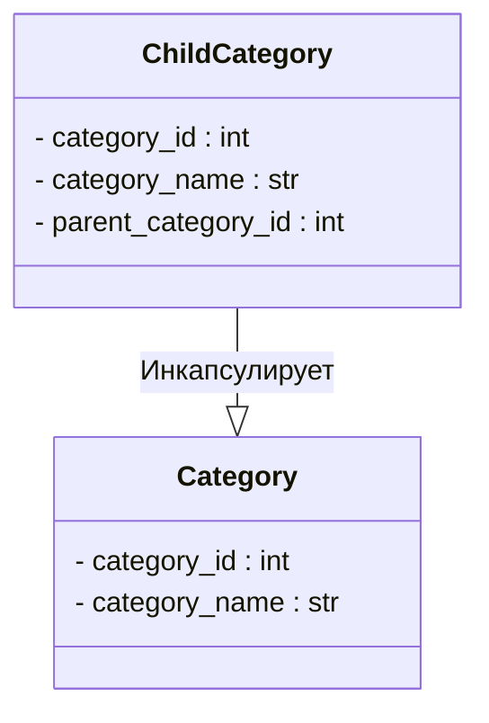

```MD
# <input code>

```python
## \file hypotez/src/suppliers/aliexpress/api/models/category.py
# -*- coding: utf-8 -*-
#! venv/Scripts/python.exe # <- venv win
## ~~~~~~~~~~~~
""" module: src.suppliers.aliexpress.api.models """
class Category:
    category_id: int
    category_name: str


class ChildCategory(Category):
    parent_category_id: int
```

# <algorithm>

**Шаг 1:** Определение класса `Category`.  
* **Описание:** Класс `Category` определяет базовый шаблон для категорий.  
* **Пример:** Представление категории "Одежда". `category_id = 1`, `category_name = "Одежда"`.
* **Передача данных:**  Данные (id и название) хранятся непосредственно в объекте класса.


**Шаг 2:** Определение класса `ChildCategory`.
* **Описание:** Класс `ChildCategory` наследуется от класса `Category`, добавляя дополнительный атрибут `parent_category_id`.
* **Пример:** Подкатегория "Мужская одежда"  `category_id = 2`, `category_name = "Мужская одежда"`, `parent_category_id = 1`.
* **Передача данных:**  Наследуются атрибуты `category_id` и `category_name` из класса `Category`, дополнительно добавляется `parent_category_id`.

# <mermaid>



# <explanation>

**Импорты:**

В данном коде нет импортируемых модулей. Это значит, что данный файл содержит определение классов `Category` и `ChildCategory`, но не зависит от внешних модулей (кроме стандартных, таких как `typing`).

**Классы:**

* **`Category`:** Представляет собой абстрактную категорию (например, "Электроника", "Одежда").  Атрибуты: `category_id` (уникальный идентификатор категории), `category_name` (название категории).

* **`ChildCategory`:**  Представляет подкатегорию, которая наследует свойства родительской категории (`Category`). Дополнительно содержит атрибут `parent_category_id` для указания id родительской категории.


**Функции:**

В данном коде нет функций.  Взаимодействие происходит непосредственно через создание объектов классов.

**Переменные:**

Переменных (в обычном смысле) в данном коде нет. Определены только атрибуты классов.

**Возможные ошибки или области для улучшений:**

* **Типизация:** Использование аннотаций типов (`category_id: int`, `category_name: str`) -- хорошая практика.  Однако, рекомендуется проверять корректность значений при инициализации объектов.
* **Отсутствует валидация данных:** Нет проверки корректности введённых значений (`category_id`, `category_name`, `parent_category_id`).  Это может привести к ошибкам в дальнейшем использовании.
* **Отсутствует логика работы с базой данных:** Нет методов для сохранения/извлечения данных из базы данных.  Этот класс пригоден только для хранения данных в памяти.

**Цепочка взаимосвязей:**

Этот модуль `hypotez/src/suppliers/aliexpress/api/models/category.py` представляет собой часть модели данных для API AliExpress.  Вероятно, дальше в коде будут использоваться эти классы для работы с API.  Например, для запроса информации о категориях или для построения иерархии категорий.  Связь с другими частями проекта неясна без контекста всего проекта.