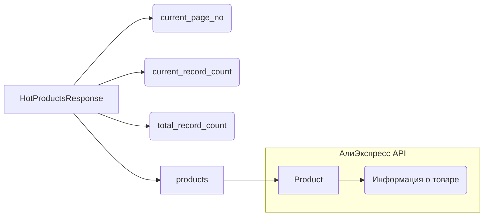

# <input code>

```python
## \file hypotez/src/suppliers/aliexpress/api/models/hotproducts.py
# -*- coding: utf-8 -*-
#! venv/Scripts/python.exe # <- venv win
## ~~~~~~~~~~~~
""" module: src.suppliers.aliexpress.api.models """
from .product import Product
from typing import List


class HotProductsResponse:
    current_page_no: int
    current_record_count: int
    total_record_count: int
    products: List[Product]
```

# <algorithm>

В данном коде определен класс `HotProductsResponse`, который, судя по имени, предназначен для хранения ответа API AliExpress о горячих товарах.

**Шаг 1:** Импортируется класс `Product` из модуля `product.py` внутри того же пакета `aliexpress/api/models`.  Это означает, что `Product` определен в другом файле.

**Шаг 2:** Объявляется класс `HotProductsResponse`. Он хранит информацию об ответе:
    * `current_page_no`: Номер текущей страницы.
    * `current_record_count`: Количество записей на текущей странице.
    * `total_record_count`: Общее количество записей.
    * `products`: Список объектов `Product`, содержащих информацию о каждом товаре.

**Пример:** Предположим, API вернуло данные о 10 горячих товарах, распределенных по страницам. На первой странице (`current_page_no` = 1) показаны 5 товаров (`current_record_count` = 5), а всего товаров 10 (`total_record_count` = 10). Тогда `products` будет списком из 5 объектов `Product`, каждый из которых содержит информацию о конкретном товаре.


# <mermaid>



**Объяснение диаграммы:**

Диаграмма показывает структуру класса `HotProductsResponse`.  `HotProductsResponse` содержит информацию о количестве страниц, количестве товаров на странице и общее количество товаров. `products` — это список объектов `Product`, каждый из которых содержит детальную информацию о конкретном товаре.  Зависимость `Product` от "АлиЭкспресс API" означает, что `Product` получает данные из внешнего источника (API).

# <explanation>

**Импорты:**

* `from .product import Product`: Импортирует класс `Product` из модуля `product.py`, находящегося в том же директории (`aliexpress/api/models`).  Это указывает на связь между `HotProductsResponse` и информацией о продуктах. `.` указывает на поиск модуля относительно текущего файла.

* `from typing import List`:  Импортирует тип данных `List` из модуля `typing`.  Это используется для типизации списка `products` объектов `Product`.  Это важная практика для повышения читаемости и надежности кода.

**Классы:**

* `HotProductsResponse`:  Представляет собой структуру данных для хранения ответа API AliExpress о горячих продуктах.  Он содержит атрибуты, необходимые для описания страницы результатов поиска, и список объектов `Product`.  Эта структура необходима для обработки и дальнейшего использования данных о товарах.


**Функции:**

В данном коде нет функций.  Определен только класс.


**Переменные:**

Переменные `current_page_no`, `current_record_count`, `total_record_count` и `products` являются атрибутами класса `HotProductsResponse`. Они используются для хранения информации из ответа API о товарах.  Типы этих переменных указаны явно (`int` и `List[Product]`).

**Возможные ошибки или области для улучшений:**

* **Отсутствует логика получения данных:**  Код не содержит логики получения данных от API.  Он лишь определяет структуру для хранения данных.  Необходимо добавить функцию или метод, который будет делать запросы к API и заполнять объекты `HotProductsResponse`.
* **Обработка ошибок:** Код не предусматривает обработку ошибок при получении данных. Если запрос к API потерпит неудачу, это может привести к непредсказуемому поведению.  В реальном коде необходима обработка исключений (например, `try...except` блоки).
* **Документирование:**  Необходимо добавить docstrings для класса `HotProductsResponse`, поясняющие его назначение, атрибуты и как им пользоваться.

**Взаимосвязи с другими частями проекта:**

Класс `HotProductsResponse` напрямую зависит от класса `Product`.  Следовательно,  `Product` должен быть определен в `hypotez/src/suppliers/aliexpress/api/models/product.py` (или аналогичном файле).  Этот класс, вероятно, содержит информацию о каждом товаре, полученную из API AliExpress.  Далее, логика работы с API находится в других файлах, скорее всего, использующих `HotProductsResponse` для обработки данных.