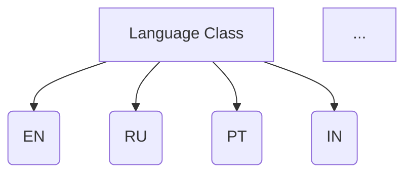
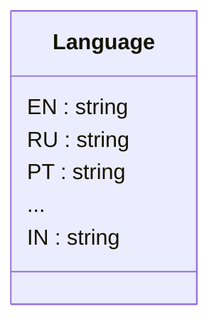

```MD
1. **<input code>**:

```python
## \file hypotez/src/suppliers/aliexpress/api/models/languages.py
# -*- coding: utf-8 -*-\
#! venv/Scripts/python.exe # <- venv win
## ~~~~~~~~~~~~~\
""" module: src.suppliers.aliexpress.api.models """
class Language:
    EN = 'EN'
    RU = 'RU'
    PT = 'PT'
    ES = 'ES'
    FR = 'FR'
    ID = 'ID'
    IT = 'IT'
    TH = 'TH'
    JA = 'JA'
    AR = 'AR'
    VI = 'VI'
    TR = 'TR'
    DE = 'DE'
    HE = 'HE'
    KO = 'KO'
    NL = 'NL'
    PL = 'PL'
    MX = 'MX'
    CL = 'CL'
    IW = 'IW'
    IN = 'IN'
```

2. **<algorithm>**:

Этот код определяет класс `Language`, содержащий константы, представляющие различные языки.  Алгоритм работы тривиален - простое объявление констант.  Нет циклов, функций или сложных операций.




Пример:  `Language.EN` будет содержать строку 'EN'.


3. **<mermaid>**:



Этот код описывает класс `Language` с множеством строковых констант. Зависимости здесь неявные, это просто определение модели данных, представляющих языки.  Нельзя выделить отдельные функции, классы или модули для построения диаграммы зависимостей.


4. **<explanation>**:

* **Импорты**: Нет импортов. Код определяет константы внутри класса.
* **Классы**: Класс `Language` хранит множество констант, представляющих языки. Каждая константа содержит строковое значение языка.  Это хорошая практика для организации констант, связанных с определенной областью (например, языками).
* **Функции**: Нет функций. Все определения внутри класса.
* **Переменные**: Все переменные (`EN`, `RU`, и т.д.) являются константами (с именами, начинающимися с заглавной буквы),  имеют тип `str` и хранят строковые обозначения языков.
* **Возможные ошибки или области для улучшений**:
    * Недостаточно гибкий.  Если нужно добавить новый язык, нужно изменять сам код.  Для лучшей гибкости можно было бы использовать словарь или перечисление (Enum), что позволит динамически добавлять языки и работать с ними более удобно.
    * Отсутствует документация.  Добавление комментариев, описывающих назначение класса и констант, сделало бы код более понятным.
    * Возможно, было бы лучше использовать Enum для хранения значений языков. Это сделало бы код более безопасным и читаемым,  но это уже вопрос стиля и предпочтений.

**Цепочка взаимосвязей с другими частями проекта**:

Этот файл (`languages.py`)  является частью проекта, ориентированного на работу с AliExpress API.  Он определяет языки, которые могут использоваться для запросов или отображения результатов. Вероятно, этот список языков будет использоваться в других частях проекта, например, для выбора языка отображения или фильтрации результатов поиска по товарам.  Например, этот список языков мог бы использоваться в функции или методе, отвечающие за выбор нужных языковых настроек для дальнейшей работы с AliExpress.  Без дополнительных контекста  (например, наличия других файлов или методов) сложно сказать, как конкретно этот класс будет использоваться.