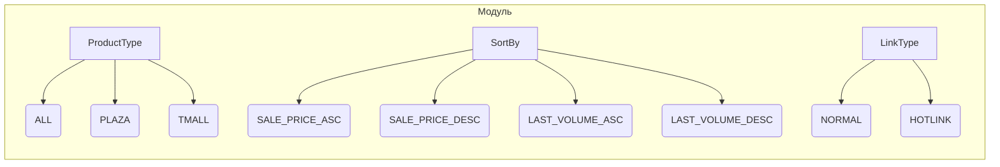

```MD
1. <input code>

```python
## \file hypotez/src/suppliers/aliexpress/api/models/request_parameters.py
# -*- coding: utf-8 -*-\
#! venv/Scripts/python.exe # <- venv win
## ~~~~~~~~~~~~~\
""" module: src.suppliers.aliexpress.api.models """
class ProductType:
    ALL = 'ALL'
    PLAZA = 'PLAZA'
    TMALL = 'TMALL'

class SortBy:
    SALE_PRICE_ASC = 'SALE_PRICE_ASC'
    SALE_PRICE_DESC = 'SALE_PRICE_DESC'
    LAST_VOLUME_ASC = 'LAST_VOLUME_ASC'
    LAST_VOLUME_DESC = 'LAST_VOLUME_DESC'

class LinkType:
    NORMAL = 0
    HOTLINK = 2
```

2. <algorithm>

Данный код определяет три класса, представляющие константы для типов продуктов, способов сортировки и типов ссылок.  Алгоритм работы заключается в объявлении этих констант, что позволяет использовать их в коде,  более читаемо и наглядно.  Нет явного алгоритма в смысле вычислений или последовательных шагов обработки данных.

Примеры использования:

```python
# Пример использования
product_type = ProductType.ALL
sort_by = SortBy.SALE_PRICE_ASC
link_type = LinkType.NORMAL
```


3. <mermaid>



**Объяснение диаграммы:**

Диаграмма представляет иерархию классов.  `ProductType`, `SortBy` и `LinkType` - это классы, содержащие константы. Стрелки от классов к константам указывают на то, что константы принадлежат к определенному типу.  Нет зависимостей между классами в данном фрагменте кода.

4. <explanation>

* **Импорты**: Нет импортируемых модулей. Файл содержит только определения классов с константами, относящимися к API AliExpress.
* **Классы**:
    * `ProductType`: Представляет типы продуктов (например, `ALL`, `PLAZA`, `TMALL`).  Это позволяет удобно и читаемо представлять разные варианты типов продуктов.
    * `SortBy`:  Представляет способы сортировки продуктов (например, по цене `SALE_PRICE_ASC`/`SALE_PRICE_DESC` или по объему продаж `LAST_VOLUME_ASC`/`LAST_VOLUME_DESC`).
    * `LinkType`: Представляет типы ссылок (например, `NORMAL`, `HOTLINK`). Позволяет представлять различные типы ссылок на продукты.

* **Функции**: Нет определенных функций. Есть только определения констант внутри классов.
* **Переменные**: Нет явно объявленных переменных.
* **Возможные ошибки или области для улучшений**:  Нет критичных ошибок.  Можно добавить документацию к классам и константам, чтобы было понятно, какие значения они представляют.


**Цепочка взаимосвязей с другими частями проекта**:

Этот файл (`request_parameters.py`) определяет данные, которые могут быть использованы другими частями проекта, например, для построения запросов к API AliExpress. Взаимосвязи будут в тех частях кода, где используются эти константы (например, в методах, которые формируют запросы к API AliExpress).  Этот файл служит для структурирования и определения данных, используемых при запросах к AliExpress.