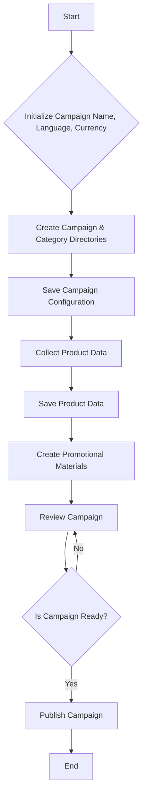
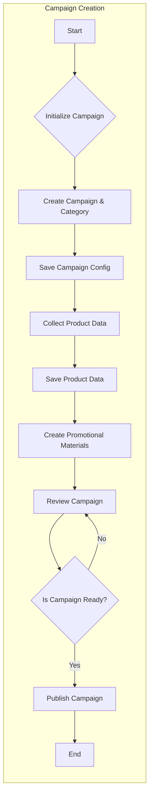

```MD
# Анализ кода создания рекламной кампании на AliExpress

## <input code>

```
<pre>
+-------------------------+
| Start                   |
| Создание рекламной      |
| кампании                |
+-----------+-------------+
            |
            v
+-----------+---------------+
| Initialize Campaign Name, |
| Language, and Currency    |
+-----------+---------------+
            |
            v
+-----------+-------------+
| Create Campaign and     |
| Category Directories    |
+-----------+-------------+
            |
            v
+-----------+-----------------+
| Save Campaign Configuration |
+-----------+-----------------+
            |
            v
+-----------+-------------+
| Collect Product Data    |
+-----------+-------------+
            |
            v
+-----------+-------------+
| Save Product Data       |
+-----------+-------------+
            |
            v
+-----------+------------------+
| Create Promotional Materials |
+-----------+------------------+
            |
            v
+-----------+-------------+
| Review Campaign         |
+-----------+-------------+
            |
            v
+-----------+-------------+
| Is Campaign Ready?      |
+-----------+-------------+
   | Yes / No
   v      v
+-----------+-------------+
| Publish Campaign        |
+-----------+-------------+
   |
   v
+-----------+-------------+
| End                     |
| Создание рекламной      |
| кампании                |
+-------------------------+
</pre>
```

## <algorithm>

Данный код представляет собой алгоритм создания рекламной кампании.  Он описывает последовательность шагов, которые необходимо выполнить.  Ниже представлена блок-схема:



**Примеры:**

* **B (Initialize):** Инициализируется название кампании (например, "Новинки 2024"), язык (например, "Русский"), валюта (например, "USD").
* **C (Create):** Создаются директории для хранения данных о кампании и категориях продуктов.
* **D (Save):** Данные о кампании (имя, язык, валюта, категории) сохраняются в соответствующую базу данных или файл конфигурации.
* **E (Collect):** Сбор данных о продуктах, которые будут включены в кампанию.
* **F (Save):** Данные о продуктах (например, ID, цена, описание) сохраняются.
* **G (Create):** Создание рекламных материалов (баннеры, тексты, изображения).
* **H (Review):** Обзор готовой кампании для проверки.
* **I (Is Ready?):** Проверка готовности кампании по заданным критериям.  Например, проверка наличия всех необходимых данных и материалов.
* **J (Publish):** Публикация кампании на AliExpress.
* **K (End):** Завершение процесса создания кампании.

## <mermaid>



## <explanation>

Этот код, представленный в виде блок-схемы, не содержит исходного кода на конкретном языке программирования.  Поэтому невозможно дать детальное объяснение импортов, классов, функций, переменных.

**Общее описание алгоритма:** Блок-схема описывает циклический процесс, который можно представить как **последовательность операций** для создания рекламной кампании на AliExpress.  Каждая из операций (от инициализации до публикации) может быть реализована в отдельной функции или методе, и этот процесс требует взаимодействия с API AliExpress (о котором не представлено информации).


**Возможные ошибки и улучшения:**

* **Отсутствие детализации:**  Не указано, как конкретно выполняются операции (например, как собираются данные о продуктах, как создаются рекламные материалы).
* **Отсутствие структуры данных:**  Не указаны структуры данных, используемые для хранения информации о кампании, продуктах и т.д.
* **Отсутствует информация об API:**  Не указано, как код взаимодействует с API AliExpress для создания кампании и публикации.


**Взаимосвязь с другими частями проекта:**

Непонятно, какими частями проекта (классами, модулями) реализован алгоритм.  Если эти шаги будут реализованы в виде функций и классов, это даст более четкое представление о том, как код взаимодействует с другими компонентами проекта.