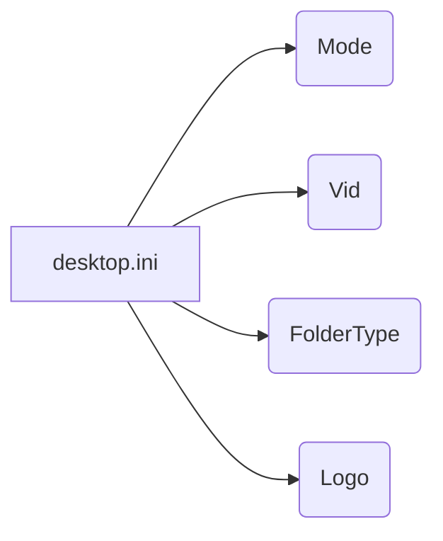

# Анализ кода

**1. <input code>**

```
[ViewState]
Mode=
Vid=
FolderType=Generic
Logo=E:\\Users\\user\\images\\LOGOS\\R.png
```

**2. <algorithm>**

Этот код не является исполняемым кодом на каком-либо языке программирования. Он представляет собой файл `desktop.ini`, используемый для хранения метаданных в Windows для отображения значков и других параметров для папок.

В данном случае файл `desktop.ini` определяет параметры для отображения папки. Алгоритма как такового нет, так как нет логики выполнения, а только набор пар "ключ-значение", которые применяются для настройки отображения.

Пример:  Значение `Logo=E:\\Users\\user\\images\\LOGOS\\R.png` указывает, что папка должна отображаться с логотипом из указанного файла.


**3. <mermaid>**



**Описание диаграммы:**

* **desktop.ini:**  Файл, содержащий метаданные.
* **Mode, Vid, FolderType, Logo:**  Ключи (атрибуты) для метаданных, влияющие на отображение папки в проводнике Windows.

**4. <explanation>**

* **Импорты:** Нет импортов, так как это не код программы, а метаданные.
* **Классы:** Нет классов.
* **Функции:** Нет функций.
* **Переменные:** Нет переменных в привычном смысле. Есть "переменные" в виде пар ключ-значение.
* **Возможное использование:**  Этот файл используется Windows для изменения отображения папки в проводнике.  Например, `Logo` указывает, какой логотип будет отображаться.

**Цепочка взаимосвязей с другими частями проекта:**

Этот файл `desktop.ini` связан с папкой, в которой он находится. Изменения в этом файле влияют на то, как папка отображается в файловом менеджере Windows.  Возможно, этот файл создается приложением или скриптом Python (`hypotez/src/...`), который управляет папкой.  Без доступа к коду приложения (`src/...`) сложно более подробно проанализировать зависимость.

**Возможные ошибки или области для улучшений:**

* Отсутствие проверки корректности пути `Logo`, чтобы избежать ошибок при отсутствии файла.
* В некоторых случаях использование пути может привести к проблемам с относительными путями.
* Необходимость обработки и валидации данных.


**Заключение:**

Файл `desktop.ini` — это конфигурационный файл, используемый Windows для управления отображением папок.  В нем нет кода в привычном понимании, только набор пар "ключ-значение".  Связь с другими частями проекта неясна без кода, создающего этот файл.