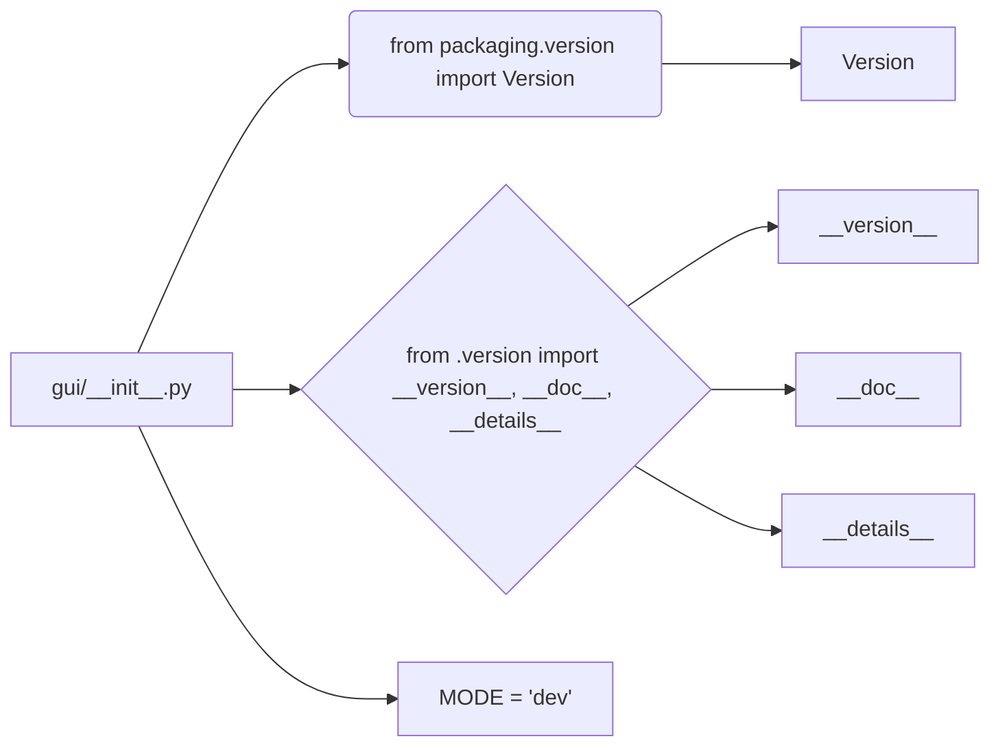

```MD
# Анализ кода hypotez/src/suppliers/aliexpress/gui/__init__.py

## <input code>

```python
## \file hypotez/src/suppliers/aliexpress/gui/__init__.py
# -*- coding: utf-8 -*-\
#! venv/Scripts/python.exe
#! venv/bin/python/python3.12

"""
.. module: src.suppliers.aliexpress.gui 
	:platform: Windows, Unix
	:synopsis:

"""
MODE = 'dev'

"""
	:platform: Windows, Unix
	:synopsis:

"""


"""
	:platform: Windows, Unix
	:synopsis:

"""


"""
  :platform: Windows, Unix

"""
"""
  :platform: Windows, Unix
  :platform: Windows, Unix
  :synopsis:
"""MODE = 'dev'
  
""" module: src.suppliers.aliexpress.gui """


""" Разные сценарии Алиэхпресс """
...
from packaging.version import Version
from .version import __version__, __doc__, __details__ 
```

## <algorithm>

Код представляет собой инициализационную часть модуля `aliexpress.gui`. Алгоритм работы прост: он содержит импорты и константы.  Пошаговая блок-схема:

1. **Импорт:** Модуль импортирует класс `Version` из пакета `packaging`.  Он также импортирует переменные `__version__`, `__doc__`, и `__details__` из подмодуля `version`.  Это указывает, что подмодуль `version` в том же каталоге `aliexpress/gui` содержит информацию о версии.

2. **Константы:**  Определяет константу `MODE` со значением 'dev'.

**Пример:**

Этот код устанавливает конфигурацию модуля, подключая к нему необходимую информацию о версии, а также глобальную константу `MODE` -  очевидно, конфигурацию режима работы.


## <mermaid>



**Объяснение диаграммы и зависимостей:**

* `gui/__init__.py` - главный файл, который содержит импорты.
* `packaging.version` - внешний пакет, предоставляющий класс `Version` для работы с версиями.  Зависимость описывает, что модуль `gui` зависит от возможностей пакета `packaging` для работы с версиями.
* `.version` - подмодуль внутри пакета `gui`, содержащий информацию о версии.  Зависимость показывает, что `gui/__init__.py` использует информацию о версии, предоставляемую модулем `version`.


## <explanation>

**Импорты:**

- `from packaging.version import Version`: Импортирует класс `Version` из пакета `packaging`. Этот пакет используется для работы с версиями программного обеспечения.  Он необходим, вероятно, для обработки информации о версиях библиотек или модулей, связанных с модулем.  Это стандартная библиотека Python для работы с версиями.
- `from .version import __version__, __doc__, __details__`: Импортирует переменные `__version__`, `__doc__`, и `__details__` из модуля `version.py` в том же каталоге (`aliexpress/gui`). Это подразумевает наличие файла `version.py` внутри `aliexpress/gui` содержащего информацию о версии модуля `aliexpress.gui` .

**Классы:**

В данном фрагменте кода нет классов.

**Функции:**

Нет функций.

**Переменные:**

- `MODE = 'dev'`: Глобальная переменная, вероятно, определяющая режим работы (например, режим разработки).

**Возможные ошибки или улучшения:**

- **Отсутствие документации:** Несмотря на наличие строк документации, они не структурированы, и не соответствуют стандарту Sphinx.
- **Неясная цель `MODE`:** Непонятно, как используется значение `MODE` в дальнейшем коде.  Было бы полезно иметь комментарий, описывающий его назначение.
- **Пустые строки документации:** Несколько строк `"""..."""` в коде не содержат никакой полезной информации. Их лучше удалить или дополнить.

**Цепочка взаимосвязей:**

Модуль `aliexpress/gui/__init__.py` зависит от пакета `packaging` для работы с версиями.  Он также зависит от содержимого файла `version.py` в том же каталоге для получения метаданных о версии. Неясно, как этот файл взаимодействует с другими частями проекта (например, с бизнес-логикой).

**Общий вывод:**

Код инициализирует модуль, импортируя необходимую информацию о версии и устанавливая константу режима.  Для более точной оценки необходимо просмотреть остальные части проекта `aliexpress`.