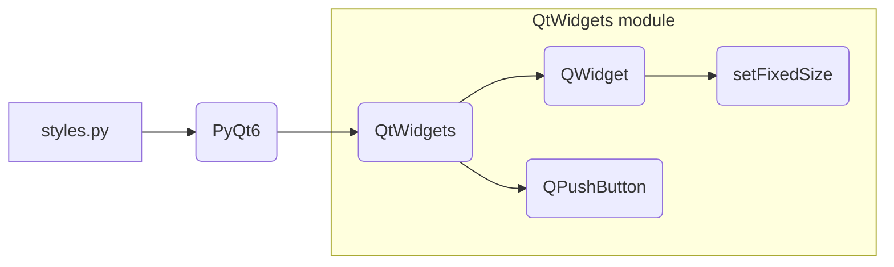

```MD
# <input code>

```python
## \file hypotez/src/suppliers/aliexpress/gui/styles.py
# -*- coding: utf-8 -*-\
#! venv/Scripts/python.exe
#! venv/bin/python/python3.12

"""
.. module: src.suppliers.aliexpress.gui 
	:platform: Windows, Unix
	:synopsis:

"""
MODE = 'dev'


"""
	:platform: Windows, Unix
	:synopsis:

"""


"""
	:platform: Windows, Unix
	:synopsis:

"""


"""
  :platform: Windows, Unix

"""
"""
  :platform: Windows, Unix
  :platform: Windows, Unix
  :synopsis:
"""MODE = 'dev'
  
""" module: src.suppliers.aliexpress.gui """


""" Common styling functions for UI elements """

from PyQt6 import QtWidgets

def set_fixed_size(widget: QtWidgets.QWidget, width: int, height: int):
    """ Set a fixed size for a given widget """
    widget.setFixedSize(width, height)
```

# <algorithm>

```mermaid
graph TD
    A[Start] --> B{Get widget};
    B -- widget is QtWidgets.QWidget -- C[Get width];
    B -- widget is not QtWidgets.QWidget -- D[Error];
    C --> E{Get height};
    E --> F[Call setFixedSize(width, height)];
    F --> G[End];
    D --> G;
```

**Пример:**

Предположим, у нас есть `QtWidgets.QPushButton` с именем `myButton`.  Хотим установить размер 100x50 пикселей.  Алгоритм будет таким:

1. Функция `set_fixed_size` получает на вход `myButton`, `100` и `50`.
2. Проверяется, что `myButton` является экземпляром `QtWidgets.QWidget` (в данном случае это `QPushButton`, который наследуется от `QWidget`).
3. Переменные `width` и `height` принимают значения 100 и 50 соответственно.
4. Вызывается метод `setFixedSize` объекта `myButton` с заданными шириной и высотой.
5. Алгоритм завершается.


# <mermaid>



# <explanation>

**Импорты:**

- `from PyQt6 import QtWidgets`: Импортирует необходимые классы и методы из библиотеки PyQt6, в частности, класс `QtWidgets.QWidget`, который используется в функции `set_fixed_size`.  Это часть Qt-фреймворка для создания графического пользовательского интерфейса.  Связь с `src` в данном случае - опосредованная через Qt6, которая, скорее всего, установлена в рамках проекта.

**Классы:**

- `QtWidgets.QWidget`:  Базовый класс для всех виджетов в PyQt6.  Функция `set_fixed_size` работает с объектами, наследуемыми от этого класса (например, `QPushButton`, `QLabel`, и др.).

**Функции:**

- `set_fixed_size(widget: QtWidgets.QWidget, width: int, height: int)`:
    - Принимает на вход `widget` - экземпляр класса `QtWidgets.QWidget`, `width` - целое число для ширины и `height` - целое число для высоты.
    - Устанавливает фиксированный размер `widget` с помощью метода `widget.setFixedSize(width, height)`.
    - Не возвращает никакого значения (возвращает `None`).

**Переменные:**

- `MODE = 'dev'`:  Глобальная переменная, скорее всего, используется для определения режима работы (например, "разработки" или "производства").  Не используется в функции `set_fixed_size`, но может использоваться в других частях приложения.

**Возможные ошибки и улучшения:**

- **Проверка типов:** Хотя типизация используется, было бы полезно добавить проверку, что `widget` действительно является экземпляром `QtWidgets.QWidget` или его потомком.  Это предотвратит ошибки при передаче неподходящих типов в функцию.  Например:

```python
def set_fixed_size(widget, width, height):
    if not isinstance(widget, QtWidgets.QWidget):
        raise TypeError("Widget must be an instance of QtWidgets.QWidget")
    if not isinstance(width, int) or not isinstance(height, int):
      raise TypeError("Width and height must be integers")
```

- **Обработка исключений:** Добавление обработки исключений (например, `try...except`) может сделать функцию более надежной, если она вызывается из кода, который может генерировать ошибки.

**Взаимосвязи с другими частями проекта:**

Функция `set_fixed_size` используется для стилизации пользовательского интерфейса в приложении.  Она будет вызываться из других частей приложения, которые отвечают за создание и управление виджетами (например, в функции, которая отвечает за создание и расположение кнопок).  Поэтому есть зависимость от классов и функций, которые создают и используют виджеты Qt.