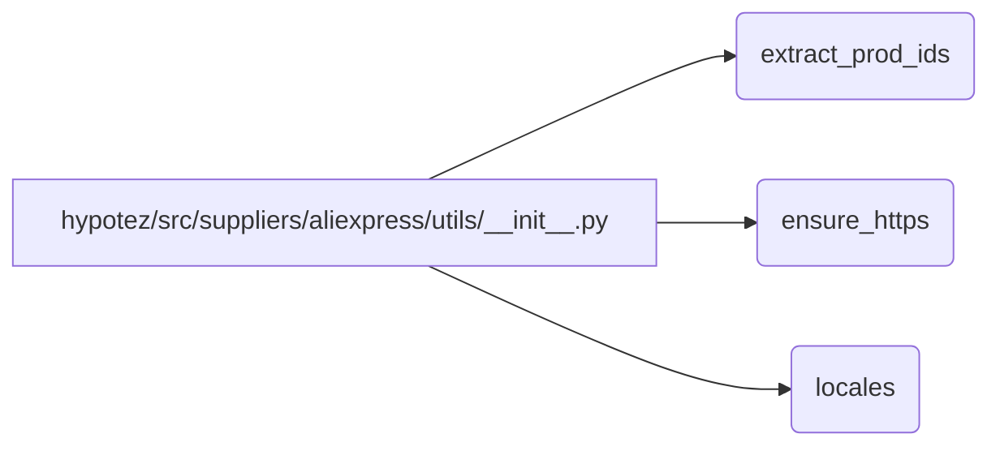

# <input code>

```python
## \file hypotez/src/suppliers/aliexpress/utils/__init__.py
# -*- coding: utf-8 -*-\
#! venv/Scripts/python.exe
#! venv/bin/python/python3.12

"""
.. module: src.suppliers.aliexpress.utils 
	:platform: Windows, Unix
	:synopsis:

"""
MODE = 'dev'

from .extract_product_id import extract_prod_ids
from .ensure_https import ensure_https
from .locales import locales
```

# <algorithm>

Этот код определяет модуль `utils` для поставщика AliExpress.  Он импортирует функции из других файлов внутри папки `utils`.  Алгоритм работы сводится к импорту необходимых функций.  Нет никакого цикла или вызова функций, поэтому нет пошаговой обработки данных.  Он просто предоставляет доступ к функциям.

Пример:  После импорта, можно вызвать функцию `extract_prod_ids()` из файла `extract_product_id.py` в коде, который использует `aliexpress.utils`.

```
# ... (другой файл)
from hypotez.src.suppliers.aliexpress.utils import extract_prod_ids
# ... (вызов extract_prod_ids())
```


# <mermaid>



Описание диаграммы:

* **A:** Модуль `aliexpress.utils` - это точка входа.
* **B:** Функция `extract_prod_ids` импортируется из файла `extract_product_id.py`
* **C:** Функция `ensure_https` импортируется из файла `ensure_https.py`.
* **D:** Функция `locales` импортируется из файла `locales.py`.

Все эти функции доступны для использования в других частях проекта, которые импортируют `aliexpress.utils`.


# <explanation>

**Импорты:**

* `from .extract_product_id import extract_prod_ids`: Импортирует функцию `extract_prod_ids` из модуля `extract_product_id` внутри текущей папки (`src/suppliers/aliexpress/utils`).  Это означает, что функции из других файлов доступны для использования.
* `from .ensure_https import ensure_https`: Импортирует функцию `ensure_https` из модуля `ensure_https` внутри текущей папки.
* `from .locales import locales`: Импортирует переменную (или функцию, или класс) `locales` из модуля `locales` внутри текущей папки.

**Классы, функции и переменные:**

* `MODE = 'dev'`: Переменная глобального уровня, вероятно, задаёт режим работы (например, `dev` или `prod`).  Этот параметр может быть использован для конфигурации в других частях кода, например, чтобы настроить пути к различным файлам или базам данных.
* **Нет классов и функций, определённых в текущем файле.** Этот файл лишь импортирует функции из других модулей.  Сам `__init__.py` файл в директории является точкой входа для модуля и просто делает компоненты из других модулей доступными для других частей проекта.

**Возможные ошибки или улучшения:**

* **Отсутствие документации:**  Недостаточно детализированные комментарии к функциям в `extract_product_id.py`, `ensure_https.py` и `locales.py` (если это файлы).
* **Неявные зависимости:** Необходимы более подробные комментарии, описывающие использование `MODE` в других модулях проекта.  Это позволит лучше понять, как используются константы и переменные из `utils`.

**Цепочка взаимосвязей:**

`aliexpress.utils` предоставляет набор инструментов для работы с данными AliExpress.  Его функции будут использоваться в других модулях, скорее всего, в контроллерах или сервисах (например, в `src/suppliers/aliexpress/api.py` или в файлах обработки данных).  Взаимодействие будет происходить через вызовы функций из `aliexpress.utils`.


```
hypotez/src/suppliers/aliexpress/api.py --> hypotez/src/suppliers/aliexpress/utils/__init__.py