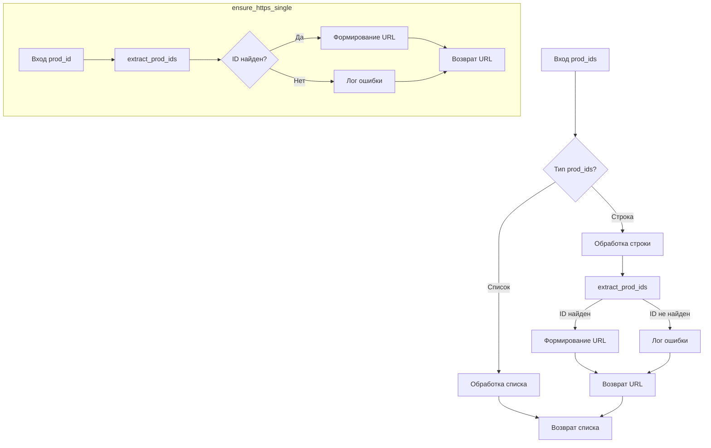

```MD
# <input code>

```python
## \file hypotez/src/suppliers/aliexpress/utils/ensure_https.py
# -*- coding: utf-8 -*-\
#! venv/Scripts/python.exe
#! venv/bin/python/python3.12

"""
.. module: src.suppliers.aliexpress.utils 
	:platform: Windows, Unix
	:synopsis: Ensures that the provided URL string(s) contain the https:// prefix. 
If the input is a product ID, it constructs a full URL with https:// prefix.

```python
# Example usage
url = "example_product_id"
url_with_https = ensure_https(url)
print(url_with_https)  # Output: https://www.aliexpress.com/item/example_product_id.html

urls = ["example_product_id1", "https://www.aliexpress.com/item/example_product_id2.html"]
urls_with_https = ensure_https(urls)
print(urls_with_https)  # Output: ['https://www.aliexpress.com/item/example_product_id1.html', 'https://www.aliexpress.com/item/example_product_id2.html']
```

"""
MODE = 'dev'

from src.logger import logger
from .extract_product_id import extract_prod_ids

def ensure_https(prod_ids: str | list[str]) -> str | list[str]:
    """ Ensures that the provided URL string(s) contain the https:// prefix.
    If the input is a product ID, it constructs a full URL with https:// prefix.

    Args:
        prod_ids (str | list[str]): A URL string or a list of URL strings to check and modify if necessary.

    Returns:
        str | list[str]: The URL string or list of URL strings with the https:// prefix.

    Raises:
        ValueError: If `prod_ids` is an instance of `WindowsPath`.

    Examples:
        >>> ensure_https("example_product_id")
        'https://www.aliexpress.com/item/example_product_id.html'

        >>> ensure_https(["example_product_id1", "https://www.aliexpress.com/item/example_product_id2.html"])
        ['https://www.aliexpress.com/item/example_product_id1.html', 'https://www.aliexpress.com/item/example_product_id2.html']

        >>> ensure_https("https://www.example.com/item/example_product_id")
        'https://www.example.com/item/example_product_id'
    """
    def ensure_https_single(prod_id: str) -> str:
        """ Ensures a single URL or product ID string has the https:// prefix.

        Args:
            prod_id (str): The URL or product ID string.

        Returns:
            str: The URL string with the https:// prefix.

        Raises:
            ValueError: If `prod_id` is an instance of `WindowsPath`.

        Examples:
            >>> ensure_https_single("example_product_id")
            'https://www.aliexpress.com/item/example_product_id.html'

            >>> ensure_https_single("https://www.example.com/item/example_product_id")
            'https://www.example.com/item/example_product_id'
        """
        _prod_id = extract_prod_ids(prod_id)
        if _prod_id:
            return f"https://www.aliexpress.com/item/{_prod_id}.html"
        else:
            logger.error(f"Invalid product ID or URL: {prod_id=}", exc_info=False)
            return prod_id

    if isinstance(prod_ids, list):
        return [ensure_https_single(prod_id) for prod_id in prod_ids]
    else:
        return ensure_https_single(prod_ids)
```

# <algorithm>

1. **Вход:** `prod_ids` (строка или список строк).
2. **Проверка типа:**
   - Если `prod_ids` - список, переходим к шагу 4.
   - Если `prod_ids` - строка, переходим к шагу 3.
3. **Обработка одной строки:**
   - Вызываем функцию `extract_prod_ids` для извлечения ID из строки.
   - Если ID найден, формируем полную URL-строку с префиксом `https://www.aliexpress.com/item/`.
   - Если ID не найден, записываем сообщение об ошибке в лог и возвращаем исходную строку.
4. **Обработка списка:**
   - Для каждой строки в списке вызываем функцию `ensure_https_single`.
   - Возвращаем список из обработанных строк.


**Пример:**

Вход: `prod_ids = ["product123", "https://example.com"]`
Шаг 4:
 - Для "product123" вызывается `ensure_https_single`, генерируется `https://www.aliexpress.com/item/product123.html`
 - Для "https://example.com" вызывается `ensure_https_single`, возвращается `https://example.com`
Результат: `['https://www.aliexpress.com/item/product123.html', 'https://example.com']`


# <mermaid>



# <explanation>

**Импорты:**

- `from src.logger import logger`: Импортирует класс `logger` из модуля `logger`, находящегося в подпапке `src`.  Это, вероятно, класс для логирования ошибок и сообщений.  Связь с `src` указывает на то, что модуль `logger` находится в корневой директории проекта.
- `from .extract_product_id import extract_prod_ids`: Импортирует функцию `extract_prod_ids` из модуля `extract_product_id`, находящегося в той же директории, что и текущий файл. Это указывает на внутреннюю зависимость и вероятно, функцию для извлечения идентификатора продукта из строки.

**Функции:**

- `ensure_https(prod_ids: str | list[str]) -> str | list[str]`:  Функция, которая принимает URL (строку или список строк) и возвращает URL с префиксом `https://` или список таких URL.  Она определяет тип входных данных и вызывает соответствующую функцию для обработки: `ensure_https_single` для строки или применение `ensure_https_single` ко всем элементам списка.
- `ensure_https_single(prod_id: str) -> str`: Функция, которая принимает одну URL-строку и добавляет префикс `https://www.aliexpress.com/item/`  к продукту, если ID продукта найден. Если ID не найден, функция выводит сообщение об ошибке с помощью `logger` и возвращает исходную строку.  

**Переменные:**

- `MODE = 'dev'`:  Вероятно, используется для переключения между режимами разработки и производства, влияя на поведение (например, логирование).


**Возможные ошибки и улучшения:**

- Отсутствует обработка исключений: функция `ensure_https_single` не обрабатывает другие возможные ошибки, такие как `TypeError` или `ValueError` при работе с `prod_id`.  Важно добавить более широкую обработку исключений.
- Отсутствие валидации входных данных:  `prod_ids` может содержать не только строки, но и другие типы данных, что может привести к ошибке. Необходимо более строго проверить входные данные.
- Неявное использование `extract_prod_ids`:  Функция `extract_prod_ids` не объявлена в файле, нужно проанализировать её реализацию для понимания, как она извлекает ID.

**Цепочка взаимосвязей:**

`ensure_https` -> `ensure_https_single` -> `extract_prod_ids` -> `logger`


Функция `ensure_https` является частью инструментария обработки данных о продуктах с AliExpress.  Она обрабатывает ссылки на продукты, используя внутреннюю функцию `extract_prod_ids`, для преобразования идентификаторов продуктов в полные URL-адреса.  `logger` используется для вывода диагностических сообщений, если обнаруживаются неверные данные.