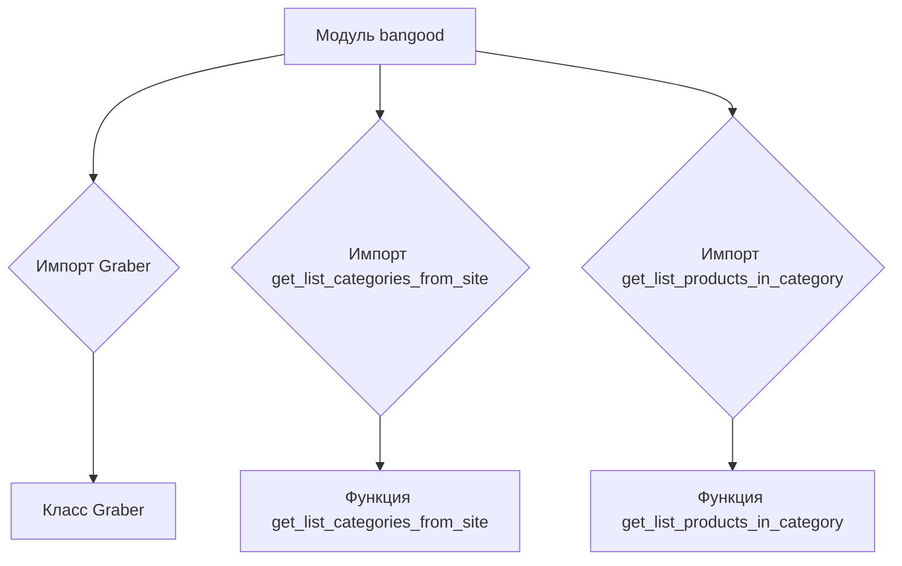
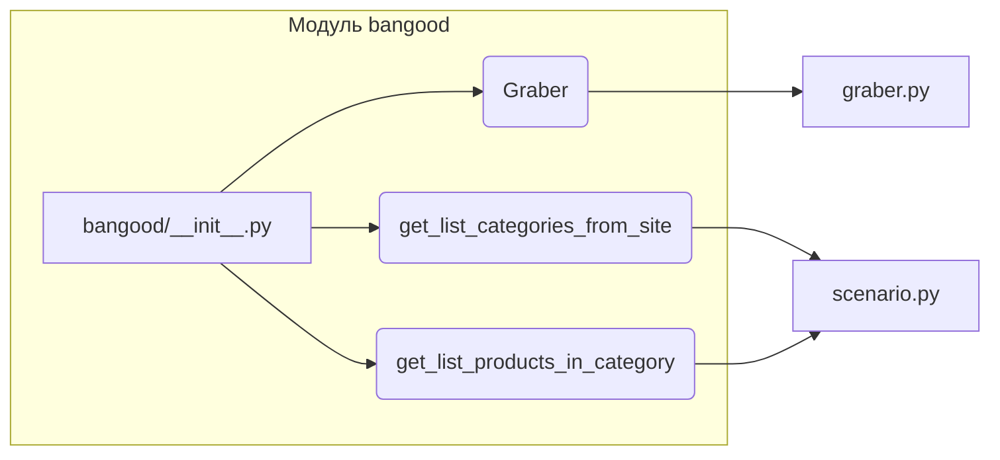

# <input code>

```python
## \file hypotez/src/suppliers/bangood/__init__.py
# -*- coding: utf-8 -*-
#! venv/Scripts/python.exe
#! venv/bin/python/python3.12

"""
.. module: src.suppliers.bangood 
	:platform: Windows, Unix
	:synopsis:

"""
MODE = 'dev'

from .graber import Graber
from .scenario import get_list_categories_from_site, get_list_products_in_category
```

# <algorithm>

Этот код определяет модуль `bangood` в пакете `suppliers` проекта `hypotez`. Он импортирует классы и функции из подмодулей `graber` и `scenario`.  Блок-схема проста и сводится к импорту:



**Пример:**  
При вызове  `get_list_categories_from_site()` извне модуля `bangood` происходит загрузка и обработка данных, возвращающих список категорий сайта Banggood.


# <mermaid>



**Объяснение диаграммы:**

Диаграмма показывает, что `bangood/__init__.py` импортирует классы и функции из `graber.py` и `scenario.py`. Эти подмодули, вероятно, содержат функции и классы, необходимые для взаимодействия с сайтом Banggood (например, для извлечения списка категорий или товаров).


# <explanation>

* **Импорты**:
    - `from .graber import Graber`: Импортирует класс `Graber` из модуля `graber.py` в текущем пакете (`suppliers/bangood`).  `.` указывает, что модуль `graber` находится в подпапке этого файла.
    - `from .scenario import get_list_categories_from_site, get_list_products_in_category`: Импортирует функции `get_list_categories_from_site` и `get_list_products_in_category` из модуля `scenario.py` в текущем пакете. Это указывает на то, что функции для получения списков категорий и товаров находятся в подмодуле `scenario`.

* **Классы**:
    - `Graber`:  Класс, скорее всего, отвечает за взаимодействие с сайтом Banggood (парсинг, веб-запросы).  Без доступа к коду `graber.py` точное назначение неясно.

* **Функции**:
    - `get_list_categories_from_site`: Возвращает список категорий с сайта Banggood.
    - `get_list_products_in_category`: Возвращает список товаров в заданной категории с сайта Banggood.

* **Переменные**:
    - `MODE = 'dev'`:  Вероятно, переменная для определения режима работы (разработка, производство).

* **Возможные ошибки/улучшения**:
    - Отсутствует информация о том, как осуществляется взаимодействие с сайтом Banggood. Необходима проверка ошибок и обработка исключений, чтобы код был надежным.
    - Нет информации о структуре данных, возвращаемых функциями.
    - Не хватает информации о том, как обрабатываются возможные исключения (например, проблемы с подключением к сайту).

**Цепочка взаимосвязей:**

Модуль `bangood` зависит от подмодулей `graber` и `scenario`.  Вероятно,  `hypotez` использует функции из `bangood` для взаимодействия с сайтом Banggood и сбора данных, которые затем могут быть использованы другими частями проекта.  Без дополнительного кода сложно проследить всю цепочку.


**Дополнительные замечания**:

Строки `#! venv/Scripts/python.exe` и `#! venv/bin/python/python3.12` — это *хедерные строки*, которые указывают интерпретатор Python, который должен использоваться для запуска файла.  Они не относятся к логике импорта, но важны для запуска скрипта.  Они, скорее всего, специфичны для вашей среды (virtualenv).