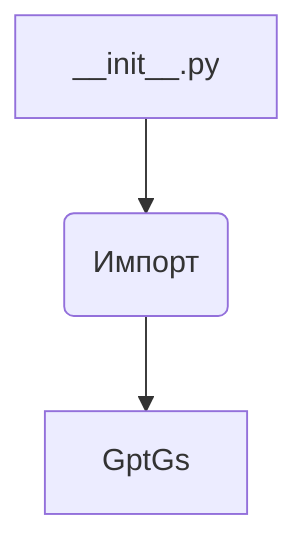
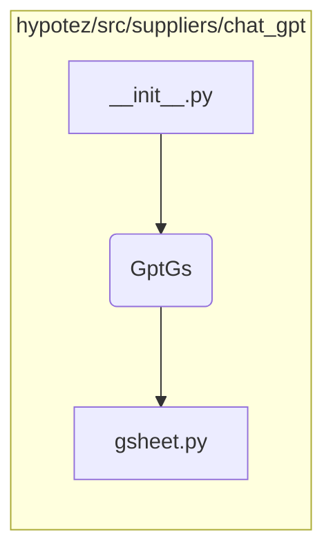

```MD
# Анализ файла hypotez/src/suppliers/chat_gpt/__init__.py

1. **<input code>**:

```python
## \file hypotez/src/suppliers/chat_gpt/__init__.py
# -*- coding: utf-8 -*-\
#! venv/Scripts/python.exe
#! venv/bin/python/python3.12

"""
.. module: src.suppliers.chat_gpt 
	:platform: Windows, Unix
	:synopsis:

"""
MODE = 'dev'

from .gsheet import GptGs
```

2. **<algorithm>**:

Этот файл является инициализатором модуля `chat_gpt` в пакете `suppliers`.  В нём происходит импорт класса `GptGs` из модуля `gsheet`.  Алгоритм работы сводится к одной операции - импорту.



Пример:  Файл `__init__.py` импортирует класс `GptGs`.  При использовании `chat_gpt` в другом модуле, доступ к классу `GptGs` будет возможен через этот импорт.


3. **<mermaid>**:



Описание диаграммы:

* __init__.py:  Инициализирующий модуль,  импортирующий `GptGs`.
* `gsheet.py`: Модуль, содержащий класс `GptGs`.


4. **<explanation>**:

* **Импорты**: `from .gsheet import GptGs` импортирует класс `GptGs` из подмодуля `gsheet` внутри пакета `chat_gpt`. Символ `.` перед именем модуля указывает, что модуль `gsheet` находится в той же директории, что и `__init__.py`.  Это стандартная практика организации Python-проектов.  Связь с другими пакетами через импорты указывает на зависимость этого модуля от `gsheet`.

* **Классы**: Класс `GptGs` определён в файле `gsheet.py`.  Данный файл, вероятно, содержит логику взаимодействия с Google Sheets API или другой системой для обработки данных чат-бота.  Без кода `gsheet.py` трудно сказать о его функциональности.

* **Функции**: Нет функций в этом файле `__init__.py`.

* **Переменные**:  `MODE = 'dev'`  - константа, вероятно, определяющая режим работы (например, разработка или производство).  Тип - строка.

* **Возможные ошибки или улучшения**:
    * Нет проверки на существование файла `gsheet.py`.  Если файл отсутствует или не содержит класс `GptGs`, произойдёт ошибка импорта.
    * Недостаточно информации о назначении переменной `MODE`.  Желательно добавить комментарий о её значении и контексте.
    * Отсутствие документации в коде (документационные строки `"""..."""`) может затруднить понимание назначения кода.


**Цепочка взаимосвязей**:

Этот модуль (`chat_gpt/__init__.py`) зависит от модуля `gsheet.py` для работы. В свою очередь, `gsheet.py` может зависеть от библиотек, таких как `google-api-python-client`, для взаимодействия с Google Sheets API.  Эта зависимость должна быть учтена в `requirements.txt` проекте.