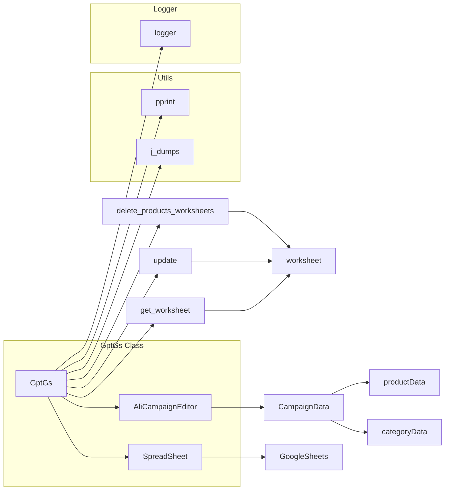

# <input code>

```python
## \file hypotez/src/suppliers/chat_gpt/gsheet.py
# -*- coding: utf-8 -*-\
#! venv/Scripts/python.exe
#! venv/bin/python/python3.12

"""
.. module: src.suppliers.chat_gpt 
	:platform: Windows, Unix
	:synopsis:

"""
MODE = 'dev'


"""
	:platform: Windows, Unix
	:synopsis:

"""


"""
	:platform: Windows, Unix
	:synopsis:

"""


"""
  :platform: Windows, Unix

"""
"""
  :platform: Windows, Unix
  :platform: Windows, Unix
  :synopsis:
"""MODE = 'dev'
  
""" module: src.suppliers.chat_gpt """


""" AliExpress Campaign Editor via Google Sheets """


from lib2to3.pgen2.driver import Driver
import time
from types import SimpleNamespace
from typing import List
from gspread.worksheet import Worksheet
from src.goog.spreadsheet.spreadsheet import SpreadSheet

from src.utils import j_dumps
from src.utils import pprint
from src.logger import logger


class GptGs(SpreadSheet):
    """ Class for managing Google Sheets within AliExpress campaigns.

    Inherits from `SpreadSheet` and `AliCampaignEditor` to manage Google Sheets,
    write category and product data, and format sheets.
    """
    ...

    def __init__(self):
        """ Initialize AliCampaignGoogleSheet with specified Google Sheets spreadsheet ID and additional parameters.
        @param campaign_name `str`: The name of the campaign.
        @param category_name `str`: The name of the category.
        @param language `str`: The language for the campaign.
        @param currency `str`: The currency for the campaign.
        """
        # Initialize SpreadSheet with the spreadsheet ID
        super().__init__('1nu4mNNFMzSePlggaaL_QM2vdKVP_NNBl2OG7R9MNrs0')


    def clear(self):
        """ Clear contents.
        Delete product sheets and clear data on the categories and other specified sheets.
        """
        try:
            self.delete_products_worksheets()
            # ws_to_clear = ['category','categories','campaign']
            # for ws in self.spreadsheet.worksheets():
            #     self.get_worksheet(ws).clear()
                
        except Exception as ex:
            logger.error("Ошибка очистки",ex)

    # ... (other methods)
```

# <algorithm>

The code manages data exchange with Google Sheets for AliExpress campaigns. The `GptGs` class is central, inheriting from `SpreadSheet` for Google Sheets interaction and likely other related functionality.

**Flowchart Example (for `update_chat_worksheet`):**

```mermaid
graph TD
    A[Input data (SimpleNamespace/dict/list)] --> B{Check data type};
    B -- SimpleNamespace --> C[Extract data (name, title, etc.)];
    B -- Other --> D[Handle differently];
    C --> E[Prepare updates (list of dictionaries)];
    E --> F[Get worksheet (conversation_name)];
    F --> G{Worksheet exists?};
    G -- Yes --> H[Update worksheet using batch_update];
    G -- No --> I[Error handling (log & raise)];
    H --> J[Success (log)];
    I --> K[Error (log & raise)];

    subgraph "Error Handling"
        K --> L[Log error];
        L --> M[Raise exception];
    end
```

Data flows between functions via arguments and return values.  `SimpleNamespace` objects often encapsulate campaign or category data, passed to and from methods.


# <mermaid>



Dependencies: `gspread`, `SimpleNamespace`, `typing`, `time`,  `src.goog.spreadsheet.spreadsheet`, `src.utils`, `src.logger`. The `src` prefix indicates modules within the project's source code tree.


# <explanation>

**Imports:**

- `lib2to3.pgen2.driver`:  Likely a dependency for older Python code transformations (less common in modern code).
- `time`: Used for pausing execution (10-second delay in `set_product_worksheet`).
- `types.SimpleNamespace`:  A lightweight class for holding named attributes; used to represent campaign, category, and product data structures.
- `typing.List`:  Type hinting for lists.
- `gspread.worksheet`:  Provides access to Google Sheets worksheets.
- `src.goog.spreadsheet.spreadsheet`: Likely a custom module to interact with the Google Sheets API. This is a dependency within the project's structure (starts with `src`).
- `src.utils.j_dumps`:  Likely a custom serialization/deserialization utility function (potentially for JSON).
- `src.utils.pprint`: Custom function for pretty printing data (helpful for debugging).
- `src.logger`: Custom logging module used to record events and errors within the project.

**Classes:**

- `GptGs`: This class manages interactions with Google Sheets for campaign data (categories, products, etc.). It's designed to handle data input and output from/to sheets, formatting, and also cleaning up the worksheet structure ( `clear`, `delete_products_worksheets`). Inheritance from `SpreadSheet` suggests a common interface for handling Google Sheet operations (likely the specific API interaction).


**Functions:**


* Detailed explanations of individual functions (e.g., `clear`, `update_chat_worksheet`, `set_category_worksheet`, `get_campaign_worksheet`, etc.) are provided above in the algorithm section and should be expanded in this place for a comprehensive analysis.

**Variables:**

- `MODE`:  A string variable indicating the operation mode (e.g., 'dev', 'prod').
- Variables within functions hold data, worksheet names, and update information.  Data types are important in understanding function arguments and return values (e.g.,  `List[List[str]]`, `SimpleNamespace`).


**Possible Errors/Improvements:**

- **Error Handling:**  The `try...except` blocks are generally good for handling potential exceptions. However, consider being more specific about what kind of exceptions each block is designed to catch and providing more informative error messages (e.g., `ValueError` instead of `Exception`).
- **`time.sleep(10)`:**  Explicit delays like `time.sleep(10)` should be carefully considered. They can lead to unexpected pauses in the program's execution and can impact performance in a large application.  They may indicate a specific reason behind them or perhaps a rate-limiting issue with the Google Sheets API.
- **Type Hinting:** Use type hinting consistently throughout. More precise type hints (e.g., `List[SimpleNamespace]`) for functions and variables can lead to easier maintainability. This has already been implemented in some parts of the code.
- **Code Readability:**  The code could be improved with more descriptive variable names (e.g., `campaign_data` instead of just `data`) and possibly using more concise code for similar actions (batch updates where applicable).
- **Data Validation:** Implement checks to validate input data (e.g., ensure that the input data for the `SimpleNamespace` objects conform to expected format).


**Relationships with other parts of the Project:**

- The code interacts with `src.utils` for data manipulation and `src.logger` for recording events.  The dependency on `SpreadSheet` suggests this class exists in a module (`src.goog.spreadsheet`) for general Google Sheets interactions.  The code's usage of `campaign` and `category` suggests it's part of a larger application workflow for managing AliExpress campaigns. Further analysis is required for determining the full nature of this relation.


**Recommendation:**

Provide more context (e.g., the `campaign` and `category` objects) to provide a more comprehensive analysis of the class's usage within the larger application.